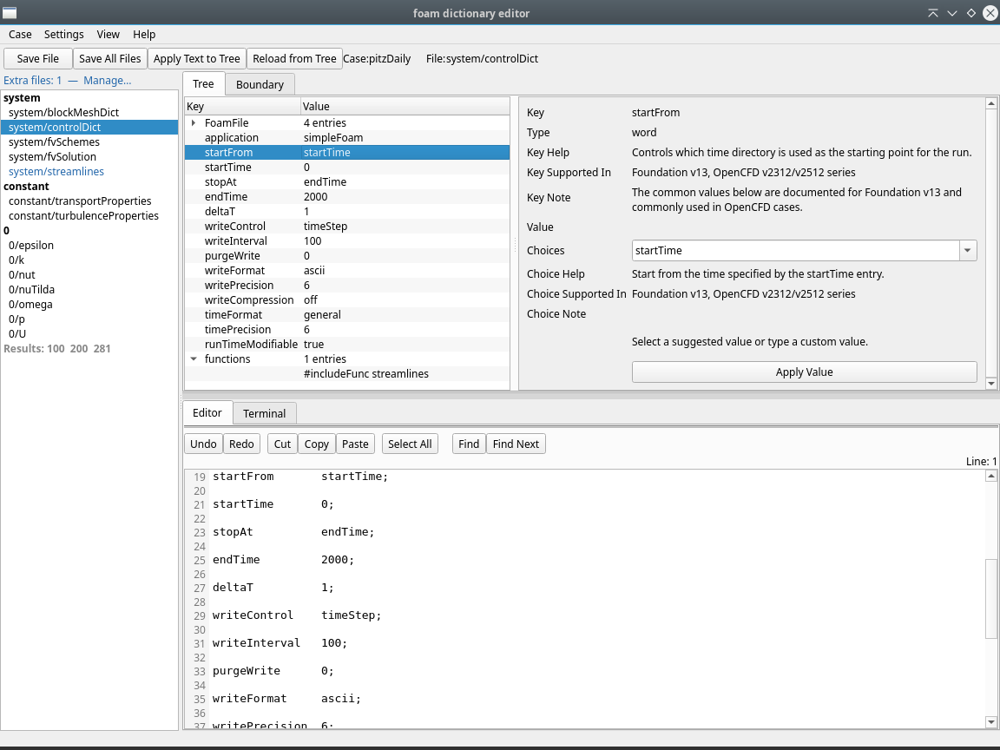
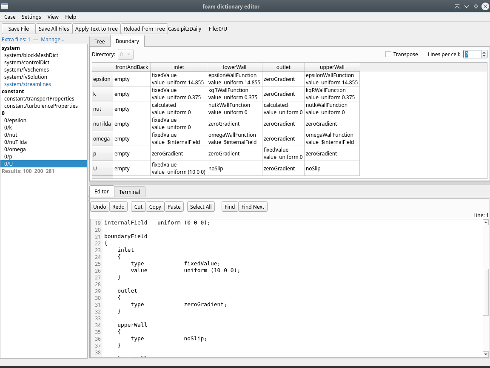

# Foam Dictionary Editor (FoDE)

FoDE — Foam Dictionary Editor (pronounced "foh-dee")

## What is FoDE?

FoDE is a graphical editor for OpenFOAM case dictionary files. It lets you browse, edit, and manage dictionaries through a structured tree view or a plain-text editor — whichever suits the task. It is aimed at engineers and researchers who run OpenFOAM simulations and want a more convenient way to set up and modify case files.

## About This Guide

This is the full feature reference for FoDE. It covers every panel, menu, dialog, and workflow in detail. For installation and a quick-start walkthrough, see [README.md](README.md). For project structure, dev setup, and testing, see [DEVELOPER.md](DEVELOPER.md).

## Where to Find Things

| I want to… | Section |
|---|---|
| Browse and manage case files | [File list behavior](#file-list-behavior) |
| Open or reload a case | [Reloading a case](#reloading-a-case) |
| Save or duplicate a case | [Duplicating a case](#duplicating-a-case) / [Saving as a new case](#saving-as-a-new-case) |
| Compare two cases side-by-side | [Case comparison](#case-comparison) |
| Use tutorial or template cases | [Case Library](#case-library) |
| Understand tree ↔ text sync | [Tree and text workflow](#tree-and-text-workflow) |
| Edit values in the tree | [Tree view context menu](#tree-view-context-menu) |
| Get help on a dictionary setting | [Detail pane](#detail-pane) |
| Edit boundary conditions in bulk | [Boundary view](#boundary-view) |
| View blockMeshDict geometry in 3-D | [BlockMesh panel](#blockmesh-panel) |
| Filter tree keys | [Tree key filter](#tree-key-filter-and-editor-sync) |
| Jump to a tree entry from the editor | [Find in Tree](#tree-key-filter-and-editor-sync) |
| Find text in the editor | [Editor toolbar](#current-ui-layout) |
| View keyboard shortcuts | Help > Keyboard Shortcuts… |
| Run OpenFOAM commands from FoDE | [Terminal tab](#terminal-tab) |
| Choose a variant (no-terminal, BlockMesh) | [Variants](#variants) |
| Add schema help for custom keys | [Schema module configuration](#schema-module-configuration) |
| Configure application settings | [Application settings](#application-settings) |
| Open help links or reference sites | [Resources dialog](#resources-dialog) |

## Contents

**Getting started**
- [Features](#features)
- [UI layout](#current-ui-layout)
- [Current case and file display](#current-case-and-file-display)

**File & case management**
- [File list behavior](#file-list-behavior)
  - [Directory header markers](#directory-header-markers)
  - [Default target files](#default-target-files)
  - [MultiRegion cases](#multiregion-cases)
  - [Symbolic links](#symbolic-links)
  - [Adding files at runtime](#adding-files-at-runtime)
  - [Adding extra directories](#adding-extra-directories)
  - [Extra files and directories indicator](#extra-files-and-directories-indicator)
  - [Removing extra files and directories](#removing-extra-files-and-directories)
  - [Numeric time directory indicator](#numeric-time-directory-indicator)
  - [Creating a backup](#creating-a-backup)
  - [Creating a new file](#creating-a-new-file)
  - [Cleaning up backup files](#cleaning-up-backup-files)
  - [Deleting a file](#deleting-a-file)
  - [Duplicating a file](#duplicating-a-file)
  - [Duplicating a field directory](#duplicating-a-field-directory)
  - [Deleting a field directory](#deleting-a-field-directory)
  - [Resetting the file list](#resetting-the-file-list)
- [Case Library](#case-library)
- [Case comparison](#case-comparison)
- [Reloading a case](#reloading-a-case)
- [Saving as a new case](#saving-as-a-new-case)
- [Duplicating a case](#duplicating-a-case)

**Editing**
- [Tree and text workflow](#tree-and-text-workflow)
- [Tree view context menu](#tree-view-context-menu)
- [Detail pane](#detail-pane)
- [Boundary view](#boundary-view)
  - [Table layout](#table-layout)
  - [Directory selector](#directory-selector)
  - [Transpose](#transpose)
  - [Single-click navigation](#single-click-navigation)
  - [Editing a boundary condition](#editing-a-boundary-condition)
  - [Creating a patch entry](#creating-a-patch-entry)
  - [Deleting a patch entry](#deleting-a-patch-entry)
  - [Copy and paste](#copy-and-paste)
  - [Copy Table](#copy-table)
  - [Renaming a boundary patch](#renaming-a-boundary-patch)
  - [Deleting a boundary condition across all field files](#deleting-a-boundary-condition-across-all-field-files)
  - [Adding a boundary condition across all field files](#adding-a-boundary-condition-across-all-field-files)
- [BlockMesh panel](#blockmesh-panel)
- [Behavior on parse failure](#behavior-on-parse-failure)

**Navigation & search**
- [Tree key filter and editor sync](#tree-key-filter-and-editor-sync)
  - [Tree key filter](#tree-key-filter)
  - [Editor sync (Auto-scroll editor)](#editor-sync-auto-scroll-editor)
  - [Find in Tree (editor → tree)](#find-in-tree-editor--tree)
- [Editor behavior](#editor-behavior)

**Configuration**
- [Terminal tab](#terminal-tab)
- [Variants](#variants)
- [Schema module configuration](#schema-module-configuration)
- [Application settings](#application-settings)
- [Resetting settings](#resetting-settings)
- [Resources dialog](#resources-dialog)

**Reference**
- [Supported syntax and node types](#supported-syntax-and-node-types)
- [Limitations](#limitations)
- [Disclaimer](#disclaimer)
- [Acknowledgements](#acknowledgements)

---

## Features

- Open an OpenFOAM case directory and list common dictionary files from the case.
- Load and edit a wide range of common dictionary files including `controlDict`, `fvSchemes`, `fvSolution`, `blockMeshDict`, `snappyHexMeshDict`, `transportProperties`, and many more when present.
- Automatically list all files found under the `0` and `0.orig` field directories.
- Automatically detect multiRegion case structures (e.g. `chtMultiRegionFoam`, `chtMultiRegionSimpleFoam`) and list per-region files under separate group headers such as `system/fluid` and `constant/heater`.
- Automatically collect phase-variant files such as `thermophysicalProperties.air` and `turbulenceProperties.water` that are present in `constant/` or per-region constant directories.
- Display symbolic links in the file list with a `⇢` marker and italic text; hovering shows the link target in the tooltip.
- Add files not in the default list to the file panel at runtime via right-click on a directory header.
- Add entire directories to the file list so that all files inside are scanned automatically, just like `0/` and `0.orig/`. Each directory can be scanned flat (direct files only, default) or recursively (all subdirectories). Useful for custom field directories (`initial/`), restart time steps (`0.5/`), or deep subdirectories (`lagrangian/chemkin/`) and cases that include a `validation/` tree. Extra directories are shown with a distinct (purple) header. Right-click the **Results** indicator to add a numeric time directory directly; use **Settings > Manage Extra Files & Directories…** or the indicator button for arbitrary directories.
- Create a new file from a FoamFile template in any directory group via right-click on the directory header.
- Save per-case extra file and directory selections to `.foam-editor-files.json` inside the case directory.
- Show an indicator at the top of the file list when extra files or directories are registered for the current case, with a link to the management dialog.
- Remove extra files individually via right-click, or manage files and directories in bulk via the management dialog.
- Create a timestamped backup of any file via right-click on a file in the file list.
- Delete any file from disk via right-click on a file in the file list. A confirmation dialog offers three choices: create a backup and delete, delete without a backup, or cancel. The deletion cannot be undone.
- Clean up accumulated backup files for the current case via **Case > Clean Backup Files...**. A dialog lists all `.bak_*` files found in the case directory with checkboxes (all selected by default) and **Select All** / **Deselect All** buttons for quick bulk selection.
- Duplicate any file in the file list via right-click; a dialog prompts for a new name and the `object` field in the FoamFile header is updated automatically to the new name. If the source file has unsaved changes, the application asks whether to save first or duplicate with the unsaved state.
- Duplicate the `0/` or `0.orig/` directory to create the missing counterpart via right-click on the group header (shown only when exactly one of the two directories exists).
- Delete the `0/` directory from disk via right-click on the `0` group header. Shown only when `0.orig` exists. A confirmation dialog shows the full path; any open files inside `0/` are closed and the deletion cannot be undone.
- View all boundary conditions across field variables at a glance in the **Boundary** tab. Rows are field files and columns are patches by default; a **Transpose** checkbox swaps the orientation. Double-click a cell to edit its content, or to create a new entry for a `–` cell. Right-click any cell to edit, create, delete, copy, paste, or rename a boundary condition. Right-click a patch column/row header to rename, delete, or add a boundary condition across all field files. Use the **Copy Table** button to copy the entire table to the clipboard as Markdown or CSV.
- Show the parsed dictionary structure in a tree view. Filter visible keys by typing in the **filter bar** above the tree; matching is case-insensitive and recursive (parent nodes remain visible when a descendant matches).
- Highlight `unknown_raw_entry` nodes (entries the parser could not fully interpret) in amber so they stand out from normal entries.
- Indicate the presence of numeric time directories (OpenFOAM calculation results such as `0.5`, `1`, `10`) with a bold **Results: …** row at the bottom of the file list. The indicator shows up to six directory names and notes the total count when more exist. Hovering shows the full count and range. Right-clicking the indicator offers a submenu to add any listed directory to the file list as an extra directory.
- Hide the **Type** column in the tree by default; re-enable it with **View > Show Type Column**.
- View rich schema information for each setting in the right-side detail pane:
  description, available choices, applicable solver versions, and notes.
  Schema annotations are provided for a subset of common settings; not all keys are covered.
- Edit node values directly from the detail pane. When a fractional value is entered for an `int` node, the node type is automatically promoted to `scalar`.
- Customize or extend schema information by writing your own schema modules.
- Edit raw file text directly in the lower text editor.
- Show line numbers and the current line position in the editor.
- Rebuild raw text from the parsed tree with **Reload from Tree**.
- Rebuild the tree from edited text with **Apply Text to Tree**.
- Save the current file from the raw text editor with **Save File**.
- Save all modified files at once with **Save Case**.
- Reload the current case from disk with the **Reload Case** button in the top bar or **Case > Reload Case**, discarding all in-memory edits. If there are unsaved changes, a confirmation dialog shows the number of affected files before proceeding.
- Duplicate the open case to a new directory with **Case > Duplicate Case**, choosing between a full directory copy or a copy of only the app-visible files.
- Save the currently open case as a new case with **Case > Save as New Case...**, which copies files from disk (all files or app-visible files only, selectable) and then writes any unsaved in-memory edits on top, then switches to the new case.
- Register reference case directories in the **Case Library** for quick access. The `$FOAM_TUTORIALS` directory is included automatically whenever the environment variable is set.
- Open a case directly from any Case Library directory with **Case > Open from Case Library...**.
- Duplicate a case from the Case Library into the working directory with **Case > Duplicate from Case Library...**, with the Default Case Directory pre-filled as the destination parent.
- Show a warning when the selected directory contains neither `system/` nor `constant/`, suggesting it may not be a valid OpenFOAM case, with an option to open it anyway.
- Open a case by dragging a directory from the file manager and dropping it anywhere on the application window. If there are unsaved changes, a confirmation dialog is shown first.
- Add, duplicate, comment out, restore, or delete tree nodes via the right-click context menu in the tree view.
- Copy and paste node values in the tree view via right-click context menu or Ctrl+C / Ctrl+V.
- Run shell commands in the integrated **Terminal** tab at the bottom of the window. The terminal automatically changes to the case directory when a case is opened.
- Undo, redo, cut, copy, paste, select all, and find text via the edit toolbar.
- Keep the text editor usable even if parsing fails.
- Configure schema modules and application settings at runtime via the **Settings** menu.
- Open **Help > Resources...** to access official OpenFOAM documentation links and manage personal reference links. The **My Links** tab lets you add, edit, reorder, and remove links; double-click any entry to open it in your browser. Links are saved to `app_config.json`.

## Current UI layout



The main window is divided into two top-level columns separated by a horizontal splitter.

- **Left column** — file list for the selected OpenFOAM case (full window height).
- **Right column** — a vertical splitter with two rows:
  - **Upper row** — a tab widget with up to three tabs:
    - **Tree** tab — parsed dictionary tree (center) and detail editor (right). A **⊞** button in the tab bar's top-right corner activates side-by-side mode when `blockMeshDict` is the active file (see [BlockMesh panel — Side-by-side mode](#side-by-side-mode)).
    - **Boundary** tab — boundary condition table for all field variables (see [Boundary view](#boundary-view)).
    - **BlockMesh** tab — interactive 3-D viewer for `blockMeshDict` geometry (see [BlockMesh panel](#blockmesh-panel)). Visible only when the Simple terminal is active; can also be toggled via **View > BlockMesh 3-D Panel**.
  - **Lower row** — tabbed panel with two tabs:
    - **Editor** — plain-text editor with line numbers.
    - **Terminal** — integrated terminal with a mode toggle (see [Terminal tab](#terminal-tab) below).

The top action bar contains the frequently used commands and the current case and file display.

- Save File.
- Save Case.
- Apply Text to Tree.
- Reload from Tree.
- Case: current case name display.
- File: current file name display.

The **Editor** tab has its own toolbar row with text search operations.

- Find — opens a search dialog (Ctrl+F).
- Find Prev — wraps to the previous match (Shift+F3).
- Find Next — advances to the next match (F3).
- Find in Tree — selects the deepest tree node whose source span covers the current cursor line (Ctrl+Shift+T).
- Line: N — current cursor line number (right side of the toolbar).

The menu bar provides a **Case** menu, a **View** menu, a **Settings** menu, a **Tools** menu, and a **Help** menu.

**Case menu:**

- Case > Open Case `Ctrl+O`.
- Case > Open from Case Library...
- *Drag and drop:* drag a case directory from your file manager onto any part of the application window to open it. If there are unsaved changes, a confirmation dialog is shown first.
- Case > Reload Case.
- Case > Duplicate Case...
- Case > Duplicate from Case Library...
- Case > Save as New Case...
- Case > Clean Backup Files...
- Case > Compare with Case...
- Case > Save File `Ctrl+S`.
- Case > Save Case `Ctrl+Shift+S`.
- Case > Exit `Ctrl+Q`.

**View menu:**

- View > Show Type Column (checkable; hidden by default).
- View > BlockMesh 3-D Panel (checkable; shows or hides the BlockMesh tab. Grayed out — with the label "BlockMesh 3-D Panel  (unavailable: xterm active)" — while xterm terminal mode is active due to the GPU conflict).

**Settings menu:**

- Settings > Set Default Case Directory.
- Settings > Manage Case Library…
- Settings > Manage Extra Files & Directories…
- Settings > Reset File List.
- Settings > Manage Schema Modules.
- Settings > Reset Window Size.
- Settings > Reset All Settings…
- Settings > Language — select the UI language (English / 日本語). Takes effect after restarting the application.

**Tools menu:**

- Tools > foamMonitor… — launch `foamMonitor` to plot residuals or other time-series data with gnuplot. See [foamMonitor launcher](#foammonitor-launcher).

**Help menu:**

- Help > About Foam Dictionary Editor (FoDE)...
- Help > Keyboard Shortcuts...
- Help > Resources...

## Current case and file display

The top bar shows the current case as its directory name and the current file as `parent-directory/file-name`. For example, `system/controlDict` and `constant/transportProperties` are shown in that form.

If no case or file is loaded, the labels show `-`.

## File list behavior

The file list is populated by `services/case_loader.py`. The implementation combines a fixed list of common dictionary files, per-case user-added files, and automatic enumeration of field files.

### Directory header markers

Each directory group in the file list is shown as a bold header. A `[+]` suffix is added to a header when files exist in that directory on disk but are not currently in the file list. No marker is shown when all files in the directory are already listed.

### Default target files

**system/**

- `blockMeshDict`
- `changeDictionaryDict`
- `controlDict`
- `createBafflesDict`
- `createPatchDict`
- `decomposeParDict`
- `extrudeMeshDict`
- `fvOptions`
- `fvSchemes`
- `fvSolution`
- `meshQualityDict`
- `mirrorMeshDict`
- `refineMeshDict`
- `setFieldsDict`
- `snappyHexMeshDict`
- `surfaceFeatureExtractDict`
- `topoSetDict`

**constant/**

- `boundaryRadiationProperties`
- `dynamicMeshDict`
- `fvOptions`
- `g`
- `kinematicCloudProperties`
- `radiationProperties`
- `regionProperties`
- `thermophysicalProperties`
- `transportProperties`
- `turbulenceProperties`

In addition, all files found directly inside the `0` and `0.orig` directories of the case are listed automatically when those directories exist.

Phase-variant files matching `thermophysicalProperties.*` and `turbulenceProperties.*` (for example `thermophysicalProperties.air`) are collected automatically via glob from `constant/` and from each per-region constant directory.

### MultiRegion cases

When subdirectories are found inside `system/`, the editor treats them as region names and builds additional file groups. The following files are listed per region when present:

**system/\<region\>/**

- `changeDictionaryDict`
- `decomposeParDict`
- `fvOptions`
- `fvSchemes`
- `fvSolution`
- `meshQualityDict`

**constant/\<region\>/**

- `boundaryRadiationProperties`
- `dynamicMeshDict`
- `fvOptions`
- `radiationProperties`
- `thermophysicalProperties`
- `turbulenceProperties`

Each region directory appears as its own group header in the file list (for example `system/fluid`, `constant/heater`). Region groups are sorted after the top-level `system` and `constant` groups.

Field files inside `0/<region>/` and `0.orig/<region>/` are also listed automatically, grouped under headers such as `0/fluid` and `0/solid`. This covers cases like `chtMultiRegionFoam` where each region has its own initial-condition files (e.g. `0/heater/T`, `0/bottomWater/p`).

### Symbolic links

Symbolic links in the file list are shown with a `⇢` marker appended to the file name and the item text is rendered in italic. Hovering over the item shows a tooltip containing the path and the link target. Editing a symlink writes through to the target file, exactly as the operating system resolves the link.

### Adding files at runtime

Right-click any directory header in the file list to open a context menu with the following actions.

- **New file in '\<dir\>'...** — create a new file from a FoamFile template (see [Creating a new file](#creating-a-new-file)).
- **Add files from '\<dir\>'...** — add existing files to the file list. A dialog lists all files in that directory that are not yet shown. Select one or more and click **OK** to add them.
- **Remove '\<dir\>' from file list** — removes an extra directory from the file list. Shown only on extra-directory headers (see [Adding extra directories](#adding-extra-directories)).
- **Duplicate '\<dir\>' → '\<counterpart\>'...** — copy a `0/` or `0.orig/` directory to create the missing counterpart (see [Duplicating a field directory](#duplicating-a-field-directory)). This action is shown only for `0` and `0.orig` headers, and only when exactly one of the two directories is present.
- **Delete '0' directory...** — permanently delete the `0/` directory from disk (see [Deleting a field directory](#deleting-a-field-directory)). Shown only on the `0` header, and only when `0.orig` exists.

Added files are saved to `.foam-editor-files.json` in the case directory and are restored the next time the case is opened. The config file is also copied when **Duplicate Case** uses the app-visible files only mode.

Extra files are displayed in a distinct colour in the file list so they can be told apart from the default target files at a glance.

### Adding extra directories

Any directory inside the case root can be added to the file list so that all files inside it are scanned and listed automatically, in the same way as `0/` and `0.orig/`. This is useful for:

- Custom field directories used by non-standard solvers (e.g. `initial/` for `laserBeamFoam`).
- Restart time steps you want to browse and edit (e.g. `0.5/`, `1/`).
- Deep subdirectories with supplementary dictionaries (e.g. `lagrangian/sprayFoam/aachenBomb/chemkin/`).
- Result or validation trees (e.g. `validation/`) that contain files in subdirectories.

Extra directory group headers are shown in **purple** to distinguish them from built-in groups. The `[+]` unlisted-files marker is never shown for extra directories because all files are already loaded.

**Adding a time directory via the Results indicator:**  
Right-click the **Results: …** row at the bottom of the file list. A submenu lists each time directory; click one to add it. Directories already added are greyed out.

**Adding an arbitrary directory via the management dialog:**  
Open **Settings > Manage Extra Files & Directories…** (or click the indicator button at the top of the file list). In the **Extra Directories** tab, click **Add Directory…**. A folder picker opens rooted at the case directory; select any subdirectory and click **OK**. The selected directory is added with flat (non-recursive) scanning by default and the file list refreshes.

**Enabling recursive scan:**  
By default a directory is scanned flat — only files directly inside it are listed. To include files in subdirectories, check the entry in the **Extra Directories** tab and click **Toggle Recursive**. The entry label changes to `<dir>  [recursive]` to indicate the mode. Click **Toggle Recursive** again on the same entry to revert to flat scanning.

**Removing an extra directory:**  
Right-click the (purple) directory header in the file list and select **Remove '\<dir\>' from file list**, or use the **Extra Directories** tab in the management dialog (check the entry, then click **Remove Selected**).

Files created or duplicated inside an extra directory are not added to the extra-files list — they are already visible because the whole directory is scanned.

**Large non-dictionary files in extra directories:**  
If a directory contains large files that are not OpenFOAM dictionaries (e.g. `log.simpleFoam`, solver output files), those files appear in the file list but are skipped during case comparison diff computation — no `≠` marker is shown for them. Opening such a file manually shows a confirmation dialog warning that the tree view will be unavailable and the application may not respond during loading.

### Extra files and directories indicator

A **Manage extra files…** button is always shown at the top of the file list panel when a case is loaded. When extra files or directories are registered it shows the count instead (e.g. **Extra files: 2, directories: 1 — Manage…**). Clicking it opens the **Manage Extra Files & Directories** dialog, which has two tabs.

- **Extra Files** — lists all individually registered extra files. Select one or more and click **Remove Selected** to remove them.
- **Extra Directories** — lists all registered extra directories. Entries with recursive scanning enabled are shown as `<dir>  [recursive]`. Click **Add Directory…** to add a new one (flat by default). Check one or more entries and click **Toggle Recursive** to flip their scan mode, or **Remove Selected** to remove them.

Changes take effect immediately when the dialog is closed.

### Removing extra files and directories

**Extra files:**
- **Right-click** an extra file (shown in blue) in the file list and select **Remove from extra files**. The file is removed immediately.
- Open the management dialog and use the **Extra Files** tab to remove one or more files at once.

**Extra directories:**
- **Right-click** the purple directory header and select **Remove '\<dir\>' from file list**. All files from that directory disappear from the list immediately.
- Open the management dialog and use the **Extra Directories** tab to remove one or more directories at once.

Removing an extra file or directory from the list does not delete anything from disk. It only removes it from the per-case configuration so it no longer appears in the file list.

### Numeric time directory indicator

When numeric directories (OpenFOAM calculation results such as `0.5`, `1`, `10`) are found at the case root — excluding `0`, `0.orig`, and any directories already added as extra directories — a non-selectable **Results: …** row is appended at the bottom of the file list. The indicator is rendered in bold gray text and lists up to six directory names. When more than six exist, a `(+N more)` suffix is added. Hovering shows the total count and, for multiple directories, the first and last in the sorted range.

Right-click the indicator to add any of the listed directories to the file list as an extra directory (see [Adding extra directories](#adding-extra-directories)). Once a directory is added, it no longer appears in the Results indicator and instead shows as a full group header.

### Creating a backup

Right-click any file in the file list and select **Create Backup**. A copy of the file is saved in the same directory with a timestamp suffix, for example `controlDict.bak_20260502_143022`.

The backup captures the current in-memory buffer if the file has been loaded, so unsaved edits are included. If the file has not been loaded yet, the on-disk version is copied. A confirmation message is shown in the status bar, and if the backup includes unsaved edits that note is appended to the message.

### Creating a new file

Right-click a directory header in the file list and select **New file in '\<dir\>'...**. An input dialog prompts for a file name. The file is created at `<case_dir>/<dir>/<name>` with a minimal FoamFile dictionary header. The file is opened automatically in the editor after creation.

Files created in directories other than `0/` and `0.orig/` are registered in `.foam-editor-files.json` so they persist across sessions.

### Cleaning up backup files

Select **Case > Clean Backup Files...** to remove accumulated `.bak_*` files from the current case. The dialog scans the entire case directory recursively and lists every file whose name matches the `.bak_YYYYMMDD_HHMMSS` pattern, showing each relative path and file size.

All files are checked by default. Use the checkboxes to select individual files, or use **Select All** / **Deselect All** to change the entire selection at once. The **Delete Selected (N)** button shows the current count of checked files and is disabled when nothing is selected.

Clicking **Delete Selected** deletes the checked files from disk immediately, with no further confirmation. If any deleted file was open in the editor, the editor and tree view are cleared. If any error occurs (e.g. a permission problem), a summary is shown after the operation.

If no backup files are found, the dialog shows a message and offers only a **Close** button.

### Deleting a file

Right-click any file in the file list and select **Delete file...**. A confirmation dialog shows the file name and three choices.

- **Backup && Delete** — creates a timestamped backup in the same directory (for example `controlDict.bak_20260506_143022`) and then deletes the original. The backup captures the current in-memory buffer, so unsaved edits are included. If the backup write fails, the deletion is aborted.
- **Delete** — deletes the file immediately without creating a backup.
- **Cancel** (default) — aborts the operation.

If the file has unsaved changes, the dialog shows an additional warning. The deleted file is removed from the in-memory buffers, the dirty-state tracking, and the per-case extra files configuration. If the deleted file was open in the editor, the editor and tree view are cleared. The file list is refreshed after deletion.

This action deletes the file from disk and cannot be undone.

### Duplicating a file

Right-click any file in the file list and select **Duplicate...**. An input dialog pre-fills the current file name and prompts for a new name. The duplicate is written to the same directory and the `object` field inside the FoamFile header is updated to match the new file name.

If the source file has unsaved changes, the application presents three choices.

- **Save and Duplicate** — save the file first, then duplicate the saved content.
- **Duplicate with Unsaved Changes** — duplicate the current in-memory buffer as-is.
- **Cancel** — abort the operation.

Files duplicated outside `0/` and `0.orig/` are registered in `.foam-editor-files.json`.

### Duplicating a field directory

Right-click the `0` or `0.orig` header in the file list and select **Duplicate '\<dir\>' → '\<counterpart\>'...**. This action copies the entire directory to create the missing counterpart (`0/` → `0.orig/` or `0.orig/` → `0/`). The action is shown only when exactly one of the two directories is present. A confirmation dialog is displayed before the copy begins.

### Deleting a field directory

Right-click the `0` header in the file list and select **Delete '0' directory...**. This action permanently deletes the entire `0/` directory and all files inside it from disk. The action is shown only when `0.orig` exists, so that initial field data is preserved.

A confirmation dialog shows the full directory path before deletion begins. If the currently open file is inside `0/`, the editor and tree view are cleared. The file list and boundary panel are refreshed after deletion.

This action deletes files from disk and cannot be undone.

### Resetting the file list

Select **Settings > Reset File List** to remove all user-added files and directories for the current case. This deletes `.foam-editor-files.json` from the case directory and reloads the file list with the default target files only.

## Boundary view



The **Boundary** tab in the upper right panel shows a table of boundary conditions for all field variable files in the current field directory.

### Table layout

**Default orientation:**
- **Rows** — one per field variable file, sorted by file name (`epsilon`, `k`, `nut`, `p`, `U`, etc.).
- **Columns** — one per boundary patch name, sorted alphabetically.

**Transposed orientation** (enable with the **Transpose** checkbox): rows become patches and columns become field files.

In both orientations:
- The column set is the union of all patch names across all field files; cells show `–` when a patch is not defined in a given file.
- **Cell text** — the `type` value for that patch (e.g. `fixedValue`, `zeroGradient`, `noSlip`). A `†` marker is appended when the patch contains large or binary data that cannot be shown in the edit dialog.
- **Tooltip** — hovering over a cell shows the full patch sub-dictionary text. For `†`-marked cells, the tooltip shows the type and a brief data description (`large data` or `binary data`) instead.
- **Lines per cell** — a spin box at the top right of the panel controls how many lines are shown per cell (1–10, default 1). When set above 1, additional key-value entries from the patch sub-dictionary are shown below the `type` line. Entries with large or complex values display as `key  …`.

### Directory selector

A drop-down at the top of the panel selects which field directory to display. It shows `0` and `0.orig` when they exist. For multiRegion cases it also shows one entry per region subdirectory (e.g. `0/bottomWater`, `0/heater`, `0/topAir`). Only directories that contain at least one parseable field file (i.e. a file with a `boundaryField` dictionary) appear in the list. When only one qualifying directory exists, the selector is disabled. The table is rebuilt automatically when the selection changes.

### Transpose

Check the **Transpose** checkbox at the top of the panel to swap rows and columns. The table is rebuilt immediately. All other operations (edit, create, copy, paste) work the same in both orientations.

### Single-click navigation

Clicking a cell opens its field file in the editor and scrolls to the corresponding patch entry in `boundaryField`.

The **Auto-scroll editor** checkbox at the top of the panel controls this behaviour:

- **Checked (default)** — clicking a cell loads the file (if it is not already open), updates the file list selection, and scrolls the editor to the patch name, highlighting the line in amber.
- **Unchecked** — single-click has no effect on the editor; only double-click (edit) and right-click (context menu) remain active.

When a cell shows `–` (no patch entry in that file), the file is still opened in the editor but no scroll is performed because there is no location to jump to.

### Editing a boundary condition

Double-click a cell (or right-click → **Edit**) to open the **Edit boundary** dialog. The dialog header shows the variable name and patch name in read-only form.

**Normal mode** (no `†` marker) — the full content of the patch sub-dictionary is shown in an editable text area. Edit any lines, including `type`, and click **OK** to apply. If the content is unchanged, **OK** has no effect and the file is not marked as modified.

**Complex mode** (`†` marker) — the patch contains a large nonuniform field or binary data. Only the `type` field is editable here; use the **Text Editor** tab to modify the full value.

### Creating a patch entry

When a cell shows `–`, the patch is not yet defined in that field file. Double-click the cell (or right-click → **Create Entry**) to open an empty **Edit boundary** dialog. Enter the patch content and click **OK** to create the entry. The new entry is appended to `boundaryField` in that file, and the cell updates immediately.

### Deleting a patch entry

Right-click a cell with a defined patch and select **Delete Entry** to remove that patch from the specific field file. The row or column for that patch is removed from the table if the patch no longer exists in any file.

### Copy and paste

Right-click any cell with a defined patch and select **Copy** to store that patch's full content in an internal clipboard. Then right-click any other cell (including `–` cells) and select **Paste** to apply the copied content. Pasting into a `–` cell creates the entry; pasting into an existing cell replaces its content. The clipboard persists within the application session.

### Copy Table

Click the **Copy Table** button in the panel toolbar to copy the entire boundary condition table to the system clipboard. A drop-down menu offers two formats:

- **Copy as Markdown** — produces a pipe-delimited Markdown table with field variable names as row headers and patch names as column headers (or the transposed equivalent). Multi-line cells (when **Lines per cell** is above 1) use `<br>` tags, which render as real line breaks in GitHub-Flavored Markdown.
- **Copy as CSV** — produces an RFC 4180-compliant CSV. Multi-line cell content is preserved inside quoted fields and displays correctly in spreadsheet applications (Excel, LibreOffice Calc).

Both formats include the row header column (field variable names or patch names, depending on the current orientation). The `–` marker is preserved as-is.

### Renaming a boundary patch

Right-click a cell, a patch column header (non-transposed view), or a patch row header (transposed view) and select **Rename Boundary...**. The same action is available by right-clicking a `boundary_entry` node or a patch `dictionary` node inside `boundaryField` in the tree view.

A dialog shows the current patch name, a text field for the new name, and a checklist of all loaded files in which that patch name was found — including both `blockMeshDict` boundary entries and `boundaryField` patch keys in field files. All matching files are pre-selected.

- Uncheck any file you want to leave unchanged.
- Use **Select All** / **Deselect All** to toggle the whole list.
- The **Rename** button is enabled only when the new name is non-empty, different from the current name, and at least one file is selected. It shows the count of selected files.

Clicking **Rename** applies the change atomically: each selected file is updated in memory and marked dirty. If the currently open file is among the renamed files, the tree view and text editor are refreshed immediately.

### Deleting a boundary condition across all field files

Right-click a patch column header (non-transposed view) or a patch row header (transposed view) and select **Delete BoundaryField '\<patch\>'**. A confirmation dialog lists the affected field files. Clicking **Yes** removes that patch entry from every field file in the current directory in one step.

### Adding a boundary condition across all field files

Right-click a patch column header or patch row header and select **Add BoundaryField...**. Enter the new patch name. A confirmation dialog states how many field files will receive an empty entry. Clicking **Yes** appends an empty `<patch> {}` block to each file that has a `boundaryField` dictionary but does not yet contain that patch. Edit individual cells afterwards to fill in the boundary condition content.

### No-type cells

Cells whose patch sub-dictionary has no `type` key are displayed in italic text. All other interactions (edit, delete, copy, paste) work identically.

Changes from all boundary view operations are immediately reflected in the tree view and text editor. Files modified through the boundary view are marked dirty (`*`) in the title bar and file list, the same as any other edit.

## BlockMesh panel

The **BlockMesh** tab in the upper panel provides an interactive 3-D view of the geometry defined in `blockMeshDict`. It is powered by [pyVista](https://pyvista.org/) / VTK and is available only when `pyvista` and `pyvistaqt` are installed. If they are absent, the tab shows an install prompt.

**Availability:** The BlockMesh tab is shown when the `blockmesh` feature flag is enabled. In the `standard` variant it is visible only when the Terminal is in Simple mode (switching to xterm mode hides it — see [Terminal tab](#terminal-tab)). In the `no-terminal-blockmesh` variant it is always visible because there is no terminal to conflict with. In the `no-terminal` variant the tab is absent entirely. See [Variants](#variants).

The tab can also be toggled at any time via **View > BlockMesh 3-D Panel** (checkable). When xterm terminal mode is active the action is grayed out and its label changes to **"BlockMesh 3-D Panel  (unavailable: xterm active)"** to explain why. Switch the terminal to Simple mode first to re-enable the panel.

The panel is updated automatically whenever `blockMeshDict` is loaded or edited. A **Refresh** button forces a manual update.

### Side-by-side mode

A **⊞** toggle button appears in the top-right corner of the upper tab widget when `blockMeshDict` is the active file and the BlockMesh panel is available. Clicking it places the 3-D viewer in a horizontal splitter to the right of the Tree tab so both are visible at the same time. The separate **BlockMesh** tab is removed while side-by-side mode is on, and restored when it is turned off.

The 3-D view is **not** updated automatically while side-by-side mode is on — click **Refresh** after editing the tree to see the updated geometry.

The **⊞** button is disabled while the xterm terminal is active (GPU/OpenGL conflict prevents the BlockMesh panel from being open at the same time).

### Variable resolution

Variable definitions at the top level of `blockMeshDict` are automatically resolved before the geometry is extracted:

- **Direct values** — `xMin -0.5;`, `length 10;` etc. are used as-is.
- **Macro references** — `nx $nCell;` is resolved to whatever `nCell` evaluates to, including through chains of arbitrary depth.
- **Negated macro references** — `xMin -$xMax;` (a leading minus sign before a `$reference`) is resolved once `xMax` is known.
- **`$varName` and `${varName}`** references inside `vertices` and `blocks` are substituted with the resolved values.
- **`#eval{ expr }`** — arithmetic expressions are evaluated after variable substitution. Supported operators: `+`, `−`, `*`, `/`, parentheses. Example: `zMax #eval{ $length / $nCell };`.

If a reference cannot be resolved (the variable is defined in an external file, for instance), any vertex or block that contains it is silently skipped.

### Geometry controls (first toolbar row)

| Control | Description |
|---|---|
| **Vertices ▾** | Drop-down menu with three checkable items: **Vertices** (show vertices as red spheres), **Vertex labels** (overlay vertex index numbers), **Vertices table** (show or hide the vertex coordinate table on the right). |
| **Blocks ▾** | Drop-down menu with four checkable items: **Block edges** (wireframe), **Block labels** (index at centroid), **Color blocks** (distinct colour per block from the tab10 palette), **Solid blocks** (semi-transparent solid faces at opacity 0.25, shares colour with Color blocks). |
| **Boundary faces** | Show boundary patch faces, colour-coded by type. |
| **Refresh** | Re-extract geometry from the current tree and redraw. In Preview mode, also discards all preview edits and resets vertex coordinates to the tree values. |
| **Preview** | Appears only when the `vertices` block contains variable references (`$varName`). This button is shown inside the **Vertices** panel (not in the main toolbar). Click to enter Preview mode: table cells become editable and each change immediately updates the 3-D view, but the tree and file are not modified. A yellow banner is shown while Preview mode is active. Click **Refresh** to leave Preview mode and restore the original values. |
| **STL ▾** | Drop-down menu: **Load STL / OBJ…** loads an STL or OBJ file and displays it as a translucent grey overlay (multiple files can be loaded); **Clear STL** removes all loaded overlays (greyed out when none are loaded). |

Both the traditional 4-vertex face notation `(v0 v1 v2 v3)` and the newer compact notation `(blockIndex faceIndex)` are supported and can coexist in the same file. The compact form is automatically expanded to 4-vertex lists using the standard hex block face numbering before display.

### Boundary face colours

| Patch type | Colour |
|---|---|
| `wall` | Orange |
| `patch` | Blue |
| `empty` | Light grey |
| `symmetry` / `symmetryPlane` | Green |
| `wedge` | Purple |
| `cyclic` / `cyclicAMI` | Gold |
| `inlet` | Light blue |
| `outlet` | Red |
| Other / unknown | Blue |

### Vertices table

A scrollable table on the right side of the panel lists every vertex from the `vertices` block as a row with columns **#**, **X**, **Y**, **Z** (coordinates are shown after applying the `scale`/`convertToMeters` factor).

- **Click a row** to highlight the corresponding vertex in the 3-D view as a larger cyan sphere.
- **Double-click an X, Y, or Z cell** to edit the coordinate value inline (only available when vertices use literal numbers — see below). Entering a non-numeric value cancels the edit and restores the previous value. After a valid commit the FoamNode tree and text editor are updated immediately and the file is marked dirty. The 3-D view updates after clicking **Refresh**.
- **When vertices contain variables** (`$varName` references), the X/Y/Z cells are read-only by default. A **⚙ Variable-based** chip and a **Preview** button appear at the top of the Vertices panel. Click **Preview** to unlock editing. In Preview mode changes update the 3-D view immediately without touching the tree or file. Click **Refresh** to exit Preview mode and restore the original values.
- The **#** index column is read-only. Reordering vertices would silently break all `hex` and `faces` index references.
- For meshes with more than 500 vertices only the first 500 rows are shown, with a truncation notice at the bottom.
- The **Vertices table** item in the **Vertices ▾** menu collapses the table pane entirely, giving more space to the 3-D view.

### Scale and label controls (second toolbar row)

| Control | Description |
|---|---|
| **Scale ▾** | Drop-down menu with three checkable items: **Axes** (corner XYZ orientation arrows), **Grid** (coordinate grid with tick labels), **Dimensions** (wireframe bounding box and X/Y/Z extents overlay; also shows the scale factor when `convertToMeters` or `scale` is not 1). |
| **Label size** | Spin box (range 6–32, default 10) that sets the font size for both vertex labels and block labels simultaneously. |
| **View: +X −X +Y −Y +Z −Z Iso** | Snap the camera to a standard direction. **+X** looks from the +X side toward the origin (shows the YZ plane), **−X** from the opposite side, and so on for Y and Z. **Iso** uses an isometric view. |

### Mouse controls

A compact hint bar at the bottom of the BlockMesh panel shows the key bindings at a glance. Hover the hint to see the full tooltip.

| Action | Mouse / key |
|---|---|
| Rotate | Left drag |
| Pan | Shift + left drag |
| Zoom | Scroll wheel  or  right drag |
| Reset camera | `R` |
| Fly to point | `F` |

The full reference is also available in **Help > Keyboard Shortcuts…** under "BlockMesh 3-D viewer (mouse)".

## Schema module configuration

Schema definitions for each dictionary type are managed in the `schemas/` directory. The runtime schema registry is handled by `schemas/registry.py`, and the default built-in configuration is defined in `schemas/builtin.py`.

Built-in schema modules:

- `schemas/control_dict.py` — schema for `controlDict`. Covers `startFrom`, `stopAt`, `writeControl`, `writeFormat`, `writeCompression`, `timeFormat`, `graphFormat`, `runTimeModifiable`, `adjustTimeStep`, and `purgeWrite`.
- `schemas/fv_schemes.py` — schema for `fvSchemes`.
- `schemas/fv_solution.py` — schema for `fvSolution`.
- `schemas/block_mesh_dict.py` — schema for `blockMeshDict`. Covers the top-level scaling keys (`convertToMeters`, `scale`), `mergeType`, and `verbose`.
- `schemas/snappy_hex_mesh_dict.py` — schema for `snappyHexMeshDict`. Covers the top-level phase-toggle keys (`castellatedMesh`, `snap`, `addLayers`), `mergeTolerance`, and `debug`; common settings inside `castellatedMeshControls`, `snapControls`, `addLayersControls` (including layer-quality and medial-axis parameters), and `meshQualityControls` (including the `relaxed` sub-dict); per-surface keys inside `refinementSurfaces` entries (`level`, `faceZone`, `cellZone`, `cellZoneInside`, `faceType`); per-region keys inside `refinementRegions` entries (`mode`, `levels`); per-patch `nSurfaceLayers` inside `layers` entries; and `patchInfo.type` with patch-type choices.

Which schema modules to load is controlled at runtime via `schema_config.json`. You can add or remove schema modules without modifying the source code.

For the complete list of internal node type strings, see [DEVELOPER.md](DEVELOPER.md).

### Writing a custom schema module

Each schema module must define two module-level names.

- `TARGET_FILE` — the dictionary filename the module applies to (e.g. `"controlDict"`).
- `SCHEMAS` — a `dict[str, KeySchema]` mapping entry keys to their schema definitions.

`KeySchema` has the following fields (defined in `schemas/_base.py`):

| Field | Type | Description |
|---|---|---|
| `key` | `str` | The dictionary key this entry describes (matches the `SCHEMAS` dict key for plain entries) |
| `label` | `str` | Short human-readable label shown in the Detail pane header |
| `description` | `str` | Longer explanation shown in the **Key Help** field |
| `supported_in` | `tuple[str, ...]` | Version strings shown in the **Key Supported In** field |
| `note` | `str` | Additional remark shown in the **Key Note** field |
| `choices` | `tuple[ChoiceItem, ...]` | Valid or common values shown in the **Choices** drop-down |

Each `ChoiceItem` in the `choices` tuple has:

| Field | Type | Description |
|---|---|---|
| `value` | `str` | The literal string written to the dictionary |
| `description` | `str` | Explanation shown when the choice is selected in the drop-down |
| `supported_in` | `tuple[str, ...]` | Which distributions support this value |
| `note` | `str` | Optional additional remark |

`_base.py` exports pre-built version strings for `supported_in`: `FOUNDATION_V13`, `OPENCFD_V2312`, `OPENCFD_V2512`, and `OPENCFD_SERIES`. A minimal custom module looks like this:

```python
from schemas._base import ChoiceItem, KeySchema, FOUNDATION_V13, OPENCFD_SERIES

TARGET_FILE = "myDict"

SCHEMAS = {
    "myKey": KeySchema(
        key="myKey",
        label="My Key",
        description="Controls what myKey does.",
        supported_in=(FOUNDATION_V13, OPENCFD_SERIES),
        choices=(
            ChoiceItem("optionA", "Use option A."),
            ChoiceItem("optionB", "Use option B."),
        ),
    ),
}
```

Keys in `SCHEMAS` can be plain (`"startFrom"`) or **context-qualified** with a dotted prefix to avoid collisions between identically named keys in different sub-dicts:

- `"snapControls.nRelaxIter"` — matched when the selected node's direct parent is `snapControls`
- `"addLayersControls.nRelaxIter"` — matched when the parent is `addLayersControls`

For blocks whose parent name is user-defined (such as named entries inside `refinementSurfaces`, `refinementRegions`, or `layers`), use the **grandparent** as the prefix instead:

- `"refinementSurfaces.level"` — matched when the grandparent node is `refinementSurfaces`, regardless of what the immediate parent (surface name) is
- `"layers.nSurfaceLayers"` — matched when the grandparent is `layers`

The lookup order is: parent-qualified match → grandparent-qualified match → plain key. Existing flat keys continue to work without any changes.

The registry imports each configured module and reads these two names. Any module that follows this convention can be added through **Settings > Manage Schema Modules** without further configuration.

### schema_config.json

`schema_config.json` is created the first time the user modifies schema settings via **Settings > Manage Schema Modules** or triggers a settings reset. If the file does not exist, the built-in default modules are used in memory without writing to disk. The file records the list of schema modules to load.

```json
{
  "schema_modules": [
    "schemas.control_dict",
    "schemas.fv_schemes",
    "schemas.fv_solution",
    "schemas.block_mesh_dict",
    "schemas.snappy_hex_mesh_dict"
  ]
}
```

To add a custom schema module, select **Settings > Manage Schema Modules** in the application, then use the **Add Module from File** button to select a Python file. The change is saved to `schema_config.json` and takes effect immediately.

## Variants

FoDE ships in three configurations controlled by feature flags. Choose the one that matches your platform and workflow.

| Variant | Terminal tab | BlockMesh tab | Launch command |
|---|---|---|---|
| `standard` | Yes (xterm / Simple toggle) | Yes (visible in Simple mode) | `python3 main.py` |
| `no-terminal` | No | No | `python3 main.py --variant no-terminal` |
| `no-terminal-blockmesh` | No | Yes (always visible) | `python3 main.py --variant no-terminal-blockmesh` |

The `--variant` flag loads a preset from the `presets/` directory and saves the chosen feature flags to `app_config.json` on exit. Subsequent launches without `--variant` use the saved flags automatically.

The `no-terminal` variants avoid the `QtWebEngineWidgets` dependency and are the recommended choice for Windows or environments where the xterm.js terminal is not needed.

Preset files are in `presets/`:

```
presets/standard.json
presets/no-terminal.json
presets/no-terminal-blockmesh.json
```

You can also set the flags directly in `app_config.json`:

```json
{
  "features": {
    "terminal": false,
    "blockmesh": true
  }
}
```

Feature flags default to `true` when absent, so a plain `app_config.json` with no `features` key runs in standard mode.

## Application settings

General application settings are stored in `app_config.json`, which is separate from `schema_config.json`. This file is created the first time a case is opened (which triggers an automatic save of the case directory). If the file does not exist, built-in defaults are used. Settings are managed internally by the `app_config` package (`app_config/app_config_manager.py`).

### app_config.json

```json
{
  "window_size": [1200, 800],
  "default_case_dir": "/path/to/cases",
  "case_library_dirs": ["/home/user/my_templates"],
  "user_links": [{"label": "My reference", "url": "https://example.com"}],
  "features": {"terminal": true, "blockmesh": true}
}
```

| Key | Description |
|---|---|
| `window_size` | Main window size on startup. Saved automatically when the application is closed. |
| `default_case_dir` | Initial directory shown when **Case > Open Case** is used. Updated automatically to the parent of the last opened case. Also used as the default destination parent in **Case > Duplicate from Case Library...** and **Case > Save as New Case...**. |
| `case_library_dirs` | User-added Case Library directories. The `$FOAM_TUTORIALS` directory is not stored here; it is included dynamically from the environment variable. |
| `user_links` | User-defined reference links shown in **Help > Resources... > My Links**. Each entry is `{"label": "…", "url": "…"}`. |
| `features` | Feature flags set by `--variant` (see [Variants](#variants)). Omitting this key is equivalent to `{"terminal": true, "blockmesh": true}`. |

### Setting the default case directory

Select **Settings > Set Default Case Directory** to set the directory that opens when **Case > Open Case** is used. The directory is also updated automatically to the parent of the last opened case, so the next session starts from the same location.

### Window size

The main window opens at the size recorded in `app_config.json`. If the file does not exist, the default size of 1200×800 is used. The size is saved automatically on exit. To restore the default size, select **Settings > Reset Window Size**.

## Resetting settings

Select **Settings > Reset All Settings** to reset `app_config.json`, `schema_config.json`, or both to their default values. A confirmation dialog is shown before any changes are made.

## Terminal tab

The bottom panel contains an **Editor** tab and a **Terminal** tab. The Terminal tab has two modes that can be switched at runtime.

### Mode toggle

A checkbox at the top of the Terminal tab reads **"xterm terminal (hides BlockMesh 3-D panel)"**.

| Mode | Description |
|---|---|
| **xterm** (checked, default on Linux/macOS) | Full PTY terminal powered by [xterm.js](https://xtermjs.org/) v6 in a `QWebEngineView`. Full VT100/xterm emulation: colour output, cursor control, interactive programs (`vim`, `htop`, …). The BlockMesh tab is hidden while this mode is active, and **View > BlockMesh 3-D Panel** is grayed out. |
| **Simple** (unchecked) | `QProcess`-based terminal running a persistent shell (`bash` on Linux/macOS, `cmd.exe` on Windows). Output shown in a plain-text area; ANSI escape codes are stripped. The BlockMesh 3-D panel becomes visible in the upper tab widget and **View > BlockMesh 3-D Panel** is re-enabled. |

The xterm checkbox is disabled on Windows or when `QtWebEngineWidgets` is not installed — Simple mode is used automatically in those cases. In the `no-terminal` and `no-terminal-blockmesh` variants the Terminal tab is absent entirely; see [Variants](#variants).

**Why are they mutually exclusive?** The Qt WebEngine GPU process (used by xterm.js) and VTK (used by the BlockMesh viewer) compete for the same GPU/OpenGL context on Linux. Switching modes ensures only one of the two is active at a time.

When a case is opened, the terminal automatically changes its working directory to the case root so that OpenFOAM commands such as `blockMesh` or `interFoam` can be run directly.

### xterm.js assets

The xterm.js library files are downloaded automatically from jsDelivr on first use and cached in `ui/xterm/`. No manual installation is required. If the download fails (e.g. no internet access), a message is displayed instead; place the following files in `ui/xterm/` manually:

| File | Source |
|---|---|
| `xterm.js` | `https://cdn.jsdelivr.net/npm/@xterm/xterm@6.0.0/lib/xterm.js` |
| `xterm.css` | `https://cdn.jsdelivr.net/npm/@xterm/xterm@6.0.0/css/xterm.css` |
| `xterm-addon-fit.js` | `https://cdn.jsdelivr.net/npm/@xterm/addon-fit@0.11.0/lib/addon-fit.js` |

### SimpleTerminalWidget

`SimpleTerminalWidget` supports basic command-line interaction:

- Type a command in the input field at the bottom and press **Enter** to run it.
- Use the **↑** and **↓** arrow keys to navigate command history.
- Click **Clear** to clear the output area.
- If the shell process exits unexpectedly, it is restarted automatically.
- The shell process is terminated cleanly when the application closes.

## foamMonitor launcher

**Tools > foamMonitor…** launches `foamMonitor` to plot residuals or other time-series data with gnuplot — without leaving FoDE.

### Launching

1. Open a case and start a solver in the Terminal tab.
2. Select **Tools > foamMonitor…**. A dialog opens with the following options:

| Field | Description |
|---|---|
| **File** | Path to the file to monitor. Click **Browse…** to open a file picker rooted at the case directory. Typical paths: `log.icoFoam`, `log.simpleFoam`, `postProcessing/residuals/0/residuals.dat`. |
| **Log scale (-l)** | Plot the y-axis on a log scale. |
| **Grid (-g)** | Draw grid lines. |
| **Refresh (-r)** | How often gnuplot re-reads the file (seconds, default 10). |
| **Idle timeout (-i)** | foamMonitor stops itself if the file has not changed for this many seconds (default 60). |
| **Extra** | Any additional `foamMonitor` flags, entered as free text (e.g. `-y [1e-8:1]`). |

3. Click **Launch**. A gnuplot window opens and refreshes automatically as the solver writes new data.

### Stopping

While foamMonitor is running the menu item reads **■ foamMonitor**. Select **Tools > ■ foamMonitor** to stop foamMonitor and close the gnuplot window.

foamMonitor also stops automatically when its idle timeout expires (the monitored file has not been updated for the configured number of seconds). When that happens the menu item reverts to **foamMonitor…** on its own.

Opening a different case while foamMonitor is running stops the current instance.

### Notes

- foamMonitor is a Unix shell script (`foamMonitor` must be on `PATH`). The menu item has no effect on Windows.
- If the selected file does not exist, or foamMonitor exits with an error (e.g. gnuplot not installed), a warning dialog shows the error message.
- FoDE automatically patches the `reread` command (deprecated in newer gnuplot versions) so that the gnuplot window refreshes correctly regardless of the installed gnuplot version.

## Tree key filter and editor sync

### Tree key filter

A filter bar sits above the tree view. Type any substring to narrow the tree to rows whose key contains the text (case-insensitive). Matching is recursive: when a descendant matches, all its ancestors remain visible so the path to the match is always clear.

Clearing the filter restores the full tree. The filter is also cleared automatically whenever a new file is loaded.

`unknown_raw_entry` and `directive_entry` nodes have an empty key and are hidden by an active filter unless a sibling or descendant matches.

### Editor sync (Auto-scroll editor)

Selecting a row in the tree highlights the corresponding lines in the text editor with an amber background, so you can immediately see the raw text for the selected entry.

The **Auto-scroll editor** checkbox sits to the right of the filter bar and controls whether the editor also scrolls to the highlighted lines:

- **Checked (default)** — the editor scrolls to the entry's first line and highlights its full span in amber. Useful for navigating through a file using the tree.
- **Unchecked** — the amber highlight appears but the editor does not scroll. Useful for keeping a specific region of the raw text visible while browsing the tree structure.

The checkbox label turns grey and reads **Auto-scroll editor (stale)** when the editor text has been modified since the last parse. In this state the stored line numbers no longer match the text, so both jump and highlight are suspended. The status bar shows a reminder: *"Apply Text to Tree to re-enable jump-to-line"*. Jump and highlight resume automatically as soon as you press **Apply Text to Tree**, load a different file and return, or open a new case.

When a node was added or modified directly in the tree (rather than parsed from text), it has no associated source location. Selecting such a node leaves the editor position unchanged and shows *"No source location — entry was added or modified in the tree"* in the status bar.

### Find in Tree (editor → tree)

Click **Find in Tree** in the Editor toolbar (or press **Ctrl+Shift+T**) to navigate in the opposite direction: the tree selects the deepest node whose source span covers the current editor cursor line.

- If source lines are stale (text edited since the last parse), a status bar message is shown instead. Press **Apply Text to Tree** first.
- If the cursor sits outside every node's span (for example, a blank line at the top of the file), *"No tree entry found for line N"* is shown.
- If the matched node is hidden by the current key filter, the nearest visible ancestor is selected instead. If no ancestor is visible, *"Entry is hidden by the current filter"* is shown.

## Tree view context menu

Right-click any row in the center tree view to open a context menu. Items are grouped by function.

### Value copy and paste

- **Copy Value** — copies the display text from the Value column of the selected row to the system clipboard. Ctrl+C when the tree has keyboard focus does the same.
- **Paste Value** — applies the clipboard text to the Value column of the selected row using the same parsing path as direct cell editing. Ctrl+V when the tree has focus does the same.

**Paste Value** is disabled when the selected node type does not support value editing (for example, `dictionary` nodes that show an entry count). If the pasted text cannot be parsed for the node type (for example, a non-numeric string pasted into a `scalar` node), the paste is silently rejected and a status-bar message is shown.

Ctrl+C and Ctrl+V are scoped to the tree widget and do not interfere with the text editor at the bottom. When a tree cell is in inline-edit mode, the shortcuts go to the inline editor as usual.

### Adding and duplicating entries

- **Add Entry After** — inserts a new `word`-typed entry (`newKey / newValue`) as a sibling immediately after the selected node and opens the key cell for inline editing. Enabled when the parent is a dictionary or the root.
- **Add Child Entry** — inserts a new entry as the last child of the selected node. Enabled only when the selected node is a `dictionary`.
- **Duplicate** — deep-copies the selected node and its subtree, inserting the copy immediately after the original.

### Commenting and deleting

- **Comment Out** — converts the selected entry into a commented-out `unknown_raw_entry` by prepending `// ` to every non-blank line of its rendered text. The result is written back into the file as a block comment. Disabled when the entry is already commented out.
- **Restore from Comment** — reverses **Comment Out**: strips the `// ` prefix from each line, re-parses the result, and replaces the `unknown_raw_entry` with the recovered node(s). Enabled only when every non-blank line of the entry starts with `//`.
- **Delete** — removes the selected node after a Yes/No confirmation dialog. This cannot be undone.

## Bundled example cases

The `tutorials/` directory in the repository root contains ready-to-open OpenFOAM cases sourced from the OpenFOAM v2512 standard tutorial set:

| Directory | Solver | What it demonstrates |
|---|---|---|
| `tutorials/cavity/` | `icoFoam` | Single-region end-to-end workflow |
| `tutorials/snappyMultiRegionHeater/` | `chtMultiRegionFoam` | Multi-region boundary view and region file listing |

Open any case directly with **Case > Open Case** and navigate to the `tutorials/<case>` subdirectory, or duplicate it to a working directory with **Case > Duplicate from Case Library** after adding `tutorials/` to the Case Library.

These case files are licensed under the **GPL-3.0**, separate from the AGPL-3.0 that covers FoDE source code. See `tutorials/tutorials_README.md` for full provenance and license details.

## Case Library

The Case Library is a set of directories used as sources for browsing and duplicating reference cases. It is intended to provide quick access to `$FOAM_TUTORIALS` and other template case collections without navigating the filesystem from scratch each time.

### Automatic inclusion of $FOAM_TUTORIALS

When the `FOAM_TUTORIALS` environment variable is set and points to an existing directory, that directory is automatically included at the top of the Case Library list on every application start. It does not need to be added manually and is not stored in `app_config.json`. If the variable is unset or the directory does not exist, it is simply absent from the list.

### Managing user-added directories

Select **Settings > Manage Case Library...** to open the library management dialog. The dialog shows two sections.

- **Auto-detected (read-only)** — shows the `$FOAM_TUTORIALS` path if the environment variable is active. This entry cannot be removed here; it disappears automatically when the variable is unset.
- **User-added directories** — directories you have added manually. Use **Add Directory...** to browse for a directory to register. Check one or more entries and click **Remove Selected (N)** to remove them. Changes are saved to `app_config.json`.

### Opening a case from the library

Select **Case > Open from Case Library...** to browse within a library directory and open a case from it. If multiple library directories are registered (including the auto-detected one), the application first asks which library to start from via a drop-down prompt, then opens a directory picker rooted at the chosen library.

### Duplicating a case from the library

Select **Case > Duplicate from Case Library...** to copy a case from the library into your working directory. The workflow is as follows.

1. Choose a library directory (if more than one is available).
2. Navigate to and select the source case inside that library.
3. A duplicate dialog opens with the **Default Case Directory** pre-filled as the destination parent.
4. Adjust the destination and name if needed, then click **OK** to copy.
5. After a successful copy, the application offers to open the new case immediately.

The copy mode options (full copy vs. app-visible files only) are the same as for **Case > Duplicate Case**.

## Resources dialog

Select **Help > Resources...** to open the Resources dialog. It has two tabs.

### OpenFOAM tab

Displays links to official OpenFOAM documentation for the two main distributions — OpenCFD/ESI Group (openfoam.com) and the OpenFOAM Foundation (openfoam.org). These links are fixed and read-only. This application is not affiliated with either organisation.

### My Links tab

Lets you manage a personal list of reference links.

- **Add** — opens a dialog to enter a label and a URL. The label is optional; if left blank, the URL is used as the display text.
- **Edit** — opens the same dialog pre-filled with the selected entry's label and URL.
- **Remove** — deletes the selected entry from the list.
- **Move Up / Move Down** — reorders the selected entry.
- **Double-click** an entry to open its URL in the default browser.

Changes are saved to `app_config.json` when the dialog is closed.

## Saving as a new case

Select **Case > Save as New Case...** to write the current editor state to a new case directory and immediately switch to it. Unlike **Duplicate Case** (which copies files from disk), this operation captures whatever is in the in-memory buffers — including unsaved edits — so the new case reflects the exact state visible in the editor at the moment the command is used. The original case is not modified.

A dialog shows the following fields.

- **Save in** — the parent directory for the new case (defaults to the parent of the current case).
- **New case name** — the name for the new case directory (defaults to the current name with `_new` appended).
- **Destination** — a live preview of the full destination path.
- **Copy mode** — controls which files are copied from disk before unsaved edits are applied:
  - **Copy app-visible files only** (default) — copies only the files shown in the file panel. Lightweight; excludes mesh data, processor directories, and result time steps.
  - **Copy all files** — full directory copy using `shutil.copytree`. Includes everything: mesh data, processor directories, existing result time steps, logs, etc.

In both modes, any unsaved in-memory edits are written into the new case on top of the copied files. The original case is not modified.

After the copy, the application opens the new case automatically.

## Duplicating a case

Select **Case > Duplicate Case** to save a copy of the current case under a new name. A dialog is shown with the following fields.

- **Save in** — the parent directory for the new case (defaults to the parent of the current case).
- **New case name** — the name for the new case directory (defaults to the current name with `_copy` appended).
- **Destination** — a live preview of the full destination path.
- **Copy mode** — choose how files are copied:
  - **Copy all files** (default) — performs a full directory copy using `shutil.copytree`. Every file and subdirectory under the case root is included, such as mesh data, time-step directories, and log files.
  - **Copy app-visible files only** — copies only the files listed in the file panel (`system/controlDict`, `fvSchemes`, `fvSolution`, etc., and all files under `0/` and `0.orig/`). Files not shown by the application, such as `constant/polyMesh`, `processor*/`, and arbitrary time-step directories, are not copied.

If the destination already exists, a confirmation prompt is shown before overwriting. After a successful copy, the application offers to open the new case immediately.

If there are unsaved changes when **Duplicate Case** is pressed, the application asks whether to save all modified files before copying so that the duplicated case reflects the latest edits.

To duplicate a case from a reference directory rather than the currently open case, use **Case > Duplicate from Case Library...** (see [Case Library](#case-library)).

## Case comparison

Select **Case > Compare with Case...** to pick a reference case directory and compare it against the currently open case.

Once a reference is selected, a diff bar appears below the action bar. It shows a colour legend, the reference case name and full path, a **Side by side** toggle, and a **Clear** button to exit compare mode.

### Side-by-side view

When a reference case is selected the centre panel splits horizontally: the left pane shows the current case's editable tree as usual, and a new **Reference** pane opens on the right showing the corresponding file from the reference case in a read-only tree. A green header bar at the top of the reference pane displays the reference case name.

Both trees are annotated with the same colour scheme (see [Tree overlay](#tree-overlay) below). The reference pane additionally uses **light green** for keys that exist only in the reference case but are absent from the current file.

**Applying a value from the reference case:**  
Right-click any leaf node in the reference pane and select **Use this value**. The value is applied to the matching node in the current case's tree immediately (or inserted if the key is absent). The diff highlighting updates automatically after the change.

**Toggling side-by-side:**  
Check or uncheck **Side by side** in the diff bar to show or hide the reference pane without leaving compare mode. The reference pane is hidden (not merely collapsed) when unchecked, so no splitter gap appears. The current case's tree always remains visible and editable.

### Tree overlay

While compare mode is active, both the main tree and the reference tree annotate rows with background colours.

**Current case tree (left):**

| Background | Meaning |
|---|---|
| Light yellow | Key exists in both cases; value or type differs. |
| Light blue | Key exists in this case but is absent in the reference. |
| No colour | Key is identical, or the node type is not compared. |

**Reference tree (right):**

| Background | Meaning |
|---|---|
| Light yellow | Key exists in both cases; value or type differs. |
| Light green | Key exists in the reference but is absent from the current file. |
| No colour | Key is identical. |

Hovering over a highlighted row shows a tooltip with additional context:
- **Changed** rows: `Ref: <value>` showing the reference value (left pane), or the current-case value (right pane).
- **Only in current** rows end with `(not in reference case)`.
- **Only in reference** rows end with `(only in reference case)`.

Comparison recurses into structural blocks (`dictionary`, `boundary_block`, `boundary_entry`, `region_block`, `region_entry`, `field_value_block`), matching children by key name. Positional list items (e.g. `vertices`, `blocks`) and anonymous nodes (`#include`, `$macro`) are not annotated.

If the corresponding file does not exist in the reference case, no overlay is applied and the status bar shows a *"not found in reference case"* message.

### File list markers

When a reference case is selected, diff counts are computed progressively in the background — markers appear in the file list as each file is processed. Large files without a `FoamFile` header (e.g. log files, residual outputs) are skipped and will show no marker.

| Suffix | Colour | Meaning |
|---|---|---|
| *(none)* | — | Not yet computed, or skipped (large non-dictionary file). |
| `≠0` | Gray | Identical to the reference. |
| `≠N` | Amber | N differences found. |
| `≠50+` | Amber | More than 50 differences (display cap). |

**Changed files only filter:**  
A **Changed files only** checkbox appears in the file list panel while compare mode is active. When checked, files with zero differences are hidden, leaving only files that differ from the reference case. Uncheck to restore the full list. The filter is reset automatically when compare mode is cleared.

### Clearing compare mode

Click **Clear** in the diff bar to exit compare mode. This removes all `≠` markers from the file list, all background highlights from both trees, closes the reference pane, and hides the **Changed files only** filter. Selecting **Case > Compare with Case...** again replaces the current reference with a new one.

## Reloading a case

Click the **Reload Case** button in the top bar or select **Case > Reload Case** to discard all in-memory edits and reload the current case from disk. All file buffers and dirty state are cleared, and the file list and boundary panel are refreshed exactly as if the case had just been opened.

If there are unsaved changes, a confirmation dialog shows the number of affected files and asks whether to proceed. Clicking **Yes** discards all changes; clicking **No** leaves the current state unchanged.

This is useful when you want to undo edits across multiple files without closing and reopening the case.

## Tree and text workflow

The editor is designed so that raw text editing remains available even when the parser cannot fully interpret a file. The intended workflow is:

1. Open a case and select a file from the file list.
2. Load the raw text into the bottom editor immediately.
3. Parse the text and update the tree when parsing succeeds.
4. Use the tree for structure browsing and simple value editing. Selecting a row highlights its source lines in the editor (see [Editor sync](#editor-sync-auto-scroll-editor)).
5. Use the lower text editor for direct manual editing.
6. Press **Apply Text to Tree** when you want to parse the edited text back into the tree. This also restores editor sync if the source lines had become stale.
7. Press **Reload from Tree** when you want to regenerate the text from the current parsed tree.
8. Press **Save File** to save the current raw text to disk, or **Save Case** to save all modified files at once.

## Detail pane

The right-side detail pane shows contextual information for the selected node and lets you edit its value.

When a schema is defined for the selected key, the pane displays:

- **Key Help** — a description of what the setting controls.
- **Key Supported In** — the solver types or configurations where the setting applies.
- **Key Note** — additional remarks or caveats.
- **Choices** — a drop-down list of valid or common values. Selecting a choice updates the help fields below to show the description, supported-in information, and notes specific to that value.

These help fields are populated from schema modules. Because OpenFOAM is highly flexible and supports a large number of settings and solvers, the built-in schemas cover only a selection of common keys — not every possible entry. For keys without a schema annotation, the detail pane still shows the key name, type, and value, but the help fields are left blank. You can fill in the gaps by writing your own schema modules, which are plain Python files you can load at runtime via **Settings > Manage Schema Modules**.

For ordinary nodes, the pane also shows Key, Type, and an editable Value field. For `field_value` nodes, the pane shows Field Type, Field Name, and Value.

### Numeric type promotion

OpenFOAM does not strictly distinguish between integer and floating-point values in most contexts. When you enter a fractional value (for example `0.5`) for a node whose current type is `int`, the editor automatically promotes the node to `scalar` without an error or confirmation prompt. The Type column updates immediately to reflect the new type. Entering an integer value in a `scalar` node keeps the type as `scalar`.

### Edit validation

If the value you enter is not valid for the node's current type — for example, a non-numeric string for a `scalar` node, or a word other than `true`/`false`/`on`/`off`/`yes`/`no` for a `bool` node — the edit is rejected silently and a message is shown in the status bar describing the problem. The node value is left unchanged.

## Behavior on parse failure

If parsing fails after loading or after editing, the application shows a warning and keeps the raw text editor usable. In this state, the last successfully parsed tree remains available until a later parse succeeds.

When parsing succeeds but some entries could not be fully interpreted, those entries are preserved as `unknown_raw_entry` nodes in the tree and a warning is shown in the status bar reporting how many unrecognized entries were found (for example, "Parsed: system/controlDict — 2 unrecognized entries"). The file is still usable; the raw text is preserved verbatim for those entries.

## Editor behavior

The bottom editor is based on the custom `CodeEditor` widget and is used for direct plain-text editing of OpenFOAM dictionary files. It shows the current line number in the lower area of the editor panel.

The window title shows a `*` suffix when the editor content has unsaved changes, and clears it after save, reload from tree, or a successful apply-to-tree.

## Supported syntax and node types

FoDE targets common OpenFOAM dictionary syntax with practical, tolerant handling rather than full specification coverage. The string shown in the **Type** column of the tree view is the exact `node_type` name for that row (see [DEVELOPER.md](DEVELOPER.md#node-types) for the internal Python representation of each type). The parser recognises the following node types:

| Type | Description |
|---|---|
| `word` | A plain keyword–value pair (single unquoted token, fallback type) |
| `string` | A double-quoted string value, e.g. `"my value"` |
| `macro` | A `$variable` reference used as a value, e.g. `$nu` in `nu $nu;` |
| `compound` | Multiple space-separated tokens that do not form a list, e.g. `uniform 0` or `uniform (0 0 0)` |
| `scalar` | A floating-point value |
| `int` | An integer value (auto-promoted to `scalar` when a fractional value is entered) |
| `bool` | A boolean value (`true`/`false`/`yes`/`no`/`on`/`off`) |
| `vector` | A parenthesised three-component value, e.g. `(0 0 9.81)` |
| `box_pair` | Two `(x y z)` vectors defining a bounding box; produced only for the `box` key |
| `int_list` | A parenthesised list of integers, e.g. `(0 1 2)`; stored internally as `int_list` |
| `scalar_list` | A parenthesised list of floats (not exactly 3 items), e.g. `(0.1 0.5 1.0 2.0)`; stored internally as `scalar_list` |
| `raw_list` | A parenthesised list with mixed or nested content (e.g. `vertices`, `blocks`); stored as raw text internally as `raw_list` |
| `nonuniform_list` | A `nonuniform List<T> N (…)` field value (e.g. `internalField` in `0/U`); shown as a count summary in the tree and stored as raw text — not editable inline |
| `dictionary` | A sub-dictionary block |
| `field_value_block` | A block with `internalField`/`boundaryField` structure (field files such as `0/U`) |
| `field_value` | An individual field value entry within a `field_value_block` |
| `region_block` | A named region block (used in `setFieldsDict`) |
| `region_entry` | An entry within a `region_block` |
| `boundary_block` | A `boundary ( … );` block in `blockMeshDict`; each patch is a `boundary_entry` child |
| `boundary_entry` | A named patch entry within a `boundary_block` |
| `directive_entry` | A `#include`, `#inputMode`, or other pre-processor directive |
| `macro_entry` | A `$variable` macro expansion |
| `unknown_raw_entry` | Any entry the parser could not fully interpret; stored and written back as raw text. Displayed in **amber** in the tree to distinguish it from normal entries |

Unrecognised syntax is preserved as `unknown_raw_entry` nodes and written back verbatim, so partially-parsed files are not corrupted.

**`field_value` nodes in the tree** — The Key column displays the `field_name` (e.g. `U`) and the Value column shows the `field_type` followed by the formatted value (e.g. `volVectorField uniform (0 0 0)`). In the Detail pane, these nodes show separate **Field Type**, **Field Name**, and **Value** fields. The value portion is editable; the type classification follows the same rules as for ordinary nodes.

## Limitations

This project is a practical editor template, not a complete OpenFOAM parser. Known limitations at this stage include these points:

- Full lossless round-trip behavior is not guaranteed for every possible OpenFOAM syntax variant.
- Formatting and comment placement can change for modified nodes when text is regenerated from the tree.

## Disclaimer

This offering is not approved or endorsed by OpenCFD Limited, producer and distributor of the OpenFOAM software via [www.openfoam.com](http://www.openfoam.com/), and owner of the OPENFOAM® and OpenCFD® trade marks.


## Acknowledgements

- [PySide6 (Qt for Python)](https://doc.qt.io/qtforpython/) — GUI framework (LGPL v3).
- [pyVista](https://pyvista.org/) / [VTK](https://vtk.org/) — 3-D viewer for `blockMeshDict` (BSD-3-Clause, optional).
- [xterm.js](https://xtermjs.org/) — Terminal emulator used in the Terminal panel (MIT).
  Files are downloaded automatically from jsDelivr on first launch and cached in `ui/xterm/`.
- [pytest](https://pytest.org/) / [pytest-qt](https://pytest-qt.readthedocs.io/) — Test framework (development only).
- [PyInstaller](https://pyinstaller.org/) — Used to build standalone executables.

Special thanks to the [OpenFOAM Foundation](https://openfoam.org/) and [OpenCFD / ESI Group](https://www.openfoam.com/) and all contributors for developing and maintaining OpenFOAM as free, open-source CFD software.

---

Copyright (C) 2025-2026 Shinji NAKAGAWA — [AGPL-3.0-or-later](LICENSE)
