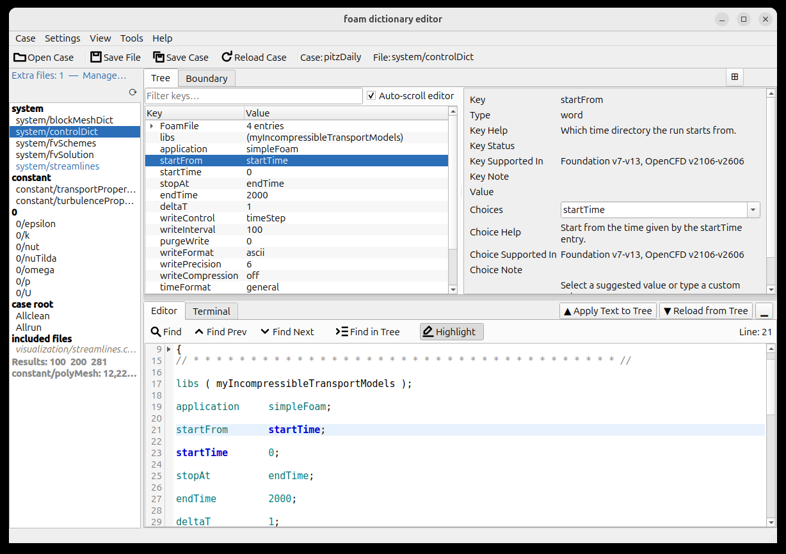
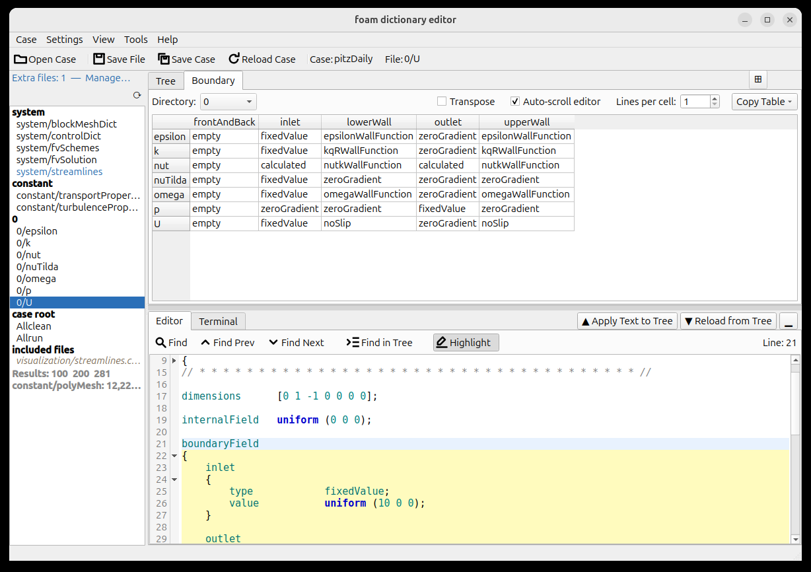

# Foam Dictionary Editor (FoDE)

FoDE — Foam Dictionary Editor（読み方: "フォーディー"）

## FoDE とは？

FoDE は OpenFOAM ケースの辞書ファイルをグラフィカルに編集するツールです。構造化されたツリー表示とプレーンテキストエディタの両方で辞書を閲覧・編集・管理できます。OpenFOAM シミュレーションを行うエンジニアや研究者が、ケースファイルのセットアップや修正をより手軽に行えることを目指しています。

## このガイドについて

本書は FoDE の全機能リファレンスです。すべてのパネル・メニュー・ダイアログ・操作手順を網羅しています。インストール手順とクイックスタートは [README_ja.md](README_ja.md) を参照してください。プロジェクト構成・開発環境・テストについては [DEVELOPER_ja.md](DEVELOPER_ja.md) を参照してください。

## 目的別ガイド

| やりたいこと | 参照セクション |
|---|---|
| ケースのファイルを管理する | [ファイル一覧の挙動](#ファイル一覧の挙動) |
| デフォルト以外のファイルやディレクトリ、結果タイムステップをファイル一覧に追加する | [追加ディレクトリの登録](#追加ディレクトリの登録) |
| ケースを開く・再読み込みする | [ケースの再読み込み](#ケースの再読み込み) |
| ケースを保存・複製する | [ケースの複製](#ケースの複製) / [新しいケースとして保存](#新しいケースとして保存) |
| ファイルをバックアップする・古いバックアップを整理する | [バックアップの作成](#バックアップの作成) / [バックアップファイルの一括削除](#バックアップファイルの一括削除) |
| 2 つのケースを比較する | [ケース比較](#ケース比較) |
| チュートリアルやテンプレートケースを使う | [ケースライブラリ](#ケースライブラリ) |
| 同梱のサンプルケースで FoDE を試す | [同梱サンプルケース](#同梱サンプルケース) |
| マルチリージョン（CHT）ケースを扱う | [マルチリージョンケース](#マルチリージョンケース) |
| `#include` で取り込まれたファイルを見る / OpenFOAM インストール内のファイルを編集する | [インクルードされたファイル](#インクルードされたファイル) |
| ツリーとテキストの同期を理解する | [ツリーとテキストの編集フロー](#ツリーとテキストの編集フロー) |
| ツリーで値を編集する | [ツリービューのコンテキストメニュー](#ツリービューのコンテキストメニュー) |
| blockMeshDict のブロックを 1 つずつ編集する | [対応構文とノード型](#対応構文とノード型)（`block_entry`） |
| blockMeshDict のブロックを追加・複製・削除する | [エントリの追加・複製](#エントリの追加複製) / [コメントアウトと削除](#コメントアウトと削除) |
| 辞書設定のヘルプを確認する | [詳細ペイン](#詳細ペイン) |
| 変数ファイルを切り替えずに全境界条件を一覧する | [境界条件ビュー](#境界条件ビュー) |
| 境界条件を全フィールドファイルへ一括で追加・削除する | [削除](#全フィールドファイルからの境界条件削除) / [全フィールドファイルへの境界条件追加](#全フィールドファイルへの境界条件追加) |
| blockMeshDict と全フィールドファイルにまたがって境界パッチをリネームする | [境界パッチのリネーム](#境界パッチのリネーム) |
| 境界条件テーブルをレポートにコピーする（Markdown/CSV） | [テーブルのコピー](#テーブルのコピー) |
| blockMeshDict のジオメトリを 3D で確認する | [BlockMesh パネル](#blockmesh-パネル) |
| topoSetDict のジオメトリを 3D で確認する | [topoSetDict オーバーレイ](#toposetdict-オーバーレイ) |
| snappyHexMeshDict の surface / region を 3D で確認する | [snappyHexMeshDict オーバーレイ](#snappyhexmeshdict-オーバーレイ) |
| setFieldsDict の領域を 3D で確認する | [setFieldsDict オーバーレイ](#setfieldsdict-オーバーレイ) |
| ツリーと 3D ビューを同時に表示する | [サイドバイサイドモード](#サイドバイサイドモード) |
| 頂点座標を調整して 3D 表示への効果をすぐ確認する | [頂点テーブル](#頂点テーブル) |
| topoSet/snappyHexMesh の形状を STL にエクスポートする・STL/OBJ を重ねて表示する | [ジオメトリコントロール](#ジオメトリコントロール) |
| 生成されたメッシュを ParaView で確認する | [Open Mesh in ParaView](#open-mesh-in-paraview) |
| ツリーキーを絞り込む | [ツリーキーフィルター](#ツリーキーフィルターとエディタ同期) |
| エディタのカーソル行からツリーエントリへ移動する | [Find in Tree](#ツリーキーフィルターとエディタ同期) |
| エディタでテキストを検索する | [Editor ツールバー](#現在のui構成) |
| キーボードショートカットを確認する | Help > Keyboard Shortcuts… |
| FoDE から OpenFOAM コマンドを実行する | [ターミナルタブ](#ターミナルタブ) |
| メッシュが最新かどうかを確認する | [メッシュ有無・古さのインジケーター](#メッシュ有無古さのインジケーター) |
| FoDE を離れずに blockMesh を実行・0/ を復元する | [Run blockMesh](#run-blockmesh) / [Restore 0/ from 0.orig](#restore-0-from-0orig) |
| FoDE を離れずに snappyHexMesh・topoSet を実行する | [Run snappyHexMesh](#run-snappyhexmesh) / [Run topoSet](#run-toposet) |
| 初期場の領域を設定する、またはメッシュを検証する | [Run setFields](#run-setfields) / [Run checkMesh](#run-checkmesh) |
| ケースのワークフロー全体を実行する、またはケースを初期状態にクリーンする | [Run Allrun Script](#run-allrun-script) / [Run Allclean Script](#run-allclean-script) / [Clean Case](#clean-case-foamcleantutorials) |
| ソルバー実行中に残差をプロットする | [foamMonitor ランチャー](#foammonitor-ランチャー) |
| 数千行に及ぶ log.snappyHexMesh をスクロールせずに読む | [View Log Summary](#view-log-summary) |
| キーワードや function object が実際のケースでどう使われているか調べる | [Find OpenFOAM Examples](#find-openfoam-examples) |
| バリアント（ターミナルなし・BlockMesh）を選ぶ | [バリアント](#バリアント) |
| カスタムキーのスキーマを追加する | [スキーマモジュール設定](#スキーマモジュール設定) |
| 自分の OpenFOAM バージョンに合わせてシンタックスハイライトを更新する | [Generate OpenFOAM Keywords](#generate-openfoam-keywords) |
| 前回の続きから再開する／その動作を止める | [セッションの復元](#セッションの復元) |
| アプリの設定を変更する | [アプリケーション設定](#アプリケーション設定) |
| UI 言語を切り替える（English / 日本語） | Settings > Language |
| 配色テーマを切り替える（システム/ライト/ダーク） | Settings > Appearance |
| ヘルプリンクや参照サイトを開く | [Resources ダイアログ](#resources-ダイアログ) |
| アプリの注釈付きスクリーンショットを見る | [スクリーンショットギャラリー](docs/SCREENSHOTS_ja.md) |
| アプリを実際に使っている様子を見る | [デモ動画](docs/DEMO_SCRIPTS_ja.md) |

## 目次

**はじめに**
- [機能](#機能)
- [現在のUI構成](#現在のui構成)
- [現在のケースとファイル表示](#現在のケースとファイル表示)

**ファイル・ケース管理**
- [ファイル一覧の挙動](#ファイル一覧の挙動)
  - [ディレクトリヘッダーのマーカー](#ディレクトリヘッダーのマーカー)
  - [デフォルト対象ファイル](#デフォルト対象ファイル)
  - [マルチリージョンケース](#マルチリージョンケース)
  - [インクルードされたファイル](#インクルードされたファイル)
  - [シンボリックリンクの表示](#シンボリックリンクの表示)
  - [実行時のファイル追加](#実行時のファイル追加)
  - [追加ディレクトリの登録](#追加ディレクトリの登録)
  - [追加ファイル・ディレクトリインジケーター](#追加ファイルディレクトリインジケーター)
  - [追加ファイル・ディレクトリの削除](#追加ファイルディレクトリの削除)
  - [数値タイムディレクトリのインジケーター](#数値タイムディレクトリのインジケーター)
  - [メッシュ有無・古さのインジケーター](#メッシュ有無古さのインジケーター)
  - [バックアップの作成](#バックアップの作成)
  - [新規ファイルの作成](#新規ファイルの作成)
  - [バックアップファイルの一括削除](#バックアップファイルの一括削除)
  - [ファイルの削除](#ファイルの削除)
  - [ファイルの複製](#ファイルの複製)
  - [フィールドディレクトリの複製](#フィールドディレクトリの複製)
  - [フィールドディレクトリの削除](#フィールドディレクトリの削除)
  - [ファイル一覧のリセット](#ファイル一覧のリセット)
- [ケース比較](#ケース比較)
- [ケースライブラリ](#ケースライブラリ)
- [同梱サンプルケース](#同梱サンプルケース)
- [ケースの再読み込み](#ケースの再読み込み)
- [新しいケースとして保存](#新しいケースとして保存)
- [ケースの複製](#ケースの複製)

**編集**
- [ツリーとテキストの編集フロー](#ツリーとテキストの編集フロー)
- [ツリービューのコンテキストメニュー](#ツリービューのコンテキストメニュー)
- [詳細ペイン](#詳細ペイン)
- [境界条件ビュー](#境界条件ビュー)
  - [テーブルの構成](#テーブルの構成)
  - [ディレクトリ切り替え](#ディレクトリ切り替え)
  - [転置（Transpose）](#転置transpose)
  - [シングルクリックナビゲーション](#シングルクリックナビゲーション)
  - [境界条件の編集](#境界条件の編集)
  - [パッチエントリの作成](#パッチエントリの作成)
  - [パッチエントリの削除](#パッチエントリの削除)
  - [コピー・ペースト](#コピーペースト)
  - [テーブルのコピー](#テーブルのコピー)
  - [境界パッチのリネーム](#境界パッチのリネーム)
  - [全フィールドファイルからの境界条件削除](#全フィールドファイルからの境界条件削除)
  - [全フィールドファイルへの境界条件追加](#全フィールドファイルへの境界条件追加)
- [BlockMesh パネル](#blockmesh-パネル)
  - [サイドバイサイドモード](#サイドバイサイドモード)
  - [変数の解決](#変数の解決)
  - [ジオメトリコントロール](#ジオメトリコントロール)
  - [topoSetDict オーバーレイ](#toposetdict-オーバーレイ)
  - [snappyHexMeshDict オーバーレイ](#snappyhexmeshdict-オーバーレイ)
  - [setFieldsDict オーバーレイ](#setfieldsdict-オーバーレイ)
  - [オーバーレイのクリップ表示](#オーバーレイのクリップ表示)
  - [頂点テーブル](#頂点テーブル)
  - [マウス操作](#マウス操作)
- [パース失敗時の挙動](#パース失敗時の挙動)

**ナビゲーション・検索**
- [ツリーキーフィルターとエディタ同期](#ツリーキーフィルターとエディタ同期)
  - [ツリーキーフィルター](#ツリーキーフィルター)
  - [エディタ同期（Auto-scroll editor）](#エディタ同期auto-scroll-editor)
  - [Find in Tree（エディタ → ツリー方向）](#ツリーキーフィルターとエディタ同期)
- [エディタの挙動](#エディタの挙動)

**設定**
- [ターミナルタブ](#ターミナルタブ)
- [バリアント](#バリアント)
- [スキーマモジュール設定](#スキーマモジュール設定)
- [Generate OpenFOAM Keywords](#generate-openfoam-keywords)
- [アプリケーション設定](#アプリケーション設定)
- [セッションの復元](#セッションの復元)
- [設定のリセット](#設定のリセット)
- [Resources ダイアログ](#resources-ダイアログ)

**ツール**
- [foamMonitor ランチャー](#foammonitor-ランチャー)
- [Restore 0/ from 0.orig](#restore-0-from-0orig)
- [Run blockMesh](#run-blockmesh)
- [Run snappyHexMesh](#run-snappyhexmesh)
- [Run topoSet](#run-toposet)
- [Run setFields](#run-setfields)
- [Run checkMesh](#run-checkmesh)
- [Run Allrun Script](#run-allrun-script)
- [Open Mesh in ParaView](#open-mesh-in-paraview)
- [Run Allclean Script](#run-allclean-script)
- [Clean Case (foamCleanTutorials)](#clean-case-foamcleantutorials)
- [View Log Summary](#view-log-summary)
- [Find OpenFOAM Examples](#find-openfoam-examples)

**リファレンス**
- [外観と配色](#外観と配色)
- [対応構文とノード型](#対応構文とノード型)
- [制限事項](#制限事項)
- [免責事項](#免責事項)
- [謝辞](#謝辞)

---

## 機能

- OpenFOAM ケースディレクトリを開き、代表的な辞書ファイルを一覧表示します。
- `controlDict`、`fvSchemes`、`fvSolution`、`blockMeshDict`、`snappyHexMeshDict`、`transportProperties` など、多数の代表的な辞書ファイルを読み込んで編集できます。
- `0` および `0.orig` ディレクトリ直下にあるファイルを自動的に一覧へ追加します。
- `chtMultiRegionFoam` / `chtMultiRegionSimpleFoam` 等のマルチリージョンケース構造を自動検出し、`system/fluid` や `constant/heater` のようなグループヘッダーごとにリージョンのファイルを一覧表示します。
- `constant/` や各リージョンの constant ディレクトリに存在する `thermophysicalProperties.air` や `turbulenceProperties.water` のようなフェーズバリアントファイルを glob で自動収集します。
- ケースルート直下の `All*` スクリプト（`Allrun`、`Allrun.pre`、`Allclean` など）を **case root** グループへ自動的に一覧表示し、Tools メニューから実行するスクリプトを確認・編集できます。スクリプトはシェル用シンタックスハイライト付きのテキストとして開かれ（ツリービューなし）、保存しても実行権限は保持され、ケースの複製にも含まれます。それ以外のケースルート直下のファイル（`log.*`、計算結果、`*.foam`）は表示されません。
- シンボリックリンクをファイル一覧に `⇢` マーカー付き・斜体で表示します。ホバーするとリンク先パスをツールチップで確認できます。
- ファイル一覧のディレクトリヘッダーを右クリックすることで、デフォルトリストにないファイルを実行時に追加できます。
- 任意のディレクトリをファイル一覧に追加し、`0/` や `0.orig/` と同様にディレクトリ内のファイルを自動スキャンできます。フラット（直下ファイルのみ、デフォルト）または再帰スキャン（サブディレクトリを含む）を選択できます。カスタムフィールドディレクトリ（`initial/`）、再起動タイムステップ（`0.5/`）、深い階層のサブディレクトリ（`lagrangian/chemkin/`）、`validation/` などのディレクトリツリーに対応します。追加ディレクトリのヘッダーは**紫色**で表示されます。**Results** インジケーターを右クリックして数値タイムディレクトリを直接追加するか、**Settings > Manage Extra Files & Directories…** またはインジケーターボタンから任意のディレクトリを追加できます。
- ディレクトリヘッダーを右クリックして、FoamFile テンプレートから新規ファイルを作成できます。
- ケースごとの追加ファイルおよびディレクトリの設定を `.foam-editor-files.json` としてケースディレクトリ内に保存できます。
- 追加ファイルまたはディレクトリが登録されている場合は、ファイル一覧の上部にインジケーターを表示します。インジケーターをクリックすると管理ダイアログを開けます。
- 追加ファイルを右クリックで個別に削除するか、管理ダイアログのファイル・ディレクトリ両方のタブからまとめて管理できます。
- ファイル一覧のファイルを右クリックしてタイムスタンプ付きバックアップを作成できます。
- ファイル一覧のファイルを右クリックしてディスクから削除できます。確認ダイアログで「バックアップを作成してから削除」「そのまま削除」「キャンセル」の 3 択を選べます。削除は元に戻せません。
- **Case > Clean Backup Files...** から、現在のケースに蓄積した `.bak_*` ファイルをまとめて削除できます。ケースディレクトリ全体を再帰スキャンして一覧表示し、チェックボックス（デフォルト全選択）と **Select All** / **Deselect All** ボタンで素早く選択できます。
- ファイル一覧のファイルを右クリックして複製できます。新しいファイル名を入力するダイアログが表示され、FoamFile ヘッダーの `object` フィールドも新しい名前へ自動更新されます。複製元に未保存の変更がある場合は、保存してから複製・未保存のまま複製・キャンセルの 3 択が表示されます。
- `0/` または `0.orig/` ディレクトリのいずれか一方しか存在しない場合、グループヘッダーを右クリックしてもう一方のディレクトリを複製作成できます。
- `0` グループヘッダーを右クリックして `0/` ディレクトリをディスクから削除できます。`0.orig` が存在する場合にのみ表示されます。確認ダイアログで削除対象の完全パスが表示されます。`0/` 内で開いていたファイルは閉じられ、削除は元に戻せません。
- **Boundary** タブで、全フィールド変数の全境界条件を一覧できます。デフォルトでは行がフィールドファイル、列がパッチですが、**Transpose** チェックボックスで行列を入れ替えられます。セルをダブルクリックして内容を編集、または `–` セルをダブルクリックして新規エントリを作成できます。右クリックメニューでセルの編集・作成・削除・コピー・ペースト・リネームを行えます。パッチの列/行ヘッダーを右クリックすると、そのパッチの境界条件をリネームしたり、全フィールドファイルからまとめて削除したり、全フィールドファイルに新規パッチエントリを追加したりできます。**Copy Table** ボタンでテーブル全体を Markdown または CSV としてクリップボードにコピーできます。
- パース済みの辞書構造をツリー表示できます。ツリー上部の**フィルターバー**にキー名の一部を入力すると、一致する行だけに絞り込めます（大文字・小文字を区別しない再帰マッチ）。
- パーサが完全に解釈できなかった `unknown_raw_entry` ノードをツリー内で**琥珀色（アンバー）**で強調表示し、通常エントリと区別できます。
- ファイル一覧の下部に、数値名のタイムディレクトリ（`0.5`、`1`、`10` のような OpenFOAM の計算結果ディレクトリ）の存在を太字で示す **Results: …** 行を表示します。最大 6 件のディレクトリ名を表示し、それ以上の場合は `(+N more)` を付加します。ホバーすると件数と範囲が確認できます。右クリックすると各タイムディレクトリを追加ディレクトリとしてファイル一覧に登録できます。
- ツリーの **Type** 列はデフォルトで非表示です。**View > Show Type Column** で表示・非表示を切り替えられます。
- 右側の詳細ペインで各設定の詳細情報（説明、選択肢、対象ソルバーバージョン、注記）を確認できます。
  スキーマ情報は主要な設定項目の一部に提供されており、すべての設定を網羅しているわけではありません。
- 詳細ペインから選択ノードの値を直接編集できます。`int` ノードに小数値を入力すると、自動的に `scalar` へ型が昇格されます。
- 独自のスキーマモジュールを作成することで、スキーマ情報をカスタマイズ・拡張できます。
- 下部のテキストエディタでファイルの生テキストを直接編集できます。
- 行番号と現在行の位置を表示します。
- **Reload from Tree** により、現在のツリーから生テキストを再生成できます。
- **Apply Text to Tree** により、編集済みテキストを再パースしてツリーへ反映できます。
- **Save File** により、現在のファイルを生テキストエディタの内容で保存できます。
- **Save Case** により、変更されたすべてのファイルを一括保存できます。
- トップバーの **Reload Case** ボタンまたは **Case > Reload Case** でケースをディスクから再読み込みし、すべてのメモリ上の編集内容を破棄できます。未保存のファイルがある場合は、対象ファイル数を示す確認ダイアログが表示されます。
- **Case > Duplicate Case** により、現在のケースを別の名前のディレクトリへ複製できます。全ファイルコピーまたは app が表示しているファイルのみのコピーを選択できます。
- **Case > Save as New Case...** により、ディスクからファイルをコピー（全ファイルまたはアプリ表示ファイルのみ、選択可能）した上で未保存の編集内容を書き込み、新しいケースへ切り替えられます。元のケースは変更されません。
- **ケースライブラリ**に参照ケースのディレクトリを登録しておくことで、素早くアクセスできます。環境変数が設定されていれば `$FOAM_TUTORIALS` ディレクトリが自動的に追加されます。
- **Case > Open from Case Library...** で、ケースライブラリ内の任意のディレクトリから直接ケースを開けます。
- **Case > Duplicate from Case Library...** で、ケースライブラリ内のケースを作業ディレクトリへ複製できます。コピー先の親ディレクトリにはデフォルトケースディレクトリが自動入力されます。
- `system/` と `constant/` の両方が存在しないディレクトリを開こうとした場合、有効な OpenFOAM ケースでない可能性を示す警告ダイアログを表示します。それでも開くことは可能です。
- ファイルマネージャからケースディレクトリをウィンドウ上の任意の場所にドロップしてケースを開けます。未保存の変更がある場合は確認ダイアログが表示されます。
- ツリービューの右クリックメニューから、エントリの追加・複製・コメントアウト・復元・削除を行えます。
- 中央のツリービューで右クリックメニューまたは Ctrl+C / Ctrl+V からノードの Value をコピー・ペーストできます。
- ウィンドウ下部の **Terminal** タブでシェルコマンドを実行できます。ケースを開くと自動的にそのディレクトリへ移動します。
- 編集ツールバーから Undo、Redo、Cut、Copy、Paste、Select All、Find、Find Next を利用できます。
- パースに失敗してもテキストエディタはそのまま利用できます。
- **Settings** メニューからスキーマモジュールやアプリ設定を実行時に変更できます。
- **Help > Resources...** から OpenFOAM 公式ドキュメントへのリンクと、個人用参照リンクを管理できます。**My Links** タブでリンクの追加・編集・並び替え・削除が可能です。エントリをダブルクリックするとブラウザで開きます。リンクは `app_config.json` に保存されます。

## 現在のUI構成



メインウィンドウは水平スプリッタで左右に分割されています。

- **左カラム** — OpenFOAM ケースのファイル一覧（ウィンドウ全高）。
- **右カラム** — 垂直スプリッタで上下に分割。
  - **上段** — タブ切り替えパネル（最大 3 タブ）。
    - **Tree** タブ — パース済み辞書のツリー表示（中央）と詳細編集ペイン（右）。`blockMeshDict`、`topoSetDict`、`snappyHexMeshDict`、`setFieldsDict` のいずれかがアクティブなファイルのとき、タブバーの右上に **⊞** ボタンが表示されサイドバイサイドモードを起動できます（「[BlockMesh パネル — サイドバイサイドモード](#サイドバイサイドモード)」参照）。
    - **Boundary** タブ — 全フィールド変数の境界条件テーブル（「[境界条件ビュー](#境界条件ビュー)」参照）。
    - **BlockMesh** タブ — `blockMeshDict` ジオメトリのインタラクティブ 3D ビューア（「[BlockMesh パネル](#blockmesh-パネル)」参照）。シンプルターミナルが有効なときのみ表示。**View > BlockMesh 3-D Panel** でも切り替え可能。
  - **下段** — タブ切り替えパネル。
    - **Editor** タブ — 行番号付きのプレーンテキストエディタ。
    - **Terminal** タブ — モード切替機能付きの統合ターミナル（詳細は「[ターミナルタブ](#ターミナルタブ)」を参照）。

上部のアクションバーには、頻繁に使う操作と現在のケース・ファイル表示があります。

- Save File
- Save Case
- Apply Text to Tree
- Reload from Tree
- Case: 現在ケース名表示
- File: 現在ファイル名表示

**Editor** タブには、テキスト検索操作用のツールバー行があります。

- Find — 検索ダイアログを開きます（Ctrl+F）。
- Find Prev — 前の一致箇所に移動します（Shift+F3）。
- Find Next — 次の一致箇所に移動します（F3）。
- Find in Tree — 現在のカーソル行を含むソーススパンを持つ最も深いツリーノードを選択します（Ctrl+Shift+T）。
- Highlight — シンタックスハイライトのオン／オフを切り替えるトグルボタン。設定は `app_config.json` に保存され、次回起動時に復元されます。
- Line: N — 現在のカーソル行番号（ツールバー右端）。

メニューバーには **Case** メニュー、**View** メニュー、**Settings** メニュー、**Tools** メニュー、**Help** メニューがあります。

**Case メニュー:**

- Case > Open Case `Ctrl+O`
- Case > Open from Case Library...
- *ドラッグ＆ドロップ:* ファイルマネージャからケースディレクトリをウィンドウ上の任意の場所にドロップするとケースを開きます。未保存の変更がある場合は確認ダイアログが表示されます。
- Case > Reload Case
- Case > Duplicate Case...
- Case > Duplicate from Case Library...
- Case > Find OpenFOAM Examples… — Tools > Find OpenFOAM Examples… と同じアクションです。チュートリアルケースを複製して新しいケースの出発点にできるため、ここにも表示されます。[Find OpenFOAM Examples](#find-openfoam-examples) を参照。
- Case > Save as New Case...
- Case > Clean Backup Files...
- Case > Compare with Case...
- Case > Save File `Ctrl+S`
- Case > Save Case `Ctrl+Shift+S`
- Case > Exit `Ctrl+Q`

**View メニュー:**

- View > Show Type Column（チェック式、デフォルトで非表示）
- View > BlockMesh 3-D Panel（チェック式。BlockMesh タブの表示・非表示を切り替えます。xterm ターミナルモードが有効な場合は GPU 競合のためグレーアウトし、ラベルが **"BlockMesh 3-D Panel  (unavailable: xterm active)"** に変わります）
- View > View Log Summary… — Tools > View Log Summary… と同じアクションで、見つけやすさのためここにも表示されます。[View Log Summary](#view-log-summary) を参照。

**Settings メニュー:**

- Settings > Set Default Case Directory
- Settings > Manage Case Library…
- Settings > Manage Extra Files & Directories…
- Settings > Reset File List
- Settings > Manage Schema Modules
- Settings > Reset Window Size
- Settings > Reset All Settings…
- Settings > Appearance — 配色テーマを選択します: **Follow System**（既定）、**Light**、**Dark**。アプリケーションを再起動すると反映されます。[外観と配色](#外観と配色)を参照してください。
- Settings > Language — UI の言語を選択します（English / 日本語）。アプリケーションを再起動すると反映されます。
- Settings > Generate OpenFOAM Keywords… — 選択した OpenFOAM インストールからシンタックスハイライト用のキーワード一覧を再生成します。[Generate OpenFOAM Keywords](#generate-openfoam-keywords) を参照。

**Tools メニュー:**

- Tools > foamMonitor… — `foamMonitor` を起動し、残差などの時系列データを gnuplot でプロットします。[foamMonitor ランチャー](#foammonitor-ランチャー) を参照。
- Tools > Restore 0/ from 0.orig — `0.orig/` から `0/` を再作成します。[Restore 0/ from 0.orig](#restore-0-from-0orig) を参照。
- Tools > Run blockMesh… — オプションを選択してケースディレクトリで `blockMesh` を実行します。[Run blockMesh](#run-blockmesh) を参照。
- Tools > Run snappyHexMesh… — オプションを選択してケースディレクトリで `snappyHexMesh` を実行します。[Run snappyHexMesh](#run-snappyhexmesh) を参照。
- Tools > Run topoSet… — オプションを選択してケースディレクトリで `topoSet` を実行します。[Run topoSet](#run-toposet) を参照。
- Tools > Run setFields… — オプションを選択してケースディレクトリで `setFields` を実行します。先に `0/` を `0.orig/` から復元するかを選べます。[Run setFields](#run-setfields) を参照。
- Tools > Run checkMesh… — オプションを選択してケースディレクトリで `checkMesh` を実行します。[Run checkMesh](#run-checkmesh) を参照。
- Tools > Run Allrun Script — ケースの `./Allrun` スクリプト（ソルバーを含む）を実行します。[Run Allrun Script](#run-allrun-script) を参照。
- Tools > Open Mesh in ParaView… — 現在のケースを ParaView で開きます。[Open Mesh in ParaView](#open-mesh-in-paraview) を参照。
- Tools > Run Allclean Script — ケースの `./Allclean` スクリプトを実行します。[Run Allclean Script](#run-allclean-script) を参照。
- Tools > Clean Case (foamCleanTutorials) — `foamCleanTutorials` でケースをクリーンします。[Clean Case (foamCleanTutorials)](#clean-case-foamcleantutorials) を参照。
- Tools > View Log Summary… — `log.*` ファイルの要約を表示します。[View Log Summary](#view-log-summary) を参照。
- Tools > Find OpenFOAM Examples… — OpenFOAM のチュートリアルと `etc/caseDicts` テンプレートからキーワードの使用例を検索します。Case メニューにも表示されます。[Find OpenFOAM Examples](#find-openfoam-examples) を参照。

**Help メニュー:**

- Help > About Foam Dictionary Editor (FoDE)... — アプリケーションのバージョン（git チェックアウトから実行した場合は開発ビルドの短い接尾辞付き）、ライセンス、謝辞を表示します。
- Help > Keyboard Shortcuts...
- Help > Resources...

## 現在のケースとファイル表示

上部バーには現在のケース名（ディレクトリ名）と、現在ファイルを `親ディレクトリ/ファイル名` の形式で表示します。たとえば `system/controlDict` や `constant/transportProperties` のように表示されます。

ケースまたはファイルが未読み込みの場合は `-` を表示します。

## ファイル一覧の挙動

ファイル一覧は `services/case_loader.py` により構築されます。デフォルト対象ファイル、ユーザーが追加したファイル、フィールドファイルの自動列挙を組み合わせています。

### ディレクトリヘッダーのマーカー

ファイル一覧の各ディレクトリグループは太字のヘッダーで表示されます。そのディレクトリにファイルが存在するにもかかわらず、現在のファイル一覧に含まれていない場合は `[+]` サフィックスが付きます。全ファイルが一覧に含まれている場合はマーカーなしで表示されます。

### デフォルト対象ファイル

**system/**

- `blockMeshDict`
- `changeDictionaryDict`
- `controlDict`
- `createBafflesDict`
- `createPatchDict`
- `decomposeParDict`
- `extrudeMeshDict`
- `fvOptions`
- `fvSchemes`
- `fvSolution`
- `meshQualityDict`
- `mirrorMeshDict`
- `refineMeshDict`
- `setFieldsDict`
- `snappyHexMeshDict`
- `surfaceFeatureExtractDict`
- `topoSetDict`

**constant/**

- `boundaryRadiationProperties`
- `dynamicMeshDict`
- `fvOptions`
- `g`
- `kinematicCloudProperties`
- `radiationProperties`
- `regionProperties`
- `thermophysicalProperties`
- `transportProperties`
- `turbulenceProperties`

これに加えて、ケース内に `0` および `0.orig` ディレクトリが存在する場合、それぞれの直下にあるファイルも自動的に一覧へ追加されます。

`thermophysicalProperties.*` および `turbulenceProperties.*` にマッチするフェーズバリアントファイル（例: `thermophysicalProperties.air`）は、`constant/` および各リージョンの constant ディレクトリから glob で自動収集されます。

### ケースルートのスクリプト

ケースルート直下の `All*` にマッチするスクリプトファイル（`Allrun`、`Allrun.pre`、`Allclean` など）は、他のすべてのグループの後に表示される **case root** グループへ自動的に一覧表示されます。Tools メニューからこれらのスクリプトを実行できるため、実行される内容をそのまま確認・編集できます。それ以外のケースルート直下のファイル（`log.*`、`*.foam`、結果ディレクトリ）は一覧を簡潔に保つためデフォルトでは表示されず、このグループに `[+]` マーカーが付くこともありません（ルートにはほぼ常に未表示のログが存在するため、マーカーが常時点灯してしまうからです）。特定のルートファイル — 実行ログ、`README`、カスタムスクリプトなど — を一覧に加えたい場合は、**case root** ヘッダーを右クリックして **Add files from 'case root'...** を選択します。同じメニューには他のディレクトリヘッダーと同様に **New file in 'case root'...** もあります。隠しファイル（`.` で始まる名前）は候補に表示されません。

スクリプトはシェルファイルであり OpenFOAM 辞書ではないため、開いてもテキストエディタにのみ表示されます — ツリービューは空のままで、**Apply Text to Tree** は効果がなく、比較モードの対象にもなりません。エディタは（`#!` シバンの検出により）自動的にシェル用のシンタックスハイライトに切り替わり、`#` コメント、引用符付き文字列、`$変数`、`runApplication`・`runParallel` などの OpenFOAM 実行ヘルパー、および通常の OpenFOAM キーワードリストによるユーティリティ・ソルバー名が色分けされます。編集と保存は他のファイルと同様に行え、実行権限は保持されます。また、ケースを複製したり新しいケースとして保存したりする際にもスクリプトが含まれるため、複製後も Tools メニューから実行できます。

### マルチリージョンケース

`system/` 内にサブディレクトリが存在する場合、各サブディレクトリをリージョン名として認識し、追加のファイルグループを構築します。リージョンごとに次のファイルが存在すれば一覧に追加されます。

**system/\<region\>/**

- `changeDictionaryDict`
- `decomposeParDict`
- `fvOptions`
- `fvSchemes`
- `fvSolution`
- `meshQualityDict`

**constant/\<region\>/**

- `boundaryRadiationProperties`
- `dynamicMeshDict`
- `fvOptions`
- `radiationProperties`
- `thermophysicalProperties`
- `turbulenceProperties`

各リージョンディレクトリはファイル一覧に独立したグループヘッダー（例: `system/fluid`、`constant/heater`）として表示されます。リージョングループはトップレベルの `system` および `constant` グループの後にソートされます。

`0/<region>/` および `0.orig/<region>/` 内のフィールドファイルも自動的に一覧表示されます。グループヘッダーは `0/fluid` や `0/solid` のように表示されます。`chtMultiRegionFoam` のようにリージョンごとに初期条件ファイルを持つケース（例: `0/heater/T`、`0/bottomWater/p`）に対応しています。

### インクルードされたファイル

辞書は `#include`（および `#sinclude`、`#includeIfPresent`、`#includeEtc`、`#includeFunc`）で別のファイルを取り込めます。FoDE はこれらのディレクティブを追跡し、参照先のファイルをファイル一覧に表示するので、ディスク上を探し回らずに内容を読めます。取り込み元の辞書に内容が展開されることはありません。インクルードされたファイルはシンボリックリンクされたファイルと同じように独立したファイルのままで、ディレクティブもツリー上の 1 行として残ります。

表示先はファイルの場所によって変わります。

- **ケース内** — 本来所属するグループに入ります。`constant/dynamicMeshDict` の `#include "caseSettings"` なら `caseSettings` は **constant** グループに `↳` マーク付きで現れます。他のケースファイルと同様、編集も保存も可能です。
- **ケース外** — 典型的には `#includeEtc "caseDicts/setConstraintTypes"` や `#includeFunc solverInfo` で、OpenFOAM のインストール先に解決されます。これらは一覧下部の **included files** グループにまとめられ、斜体で表示されます。インクルードされたファイルにカーソルを合わせると、どのファイルの `#include` が取り込んだかが表示されます。

ケース外のファイルは**読み取り専用**です。編集するとマシン上の全ケースが共有するファイルを変えてしまうため、ツリーとテキストは表示されますが、テキストエディタはロックされ（Line 表示の隣に `read-only` バッジが出ます）、ツリーの項目は編集できず、Save・Create Backup・Duplicate・Delete も使えません。手を入れたい場合は右クリックして **Copy into case...** を選びます。ファイルがケース内（通常は OpenFOAM が最初に参照する `system/`）へコピーされ、コピーは編集可能になります。`#includeFunc` ならコピーは即座に効きます。`#includeEtc` の場合はディレクティブを素の `#include "<名前>"` に変えると、ローカルのコピーが使われます。

ディレクティブから参照先ファイルへ移動するには、ツリー上のディレクティブ行を右クリックして **Open Included File** を選ぶか、行の Key 列または Type 列をダブルクリックします。行にカーソルを合わせると、解決先、あるいは解決できなかった理由が表示されます。

- **not found** — ファイルが存在しません。チュートリアルにはインクルード対象を `Allrun` で生成するものがあるため、ケースを実行する前は正常な状態です。
- **optional include not present** — `#sinclude`/`#includeIfPresent` の対象が存在しません。これは正当であり、エラーではありません。
- **no OpenFOAM installation found** — `#includeEtc` と `#includeFunc` の解決にはインストールが必要です。**Settings** から選択してください（*Find OpenFOAM Examples* と同じインストール選択欄です）。

制限が 2 点あります。インクルードは**1 段階のみ**追跡するため、インクルードされたファイル自身のインクルードは辿りません。また、ケースがどの OpenFOAM バージョン向けに書かれたかは判別できないため、明示的に選択しない限り `#includeEtc` は見つかった最新のインストールに対して解決されます。

### シンボリックリンクの表示

ファイル一覧内のシンボリックリンクは、ファイル名の末尾に `⇢` マーカーを付け、斜体テキストで表示されます。アイテムにホバーするとパスとリンク先を含むツールチップが表示されます。シンボリックリンクを編集するとリンク先ファイルへ書き込まれます（OS のリンク解決と同じ動作）。

### 実行時のファイル追加

ファイル一覧のディレクトリヘッダー（**case root** ヘッダーを含む）を右クリックすると、次のコンテキストメニューが表示されます。

- **New file in '\<dir\>'...** — FoamFile テンプレートから新規ファイルを作成します（「[新規ファイルの作成](#新規ファイルの作成)」を参照）。
- **Add files from '\<dir\>'...** — 既存ファイルを一覧に追加します。そのディレクトリにあって未登録のファイルがダイアログで表示されます（`.` で始まる隠しファイルは除外されます）。1 つ以上選択して **OK** をクリックすると追加されます。
- **Remove '\<dir\>' from file list** — 追加ディレクトリをファイル一覧から削除します。追加ディレクトリのヘッダー（紫色）にのみ表示されます（「[追加ディレクトリの登録](#追加ディレクトリの登録)」を参照）。
- **Duplicate '\<dir\>' → '\<counterpart\>'...** — `0/` または `0.orig/` ディレクトリを複製してもう一方を作成します（「[フィールドディレクトリの複製](#フィールドディレクトリの複製)」を参照）。`0` および `0.orig` のヘッダーでのみ表示され、2 つのうちどちらか一方しか存在しない場合に限り表示されます。
- **Delete '0' directory...** — `0/` ディレクトリをディスクごと削除します（「[フィールドディレクトリの削除](#フィールドディレクトリの削除)」を参照）。`0` ヘッダーでのみ表示され、`0.orig` が存在する場合にのみ有効です。

追加したファイルはケースディレクトリ内の `.foam-editor-files.json` に保存され、次回ケースを開いたときに自動的に復元されます。**Duplicate Case** でアプリ表示ファイルのみコピーモードを使用した場合も、この設定ファイルがコピーされます。

追加ファイルはデフォルトのターゲットファイルと区別できるよう、ファイル一覧内で異なる色（青）で表示されます。

### 追加ディレクトリの登録

ケースルート内の任意のディレクトリをファイル一覧に追加し、`0/` や `0.orig/` と同様にディレクトリ内のファイルを自動スキャンできます。次のような用途に対応します。

- 非標準ソルバーが使うカスタムフィールドディレクトリ（例: `laserBeamFoam` の `initial/`）。
- 閲覧・編集したい再起動タイムステップ（例: `0.5/`、`1/`）。
- 補助辞書を含む深い階層のサブディレクトリ（例: `lagrangian/sprayFoam/aachenBomb/chemkin/`）。
- サブディレクトリにファイルを含む結果・検証ツリー（例: `validation/`）。

追加ディレクトリのグループヘッダーは**紫色**で表示されます。ファイルがすべて読み込まれるため、`[+]` の未読み込みマーカーは表示されません。

隠しファイル・隠しディレクトリ（`.` で始まる名前、例: アプリ自身の `.foam-editor-files.json` や `.git/` ツリー）は、追加ディレクトリのスキャンから常に除外されます。

**Results インジケーターからタイムディレクトリを追加する:**  
ファイル一覧下部の **Results: …** 行を右クリックします。各タイムディレクトリがサブメニューに表示されます。クリックするとそのディレクトリが追加されます。すでに追加済みのディレクトリはグレーアウトされます。

**管理ダイアログから任意のディレクトリを追加する:**  
**Settings > Manage Extra Files & Directories…**（またはファイル一覧上部のインジケーターボタン）を開きます。**Extra Directories** タブで **Add Directory…** をクリックするとケースディレクトリ配下のフォルダピッカーが開きます。追加したいサブディレクトリを選択して **OK** をクリックします。デフォルトはフラットスキャン（直下ファイルのみ）で追加されます。

**再帰スキャンを有効にする:**  
デフォルトのフラットスキャンではディレクトリ直下のファイルのみ一覧表示されます。サブディレクトリ内のファイルも含めるには、**Extra Directories** タブで対象エントリにチェックを付けて **Toggle Recursive** をクリックします。エントリのラベルが `<dir>  [recursive]` に変わり再帰モードであることを示します。同じエントリに再度 **Toggle Recursive** をクリックするとフラットスキャンに戻ります。

**追加ディレクトリを削除する:**  
紫色のディレクトリヘッダーを右クリックして **Remove '\<dir\>' from file list** を選択するか、管理ダイアログの **Extra Directories** タブでチェックを付けて **Remove Selected** をクリックします。

追加ディレクトリ内で作成・複製したファイルは、そのディレクトリ全体がスキャン対象のため、追加ファイルリストへは追加されません。

**追加ディレクトリ内の実行ログと大きな非ディクショナリファイル:**  
追加ディレクトリ経由で一覧に含まれた `log.*` 実行ログ（例: `log.blockMesh`、`log.simpleFoam`）は、ファイル一覧で**グレー（薄く）表示**され、常にプレーンテキストとして開かれます — 辞書パーサーは一切実行されないため、ツリービューはなく、**Apply Text to Tree** は効果がなく、ケース比較でもスキップされます（`≠` マーカーなし）。100 KB を超えるログを開く場合は、大きなテキストファイルの読み込みに時間がかかることがあるため、先に確認ダイアログが表示されます。それ以外の大きな非ディクショナリファイルにも同じ確認ダイアログが表示され、差分計算では同様にスキップされます。

### 追加ファイル・ディレクトリインジケーター

ケースが読み込まれている間は、ファイル一覧パネルの上部に常に **Manage extra files…** ボタンが表示されます。追加ファイルやディレクトリが登録されている場合はボタンの表示が件数に変わります（例: **Extra files: 2, directories: 1 — Manage…**）。クリックすると **Manage Extra Files & Directories** ダイアログが開き、2 つのタブで管理できます。

- **Extra Files** — 個別に登録した追加ファイルの一覧。1 件以上選択して **Remove Selected** で削除できます。
- **Extra Directories** — 登録した追加ディレクトリの一覧。**Add Directory…** で新しいディレクトリを追加し、**Remove Selected** で削除できます。

ダイアログを閉じると変更が即座に反映されます。

### 追加ファイル・ディレクトリの削除

**追加ファイルの場合:**
- ファイル一覧の追加ファイル（青色）を**右クリック**して **Remove from extra files** を選択します。即座に削除されます。
- 管理ダイアログの **Extra Files** タブで1件または複数件をまとめて削除します。

**追加ディレクトリの場合:**
- 紫色のディレクトリヘッダーを**右クリック**して **Remove '\<dir\>' from file list** を選択します。そのディレクトリのファイルが即座に一覧から消えます。
- 管理ダイアログの **Extra Directories** タブで1件または複数件をまとめて削除します。

削除してもディスク上のファイルは削除されません。ケースごとの設定から除外されるだけで、ファイル一覧に表示されなくなります。

### 数値タイムディレクトリのインジケーター

ケースルートに数値名のディレクトリ（`0.5`、`1`、`10` のような OpenFOAM の計算結果ディレクトリ）が存在する場合、`0`、`0.orig`、およびすでに追加ディレクトリとして登録済みのものを除いて、ファイル一覧の末尾に非選択の **Results: …** 行が追加されます。太字のグレーテキストで表示され、最大 6 件のディレクトリ名を並べます。7 件以上の場合は `(+N more)` サフィックスが付きます。ホバーすると件数と、複数ある場合は最初と最後のディレクトリ名が表示されます。

右クリックするとサブメニューが表示され、任意のタイムディレクトリを追加ディレクトリとしてファイル一覧に登録できます（「[追加ディレクトリの登録](#追加ディレクトリの登録)」を参照）。登録後はそのディレクトリは Results インジケーターに表示されなくなり、代わりに通常のグループヘッダーとして表示されます。

### メッシュ有無・古さのインジケーター

`constant/polyMesh/owner` が存在する場合、ファイル一覧の下部（Results インジケーターの近く）に非選択の行が追加され、**「constant/polyMesh: 8,000 cells」** のようにセル数が表示されます。この件数はメッシュ自体を解析するのではなく、ファイルの `FoamFile` ヘッダーの `note` フィールド（例: `nPoints:9261 nCells:8000 nFaces:25200`）から読み取るため、チェックは軽量です。ヘッダーから件数を読み取れない場合は **「constant/polyMesh (present)」** にフォールバックします。

`system/blockMeshDict` がメッシュの生成後に変更されている場合、インジケーターはアンバー色になり **「 — stale (blockMeshDict changed since last run)」** というサフィックスが付き、ツールチップに理由が表示されます。ホバーすると、利用可能な場合は常に頂点・セル・面の全カウントが表示されます。

インジケーターは自動的に更新されます。ファイル一覧が更新されるたびに再計算され、**Tools > Run blockMesh** の実行後、`blockMeshDict` の保存後（**Save File** / **Save Case**）、ファイルシステムウォッチャーが変更を検知した後のいずれでも、手動で **Reload Case** を行う必要はありません。

### バックアップの作成

ファイル一覧でファイルを右クリックし、**Create Backup** を選択すると、同じディレクトリにタイムスタンプ付きのコピーが保存されます（例: `controlDict.bak_20260502_143022`）。

バックアップはそのファイルが読み込み済みであれば現在のバッファの内容（未保存の編集を含む）を使用します。未読み込みの場合はディスク上のファイルをコピーします。ステータスバーにバックアップ完了のメッセージが表示され、未保存の編集が含まれる場合はその旨も表示されます。

### 新規ファイルの作成

ファイル一覧のディレクトリヘッダーを右クリックして **New file in '\<dir\>'...** を選択します。入力ダイアログでファイル名を指定すると、`<ケースディレクトリ>/<dir>/<name>` に最小限の FoamFile ヘッダーを持つファイルが作成されます。作成後、エディタで自動的に開かれます。

`0/` と `0.orig/` 以外のディレクトリで作成したファイルは `.foam-editor-files.json` に登録され、次回以降もファイル一覧に表示されます。

### バックアップファイルの一括削除

**Case > Clean Backup Files...** を選ぶと、現在のケースに蓄積した `.bak_*` ファイルをまとめて削除できます。ケースディレクトリ全体を再帰スキャンして `.bak_YYYYMMDD_HHMMSS` パターンに一致するファイルを一覧表示します。各ファイルは相対パスとサイズで表示されます。

全ファイルがデフォルトで選択された状態で開きます。チェックボックスで個別に選択を変更するか、**Select All** / **Deselect All** でまとめて切り替えられます。**Delete Selected (N)** ボタンは現在のチェック数を表示し、選択がない場合はグレーアウトされます。

**Delete Selected** をクリックすると追加確認なしに即座に削除されます。削除したファイルがエディタで開かれていた場合はエディタとツリービューがクリアされます。エラーが発生した場合は操作後に一覧が表示されます。

バックアップファイルが見つからない場合は「No backup files found.」と表示され、**Close** ボタンのみが表示されます。

### ファイルの削除

ファイル一覧の任意のファイルを右クリックして **Delete file...** を選択します。ファイル名を表示する確認ダイアログが開き、次の 3 択を選べます。

- **Backup && Delete** — 同じディレクトリにタイムスタンプ付きバックアップ（例: `controlDict.bak_20260506_143022`）を作成してから元ファイルを削除します。バックアップには現在のバッファの内容（未保存の編集を含む）が反映されます。バックアップの書き込みに失敗した場合、削除は中断されます。
- **Delete** — バックアップを作成せずにファイルを即座に削除します。
- **Cancel**（デフォルト）— 操作を中止します。

ファイルに未保存の変更がある場合は、ダイアログに追加の警告文が表示されます。削除後はそのファイルがメモリバッファ・ダーティ状態管理・ケースごとの追加ファイル設定から除外されます。削除したファイルがエディタで開かれていた場合は、エディタとツリービューがクリアされます。削除後にファイル一覧が自動更新されます。

この操作はディスク上のファイルを削除するため、元に戻せません。

### ファイルの複製

ファイル一覧の任意のファイルを右クリックして **Duplicate...** を選択します。現在のファイル名があらかじめ入力されたダイアログが表示され、新しいファイル名を指定できます。複製先は同じディレクトリで、FoamFile ヘッダーの `object` フィールドが新しいファイル名に自動更新されます。

複製元ファイルに未保存の変更がある場合は、次の 3 択が表示されます。

- **Save and Duplicate** — 先にファイルを保存してから複製します。
- **Duplicate with Unsaved Changes** — 現在のバッファの内容（未保存状態）をそのまま複製します。
- **Cancel** — 操作をキャンセルします。

`0/` と `0.orig/` 以外で複製したファイルは `.foam-editor-files.json` に登録されます。

### フィールドディレクトリの複製

ファイル一覧の `0` または `0.orig` ヘッダーを右クリックして **Duplicate '\<dir\>' → '\<counterpart\>'...** を選択します。このアクションはディレクトリ全体をコピーしてもう一方のディレクトリを作成します（`0/` → `0.orig/`、または `0.orig/` → `0/`）。このメニューは 2 つのうちどちらか一方しか存在しない場合にのみ表示されます。コピー開始前に確認ダイアログが表示されます。

### フィールドディレクトリの削除

ファイル一覧の `0` ヘッダーを右クリックして **Delete '0' directory...** を選択します。このアクションは `0/` ディレクトリとその中にあるすべてのファイルをディスクから完全に削除します。`0.orig` が存在する場合にのみ表示され、初期フィールドデータが保持されることが保証されます。

削除前に確認ダイアログで対象ディレクトリの完全パスが表示されます。現在開いているファイルが `0/` 内にある場合はエディタとツリービューがクリアされます。削除後にファイル一覧と境界条件パネルが自動更新されます。

この操作はディスク上のファイルを削除するため、元に戻せません。

### ファイル一覧のリセット

**Settings > Reset File List** を選択すると、現在のケースに対して追加したファイルおよびディレクトリをすべて削除できます。ケースディレクトリの `.foam-editor-files.json` が削除され、ファイル一覧がデフォルトに戻ります。

## 境界条件ビュー



右上パネルの **Boundary** タブに、現在のフィールドディレクトリにある全フィールド変数ファイルの境界条件テーブルが表示されます。

### テーブルの構成

**デフォルトの向き:**
- **行** — フィールドファイルごと（`epsilon`、`k`、`nut`、`p`、`U` など、ファイル名順）。
- **列** — 境界パッチ名ごと（アルファベット順）。

**転置の向き**（**Transpose** チェックボックスで切り替え）: 行がパッチ、列がフィールドファイルになります。

どちらの向きでも:
- 列は全ファイルにわたるパッチ名の和集合です。そのファイルに定義されていないパッチのセルは `–` で表示されます。
- **セルテキスト** — そのパッチの `type` 値（例: `fixedValue`、`zeroGradient`、`noSlip`）。大規模データまたはバイナリデータを含むパッチには `†` マーカーが付きます。
- **ツールチップ** — セルにホバーするとパッチ sub-dict の全テキストを表示します。`†` マーカーのあるセルでは、type と簡潔なデータ説明（`large data` または `binary data`）を表示します。
- **Lines per cell** — パネル右上のスピンボックスで、セルあたりの表示行数を 1〜10 の範囲で指定できます（デフォルト: 1）。2 以上に設定すると、`type` 行の下にパッチ sub-dict の追加キー・値が表示されます。値が大きい・複雑なエントリは `key  …` として表示されます。

### ディレクトリ切り替え

パネル上部のドロップダウンで表示対象のフィールドディレクトリを切り替えられます。`0` および `0.orig` のほか、マルチリージョンケースではリージョンごとのサブディレクトリ（例: `0/bottomWater`、`0/heater`、`0/topAir`）も選択肢に表示されます。パース可能なフィールドファイル（`boundaryField` 辞書を持つファイル）を含むディレクトリのみが表示されます。有効なディレクトリが 1 件のみの場合はドロップダウンが無効化されます。切り替えるとテーブルが即座に再構築されます。

### 転置（Transpose）

パネル上部の **Transpose** チェックボックスをオンにすると、行と列が入れ替わります。テーブルは即座に再構築されます。編集・作成・コピー・ペーストの各操作はどちらの向きでも同様に機能します。

### シングルクリックナビゲーション

セルをクリックすると、そのフィールドファイルがエディタで開かれ、`boundaryField` 内の対応するパッチエントリまでスクロールします。

パネル上部の **Auto-scroll editor** チェックボックスでこの動作を切り替えられます:

- **オン（デフォルト）** — セルをクリックすると、ファイルが未開の場合は読み込み、ファイルリストの選択を更新し、エディタをパッチ名の位置にスクロールしてその行を琥珀色でハイライトします。
- **オフ** — シングルクリックはエディタに影響しません。ダブルクリック（編集）と右クリック（コンテキストメニュー）のみが有効です。

セルが `–`（そのファイルにパッチエントリなし）の場合、ファイルはエディタで開かれますが、ジャンプ先がないためスクロールは行われません。

### 境界条件の編集

セルをダブルクリック（または右クリック → **Edit**）すると **Edit boundary** ダイアログが開きます。ダイアログ上部に編集対象の変数名とパッチ名が読み取り専用で表示されます。

**通常モード**（`†` なし）— パッチ sub-dict の全内容を編集可能なテキストエリアで表示します。`type` を含む任意の行を編集して **OK** をクリックすると反映されます。内容が変更されていない場合、**OK** を押してもファイルは変更済みにはなりません。

**複雑モード**（`†` あり）— パッチに大規模な nonuniform フィールドやバイナリデータが含まれます。ここでは `type` フィールドのみ編集できます。全内容の編集には **Text Editor** タブを使用してください。

### パッチエントリの作成

セルが `–` の場合、そのフィールドファイルにそのパッチがまだ定義されていません。セルをダブルクリック（または右クリック → **Create Entry**）すると空の **Edit boundary** ダイアログが開きます。パッチの内容を入力して **OK** をクリックするとエントリが作成されます。新しいエントリはそのファイルの `boundaryField` に追加され、セルが即座に更新されます。

### パッチエントリの削除

パッチが定義されているセルを右クリックして **Delete Entry** を選択すると、その特定フィールドファイルからそのパッチを削除します。全ファイルからそのパッチが無くなった場合、そのパッチの行/列もテーブルから削除されます。

### 元に戻す・やり直す

ツリーの編集は元に戻せます: ツリーがキーボードフォーカスを持つ状態で **Ctrl+Z** を押すと、現在のファイルで最後に行ったツリー変更が取り消され、**Ctrl+Shift+Z** で再適用されます（コンテキストメニューの **Undo Tree Edit** / **Redo Tree Edit** からも実行できます）。対象はツリー側のすべての変更 — インラインセル編集、Detail パネルの Apply、Paste Value、Add/Duplicate/Delete/Comment Out/Restore、**Apply Text to Tree**、BlockMesh パネルでの頂点ドラッグ、Boundary タブのパッチ操作 — です。複数のフィールドファイルを一度に変更する境界操作（例: `0/` 全体でのパッチ名変更）は一体として取り消されます。1 回の Ctrl+Z で触れたすべてのファイルが復元され、ステータスバーに追加ファイル数が表示されます。

Undo はセッション全体で単一の履歴として保持され（最大 50 ステップ）、別のケースを開くとクリアされます: Ctrl+Z は場所を問わず最後のツリー変更を取り消し、対象ファイルが画面に表示されていない場合はそのファイルへ表示を切り替えます。下部のテキストエディタは自由入力用に自身のネイティブな Ctrl+Z を保持しています — ツリーのショートカットはツリーにフォーカスがあるときだけ発火します。Undo はツリーを再読み込みするため、行の展開・選択状態はリセットされます。

### コピー・ペースト

パッチが定義されているセルを右クリックして **Copy** を選択すると、そのパッチの全内容がアプリ内クリップボードに保存されます。別のセル（`–` セルを含む）を右クリックして **Paste** を選択すると、コピーした内容が適用されます。`–` セルへのペーストは新規エントリを作成し、既存セルへのペーストは内容を置き換えます。クリップボードはアプリのセッション中に保持されます。

### テーブルのコピー

パネルツールバーの **Copy Table** ボタンをクリックすると、境界条件テーブル全体をシステムクリップボードにコピーします。ドロップダウンメニューで 2 つの形式を選択できます:

- **Copy as Markdown** — フィールド変数名を行ヘッダー、パッチ名を列ヘッダーとするパイプ区切りの Markdown テーブルを生成します（転置時はその逆）。**Lines per cell** が 2 以上の場合、複数行のセルは `<br>` タグで結合され、GitHub Flavored Markdown では改行として表示されます。
- **Copy as CSV** — RFC 4180 準拠の CSV を生成します。複数行のセル内容は引用符付きフィールドとして保持され、スプレッドシートアプリ（Excel、LibreOffice Calc）で正しく表示されます。

どちらの形式も行ヘッダー列（現在の向きに応じてフィールド変数名またはパッチ名）を含みます。`–` マーカーはそのまま出力されます。

### 境界パッチのリネーム

セル、パッチ列ヘッダー（非転置時）、またはパッチ行ヘッダー（転置時）を右クリックして **Rename Boundary...** を選択します。ツリービューでも、`boundary_entry` ノードまたは `boundaryField` 内のパッチ `dictionary` ノードを右クリックすることで同じ操作が行えます。

ダイアログには現在のパッチ名、新しい名前を入力するテキストフィールド、および読み込み済みの全ファイルのうちそのパッチ名が見つかったファイルのチェックリストが表示されます。`blockMeshDict` の `boundary` エントリおよびフィールドファイルの `boundaryField` パッチキーの両方が対象になります。一致した全ファイルは最初から選択状態になっています。

- 変更を適用したくないファイルのチェックを外してください。
- **Select All** / **Deselect All** でリスト全体を一括切り替えできます。
- **Rename** ボタンは、新しい名前が空でなく現在の名前と異なり、かつ 1 件以上のファイルが選択されているときにのみ有効になります。ボタンには選択中のファイル数が表示されます。

**Rename** をクリックすると変更がアトミックに適用されます。選択した各ファイルはメモリ上で更新されてダーティ状態になります。現在開いているファイルが対象に含まれる場合、ツリービューとテキストエディタが即座に更新されます。

### 全フィールドファイルからの境界条件削除

パッチ列ヘッダー（非転置時）またはパッチ行ヘッダー（転置時）を右クリックして **Delete BoundaryField '\<patch\>'** を選択します。確認ダイアログで対象フィールドファイルの一覧が表示されます。**Yes** をクリックすると、現在のディレクトリにある全フィールドファイルからそのパッチエントリを一括削除します。

### 全フィールドファイルへの境界条件追加

パッチ列ヘッダーまたはパッチ行ヘッダーを右クリックして **Add BoundaryField...** を選択します。新しいパッチ名を入力すると、何件のフィールドファイルに空のエントリが追加されるかを示す確認ダイアログが表示されます。**Yes** をクリックすると、`boundaryField` 辞書を持ちそのパッチがまだ存在しない全ファイルに空の `<patch> {}` ブロックが追加されます。その後、各セルを編集して境界条件の内容を入力してください。

### type キーなしのセル

パッチ sub-dict に `type` キーが存在しないセルは斜体テキストで表示されます。編集・削除・コピー・ペーストなどの操作は通常のセルと同じように行えます。

境界条件ビューでの変更はすべてツリービューとテキストエディタに即座に反映されます。変更したファイルは通常の編集と同様にタイトルバーとファイル一覧で dirty（`*`）としてマークされます。

## BlockMesh パネル

上部パネルの **BlockMesh** タブは、`blockMeshDict` に定義されたジオメトリをインタラクティブに 3D 表示します。[pyVista](https://pyvista.org/) / VTK を使用しており、`pyvista` と `pyvistaqt` がインストールされている場合にのみ利用できます。インストールされていない場合はタブにインストールを促すメッセージが表示されます。

**表示条件:** BlockMesh タブは `blockmesh` フィーチャーフラグが有効なときに表示されます。`standard` バリアントではシンプルモード時のみ表示されます（xterm モードに切り替えると非表示になります — 「[ターミナルタブ](#ターミナルタブ)」参照）。`no-terminal-blockmesh` バリアントではターミナルとの競合がないため常時表示されます。`no-terminal` バリアントではタブ自体が存在しません。「[バリアント](#バリアント)」も参照してください。

**View > BlockMesh 3-D Panel**（チェック式）でいつでもタブを切り替えられます。xterm ターミナルモードが有効な場合はこの項目がグレーアウトし、ラベルが **"BlockMesh 3-D Panel  (unavailable: xterm active)"** に変わって理由を示します。パネルを有効にするには先にターミナルをシンプルモードに切り替えてください。

`blockMeshDict` を読み込んだとき、または編集したときにパネルが自動的に更新されます。**Refresh** ボタンで手動更新もできます。

`topoSetDict` を読み込んだり編集したりしたときも、各アクションのジオメトリソース（ボックス・回転ボックス・球・円柱・円錐、`nearestToCell` のような点を持つソース、`planeToFaceZone`）が 3D パネルにオーバーレイ表示されます。`blockMeshDict` が読み込まれていない場合でもオーバーレイのみ表示できます。**topoSet ▾** メニューの **"Show topoSet geometry"** トグルで表示・非表示を切り替えられます。

`snappyHexMeshDict` を読み込んだり編集したりすると、その `geometry` ブロック（ボックス／球／円柱／円錐／triSurfaceMesh／collection）が `refinementSurfaces`/`refinementRegions` と照合して surface・region・ジオメトリのみに分類されオーバーレイ表示され、`locationInMesh`/`locationsInMesh` の保持点マーカーも表示されます — 詳細は「[snappyHexMeshDict オーバーレイ](#snappyhexmeshdict-オーバーレイ)」を参照してください。このオーバーレイも `blockMeshDict`/`topoSetDict` とは独立して表示されます。

`setFieldsDict` を読み込んだり編集したりすると、その `regions ( … )` リストも同様にオーバーレイ表示され、各領域には `fieldValues` の要約がラベルとして付きます — 「[setFieldsDict オーバーレイ](#setfieldsdict-オーバーレイ)」を参照してください。

ブロックメッシュを超えて広がるオーバーレイシェイプは、メッシュが見えるようにビュー内でクリップされます — 「[オーバーレイのクリップ表示](#オーバーレイのクリップ表示)」を参照してください。

### サイドバイサイドモード

`blockMeshDict`、`topoSetDict`、`snappyHexMeshDict`、`setFieldsDict` のいずれかがアクティブなファイルで BlockMesh パネルが利用可能なとき、上部タブウィジェットの右上に **⊞** トグルボタンが表示されます。クリックすると Tree タブの右隣に 3D ビューが水平スプリッターで並列表示され、ツリーの編集と 3D ビューを同時に確認できます。サイドバイサイドモード中は独立した **BlockMesh** タブが非表示になり、モードを切ると復元されます。

サイドバイサイドモード中は 3D ビューが **自動更新されません**。ツリーを編集した後は BlockMesh パネルの **Refresh** をクリックしてください。

ツリーと 3D ビューの間のスプリッターハンドルは自由にドラッグできます。どちらのペインも折りたたまれて消えることはなく、3D ビューは小さな最小幅まで狭められ、ツールバーは必要に応じて複数行に折り返されます。

xterm ターミナルがアクティブな間は **⊞** ボタンが無効化されます（GPU/OpenGL の競合により BlockMesh パネルを同時に開けないためです）。

### 変数の解決

`blockMeshDict` のトップレベルに定義された変数は、ジオメトリを抽出する前に自動的に解決されます。

- **直接値** — `xMin -0.5;`、`length 10;` などはそのまま使用されます。
- **マクロ参照** — `nx $nCell;` は `nCell` が評価される値に解決されます。任意の深さのチェーンに対応しています。
- **否定マクロ参照** — `xMin -$xMax;`（`$参照` の前にマイナス符号）は `xMax` が判明した時点で解決されます。
- **`$varName` および `${varName}`** — `vertices` と `blocks` 内の参照が解決済みの値に置換されます。
- **`#eval{ expr }`** — 算術式は変数置換後に評価されます。対応演算子：`+`、`−`、`*`、`/`、括弧。例：`zMax #eval{ $length / $nCell };`

参照が解決できない場合（例：変数が外部ファイルで定義されている場合）、その変数を含む頂点やブロックは静かにスキップされます。

### ジオメトリコントロール

すべてのコントロールはパネル上部の 1 本のツールバーに配置されています。ツールバーは*折り返し*式で、パネルが狭いとき（サイドバイサイドモードなど）はボタンが複数行に流し込まれ、パネルの最小幅を押し広げません。

| コントロール | 説明 |
|---|---|
| **Vertices ▾** | 3 つのチェック可能な項目を持つドロップダウンメニュー: **Vertices**（頂点を赤い球で表示）、**Vertex labels**（頂点インデックス番号をオーバーレイ表示）、**Vertices table**（右側の頂点座標テーブルを表示・非表示）。 |
| **Blocks ▾** | 4 つのチェック可能な項目を持つドロップダウンメニュー: **Block edges**（ワイヤーフレーム表示）、**Block labels**（重心にブロックインデックスをオーバーレイ）、**Color blocks**（tab10 パレットでブロックごとに色分け）、**Solid blocks**（半透明ソリッド面を opacity 0.25 で追加表示、Color blocks の色設定を共有）。 |
| *(ブロックのハイライト)* | コントロールではありません: Tree ビューで `block N` 行を選択すると、ここで該当ブロックが専用色で輪郭表示されます。行番号とブロック中心に描かれる番号は同じ番号です。**Block edges** と **Solid blocks** の両方をオフにしていても表示され、他の行を選択するか別のメッシュを読み込むと解除されます。 |
| **Boundary faces** | 境界パッチの面をパッチ種別で色分けして表示します。どのパッチにも割り当てられていない外部ブロック面 — blockMesh の暗黙の `defaultFaces` — は薄いグレーで描画されます。これがないと、damBreak のような擬似 2D ケース（大きな前面・背面が `boundary` に列挙されない）では境界が何も表示されないように見えてしまいます。 |
| **topoSet ▾** | `topoSetDict` オーバーレイ用のドロップダウンメニュー: マスタートグルの **Show topoSet geometry**、**Show all shapes** / **Hide all shapes** アクション、アクションカラーの凡例、描画可能なシェイプごとのチェック可能な表示切替、そして描画可能なジオメトリを持たないエントリをまとめた **Non-geometric sources (N)** サブメニュー（「[topoSetDict オーバーレイ](#toposetdict-オーバーレイ)」参照）。 |
| **snappyHexMesh ▾** | `snappyHexMeshDict` オーバーレイ用のドロップダウンメニューで、構成は **topoSet ▾** と同じです: マスタートグル、**Show all shapes** / **Hide all shapes**、カテゴリカラーの凡例、シェイプごと・保持点ごとの表示切替、**Non-geometric sources (N)** サブメニュー（「[snappyHexMeshDict オーバーレイ](#snappyhexmeshdict-オーバーレイ)」参照）。 |
| **setFields ▾** | `setFieldsDict` オーバーレイ用のドロップダウンメニューで、構成は **topoSet ▾** と同じです: マスタートグルの **Show setFields regions**、**Show all shapes** / **Hide all shapes**、領域カラーの凡例、描画可能な領域ごとの表示切替、**Non-geometric sources (N)** サブメニュー（「[setFieldsDict オーバーレイ](#setfieldsdict-オーバーレイ)」参照）。 |
| **sample ▾** | サンプリングオーバーレイ — `controlDict` の `functions {}` ブロックまたはスタンドアロンのサンプリング辞書に定義されたプローブ点・サンプル線・サンプル平面 — 用のドロップダウンメニューで、構成は **topoSet ▾** と同じです（「[サンプリングオーバーレイ](#サンプリングオーバーレイ)」参照）。 |
| **Refresh** | 現在のツリーからジオメトリを再抽出して再描画します。プレビューモード中はすべてのプレビュー編集を破棄してツリーの値に戻します。 |
| **Preview** | `vertices` ブロックに変数参照（`$varName`）が含まれる場合のみ表示されます。このボタンはメインツールバーではなく **Vertices** パネル内（テーブルの上部）に表示されます。クリックするとプレビューモードになり、テーブルセルが編集可能になって各変更が即座に 3D ビューへ反映されますが、ツリーとファイルは変更されません。プレビューモード中は黄色いバナーが表示されます。**Refresh** をクリックするとプレビューモードを終了して元の値に戻ります。 |
| **STL ▾** | ドロップダウンメニュー: **Load STL / OBJ…** で STL または OBJ ファイルを読み込み半透明オーバーレイとして表示（ファイルダイアログで複数ファイルをまとめて選択でき、さらに読み込むと既存の表示に追加されます。選択したファイルの一部が読み込めない場合も残りは読み込まれ、失敗したファイル名をまとめた警告が 1 回だけ表示されます）。gzip 圧縮されたファイル（`.stl.gz`、`.obj.gz`）もそのまま読み込めます（手動での解凍は不要）。読み込んだファイルはメニュー下部にファイルごとのチェック可能な行として表示され、行の横のスウォッチの色で描画されるため、複数のサーフェスを見分けられます。マスタートグルの **Show loaded surfaces** と **Show all surfaces** / **Hide all surfaces** で一括切替でき、構成は上のオーバーレイメニューと同じです。既に読み込み済みのファイルを読み込むと、行が増えるのではなく既存の行に再読み込みされます。FoDE の外で編集したサーフェスを更新したいときはこれを使います。**Unload ▸** で個別のファイルを削除、**Clear STL** ですべて削除（いずれも未読み込み時はグレーアウト。別のケースを開いたときも、それらは離れたケース用に読み込まれたものなので同様に削除されます）。`blockMeshDict` を開いていなくてもサーフェスは描画されます。**Export Shapes as STL…** は、読み込み済みの `topoSetDict`/`snappyHexMeshDict`/`setFieldsDict` の描画可能な各シェイプをチェックボックス付きで一覧表示するダイアログを開きます（初期状態は 3D ビューでの現在の表示/非表示に対応）。Select All / Deselect All も使えます。出力先フォルダを選んで Export をクリックすると、チェックした各シェイプがそのラベル/名前にちなんだ個別の `.stl` ファイルとして書き出されます（topoSet/snappyHexMesh/setFields のジオメトリが読み込まれていない場合はグレーアウト）。点マーカーのシェイプ（`nearestToCell` など）と `planeToFaceZone` の円板は、意味のある STL サーフェスを持たないため一覧に表示されません。3D ビューでクリップ表示されているシェイプも、エクスポートされるのは常にクリップ前の完全なジオメトリです。 |

従来の 4 頂点インデックス記法 `(v0 v1 v2 v3)` と新しいコンパクト記法 `(blockIndex faceIndex)` の両方がサポートされており、同じファイル内で混在させることができます。コンパクト記法は表示前に標準的な六面体ブロック面番号を使用して 4 頂点リストに自動展開されます。

### topoSetDict オーバーレイ

`topoSetDict` を読み込んだり編集したりすると、各アクションエントリのジオメトリソースが半透明シェイプとしてメッシュ上に描画されます。**topoSet ▾** メニューのマスタートグル **"Show topoSet geometry"** でオーバーレイ全体を切り替えられるほか、描画可能な各シェイプには個別のチェック可能な表示切替があり、**Show all shapes** / **Hide all shapes** で全シェイプを一括切替できます。描画可能なジオメトリを持たないソース（`cellToFace`、`patchToCell` など）は **Non-geometric sources (N)** サブメニューにまとめられるため、ソースの多い辞書でもメニューが読みやすいままです。

**対応ソースタイプ:**

| ソースファミリー | 例 | シェイプ |
|---|---|---|
| `boxToCell/Face/Point` | `box (x0 y0 z0) (x1 y1 z1)`、`min`/`max` キー、または複数ボックスの `boxes ( … )` リスト | ボックス（ワイヤーフレーム＋面。`boxes` リストはすべてのボックスを描画） |
| `rotatedBoxToCell/Face/Point` | `origin`、`i`、`j`、`k` | 回転（傾いた）ボックス |
| `sphereToCell/Face/Point` | `origin`/`centre`、`radius`、任意で `innerRadius` | 球（`innerRadius` 指定時は中空球 — 内殻が透けて見えます） |
| `cylinderToCell/Face/Point`、`cylinderAnnulusToCell` | `point1`/`p1`、`point2`/`p2`、`radius` | 円柱 |
| `coneToCell/Face/Point`、`coneAnnulusToCell` | `point1`/`p1`、`point2`/`p2`、`radius1`、`radius2` | 円錐（円錐台。`radius2` が 0 のときは真円錐） |
| `nearestToCell`、`nearestToPoint` | `points ( … )` | ラベル付き点マーカー |
| `regionToCell` / `regionToFace` | `insidePoints`/`insidePoint` / `nearPoint` | ラベル付き点マーカー |
| `planeToFaceZone` | `point`、`normal` | 指定平面上の円板。シーンの大きさに合わせて表示されます（平面は無限なので、表示範囲は表示専用です） |

**アクションによる色分け:**

| アクション | 色 |
|---|---|
| `new` | スチールブルー |
| `add` | 緑 |
| `subtract` / `delete` | 赤 |
| `subset` | 紫 |
| `invert` | ゴールド |

ジオメトリを完全に解決できないエントリ（未解決の `$変数` がある場合など）は静かにスキップされます。`blockMeshDict` が読み込まれていない場合でもオーバーレイのみ表示できます。

**変数の解決** — `topoSetDict` のトップレベルに定義したスカラー・整数変数（例：`xMin -0.01;`）は抽出前に解決されます。マクロチェーン（`y $x;`）や `#eval{ 式 }` 表現も対応します。これは `blockMeshDict` と同じ仕組みです。他のファイルで定義された変数はスコープ外です。

### snappyHexMeshDict オーバーレイ

`snappyHexMeshDict` を読み込んだり編集したりすると、その `geometry {}` ブロックが半透明シェイプの集合としてメッシュ上に描画されます。各シェイプは `castellatedMeshControls.refinementSurfaces` / `refinementRegions` と照合して **surface**（サーフェス）・**region**（リージョン）・**geometry**（ジオメトリのみ）のいずれかに分類されます。**snappyHexMesh ▾** メニューのマスタートグル **"Show snappyHexMesh geometry"** でオーバーレイ全体を切り替えられます。メニューには、シェイプごとのチェック可能な表示切替（**Show all shapes** / **Hide all shapes** で一括切替可能）に加え、描画できなかったジオメトリのエントリをまとめた **Non-geometric sources (N)** サブメニューも表示されます。

**対応する `geometry` エントリタイプ:**

| `type` | フィールド | シェイプ |
|---|---|---|
| `box` | `min`、`max` | ボックス（ワイヤーフレーム＋面） |
| `sphere` | `centre`/`origin`、`radius` | 球。`radius` がベクトル `(rx ry rz)` で与えられている場合（イグルー型のドームなど）は球ではなくだ円体として描画されます |
| `cylinder` | `point1`/`p1`、`point2`/`p2`、`radius` | 円柱 |
| `cone` | `point1`/`p1`、`point2`/`p2`、`radius1`、`radius2` | 円錐（円錐台。`radius2` が 0 のときは真円錐） |
| `triSurfaceMesh` / `distributedTriSurfaceMesh` | `file`（または `.stl`/`.stlb`/`.obj` で終わるエントリ自身のキー名） | ケースディレクトリを基準に `constant/triSurface/` から自動的に読み込まれたメッシュ。gzip 圧縮された状態（例: `motorBike.obj.gz`）で配布されていても、辞書がプレーンな名前を参照していても `.gz` の名前を直接参照していても見つけられます（手動での解凍は不要）。ファイルが見つからない場合はグレーアウト表示され、描画されません |
| `collection`（searchableSurfaceCollection） | 名前付きサブエントリ。それぞれ `surface <name>`、`scale`、`transform { origin; rotation none; }` または `transform { origin; e1; e3; }` を持つ | ベースサーフェスが **box** タイプのサブエントリのみ、スケール・回転・平行移動済みのボックスとして `<collection>.<member>`（例：`twoFridgeFreezers.seal`）の名前で個別に描画されます。ベースが box 以外、または `transform` が未対応・未指定のメンバーは描画されません。collection のメンバーが 1 つも解決できなかった場合は collection 自体がグレーアウト表示されます |

**カテゴリによる色分け:**

| カテゴリ | 色 | 判定方法 |
|---|---|---|
| Surface | ティール | ジオメトリエントリの名前（または `name` による上書き名）が `refinementSurfaces` のエントリと一致 — 完全一致、または `"iglo.*"` のような正規表現パターンのキーによる一致 |
| Region | 紫 | `refinementRegions` のエントリと一致（完全一致のみ）。surface と region の両方に一致するシェイプは surface として表示されます |
| Geometry | グレー | `geometry {}` で定義されているが、いずれの制御ブロックからも参照されていない |

描画された各シェイプには名前に加え、可能であれば `refinementSurfaces` のレベル `(min max)` または `refinementRegions` のモード（`inside`/`outside`/`distance`）もラベル表示されます。

**保持点** — `castellatedMeshControls.locationInMesh`（単一の点）または `locationsInMesh`（マルチリージョンケースで使われる `((x y z) regionName)` のペアのリスト）は、上記のシェイプオーバーレイとは独立してラベル付きの点マーカーとして描画されます。

`geometry` エントリのフィールドを完全に解決できない場合（未解決の `$変数` があるなど）は、描画されずにグレーアウト表示されます。`blockMeshDict`/`topoSetDict` が読み込まれていない場合でもオーバーレイのみ表示できます。

**表示されないもの** — `refinementSurfaces` エントリ内の `regions { … }` によるリージョン単位の上書き、`patchInfo`、`castellatedMeshControls.features`（フィーチャーエッジの `.eMesh` 参照）、`refinementRegions.levelIncrement`（方向性リファインメント）は、パーサー／スキーマでは読み取られますが、このオーバーレイには反映されません。

### setFieldsDict オーバーレイ

`setFieldsDict` を読み込んだり編集したりすると、その `regions ( … )` リストの各エントリが半透明のオレンジ色のシェイプとしてメッシュ上に描画されます。領域ソースは `topoSetDict` と同じジオメトリキーワードを使うため、同じシェイプファミリーが描画されます: `boxToCell`（`min`/`max` 形式と複数ボックスの `boxes ( … )` 形式を含む）、`rotatedBoxToCell`、`sphereToCell`（オプションの `innerRadius` 付き）、`cylinderToCell`/`cylinderAnnulusToCell`、`coneToCell`/`coneAnnulusToCell` — ソースの一覧表は「[topoSetDict オーバーレイ](#toposetdict-オーバーレイ)」を参照してください。`$変数` と `#eval{ 式 }` の参照も同じ仕組みで解決されます。

各シェイプにはエントリの `fieldValues` の要約（例: `alpha.water=1`）がラベル表示されるため、どの領域がどの場を設定するのかが一目で分かります。**setFields ▾** メニューのマスタートグル **"Show setFields regions"** でオーバーレイ全体を切り替えられるほか、各領域には個別のチェック可能な表示切替があり、**Show all shapes** / **Hide all shapes** で一括切替できます。描画可能なジオメトリを持たないソース（`zoneToCell`、`surfaceToCell` など）は **Non-geometric sources (N)** サブメニューにまとめられます。`defaultFieldValues` はメッシュ全体に適用されるため描画されません。

`blockMeshDict` が読み込まれていない場合でもオーバーレイのみ表示できます。描画可能な領域は **STL ▾ → Export Shapes as STL…** にも 3 つ目のグループとして表示されます。

### サンプリングオーバーレイ

`controlDict` — またはスタンドアロンのサンプリング辞書 `system/sample`、`system/probes`、`system/surfaces`、`system/singleGraph`（この 4 つは存在すればファイル一覧に表示されるようになりました）— を読み込み・編集すると、そのサンプリング定義がティール色で 3D ビューに描画されます:

- **プローブ点** — `probes` / `patchProbes` / `boundaryProbes` ファンクションオブジェクト: 各 `probeLocations` が点マーカーとして描画されます。
- **サンプル線** — `sets` タイプのエントリ: `start`/`end` の組を持つメンバー（`lineUniform`、`lineCell`、`uniform`、`face` など）は細いチューブとして、`points` リストを持つ `cloud` タイプのメンバーは点マーカーとして描画されます。メンバーリストの 2 つの書式 — 辞書形式 `sets { … }` と従来の丸括弧リスト形式 `sets ( y0.1 { … } … );` — の両方に対応し、`start`/`end` がファイルのトップレベルに置かれる .org 系の `singleGraph` スタイルも使えます。
- **サンプル平面** — `surfaces` タイプのエントリ: `plane` と `cuttingPlane` のメンバー（直接の `point`/`normal`、`basePoint`/`normalVector`、または `pointAndNormalDict {}`）は、topoSet オーバーレイの `planeToFaceZone` と同様に、表示専用の広がりを持つ円盤として描画されます。

定義は複数のファイルから同時に取り込めます（例: `controlDict` のプローブ + `system/sample` ファイル）。**sample ▾** メニューにはその合算が表示され、各行には角括弧で元ファイル名が付きます。描画可能なジオメトリを持たないエントリ — `patch` タイプのサーフェス、座標を解決できないメンバー、メンバーリスト自体が無い `sets`/`surfaces` エントリ — は **Non-geometric sources (N)** にまとめられます。サンプリング以外のファンクションオブジェクト（`forces`、`fieldAverage` など）は完全に無視されます。サンプリングシェイプは STL エクスポートの対象外です: 点と線にはサーフェスがなく、平面の描画上の広がりは表示専用のためです。

### オーバーレイのクリップ表示

特に setFieldsDict の領域は、ドメインよりはるかに大きく書かれることがよくあります（例: 約 0.6 m のタンクに対する damBreak の `box (0 0 -1) (0.1461 0.292 1)`）— そのままの大きさで描画するとブロックメッシュが極端に小さく見えてしまいます。そのため、ブロックメッシュが読み込まれている場合、すべてのオーバーレイシェイプ（topoSet、snappyHexMesh、setFields、サンプリング）は、ブロックメッシュのバウンディングボックスを各軸 10% 拡大した範囲に **表示上のみ** クリップされます:

- 拡大した範囲に収まるシェイプはそのまま描画されます。
- はみ出すシェイプは範囲内に切り取られ、シーンラベルに **「(clipped)」** マークが付くため、切り取られた形状を実際の大きさと見誤ることはありません。
- ブロックメッシュの完全に外側にあるシェイプはクリップせずに **「(outside block mesh)」** とラベル付けされます。
- シーン全体を包み込むシェイプ（表面のどの部分も範囲内に入らないもの）は、消えてしまう代わりにバウンディングボックスの重なり部分として描画されます。

クリップ表示は辞書にも抽出済みジオメトリにも影響しません: **Export Shapes as STL…** は常に完全なシェイプを書き出し、ブロックメッシュが読み込まれていないときはクリップも行われません。

**変数の解決** — `snappyHexMeshDict` のトップレベルに定義されたスカラー・整数変数は、`blockMeshDict`/`topoSetDict` と同じ仕組み（マクロチェーンおよび `#eval{ 式 }` 表現を含む）で解決されます。

### 境界面の色分け

| パッチ種別 | 色 |
|---|---|
| `wall` | オレンジ |
| `patch` | 青 |
| `empty` | ライトグレー |
| `symmetry` / `symmetryPlane` | 緑 |
| `wedge` | 紫 |
| `cyclic` / `cyclicAMI` | 金 |
| `inlet` | ライトブルー |
| `outlet` | 赤 |
| その他 / 未知 | 青 |

### 頂点テーブル

パネル右側のスクロール可能なテーブルに、`vertices` ブロックのすべての頂点が **#**、**X**、**Y**、**Z** 列で表示されます（座標は `scale`/`convertToMeters` 係数適用後の値です）。

- **行をクリック**すると、対応する頂点が 3D ビュー内でより大きなシアン色の球としてハイライト表示されます。
- **X・Y・Z セルをダブルクリック**すると座標値をインライン編集できます（頂点がリテラル数値の場合のみ。以下参照）。数値以外を入力するとキャンセルされ元の値に戻ります。有効な値をコミットすると FoamNode ツリーとテキストエディタが即座に更新され、ファイルはダーティとしてマークされます。3D ビューへの反映は **Refresh** ボタンで行います。
- **頂点に変数参照（`$varName`）が含まれる場合**、X/Y/Z セルはデフォルトで読み取り専用になります。Vertices パネルの上部に **⚙ Variable-based** チップと **Preview** ボタンが表示されます。**Preview** をクリックすると編集可能になり、変更は即座に 3D ビューへ反映されますが、ツリーとファイルは変更されません。**Refresh** をクリックするとプレビューモードを終了して元の値に戻ります。
- **#** 列（インデックス）は読み取り専用です。頂点の順序を変えると `hex` や `faces` のインデックス参照がすべて壊れるためです。
- 頂点数が 500 を超える場合は先頭 500 行のみ表示され、末尾に件数の通知が表示されます。
- **Vertices ▾** メニューの **Vertices table** 項目でテーブルペインを完全に折りたたむことができ、3D ビューの表示領域を広げられます。

### スケール・ラベルコントロール

| コントロール | 説明 |
|---|---|
| **Scale ▾** | 3 つのチェック可能な項目を持つドロップダウンメニュー: **Axes**（コーナー XYZ 方向矢印）、**Grid**（ティックラベル付き座標グリッド）、**Dimensions**（バウンディングボックスと X/Y/Z 範囲オーバーレイ。`convertToMeters` または `scale` が 1 でない場合はスケール係数も表示）。 |
| **Label size** | 頂点ラベルとブロックラベルのフォントサイズを共通で設定するスピンボックス（範囲 6–32、デフォルト 10）。 |
| **View: +X −X +Y −Y +Z −Z Iso** | カメラを標準方向へスナップします。**+X** は +X 側から原点方向（YZ 平面が正面）、**−X** はその反対方向、Y・Z も同様。**Iso** はアイソメトリックビューです。 |

### マウス操作

BlockMesh パネル下部のヒントバーに主要な操作が常時表示されます。ヒントにカーソルを合わせると詳細なツールチップが表示されます。

| 操作 | マウス / キー |
|---|---|
| 回転 | 左ドラッグ |
| 平行移動 | Shift + 左ドラッグ |
| ズーム | スクロールホイール または 右ドラッグ |
| カメラリセット | `R` |
| ポイントへフライ | `F` |

完全なリファレンスは **Help > Keyboard Shortcuts…** の「BlockMesh 3-D viewer (mouse)」セクションでも確認できます。

## スキーマモジュール設定

辞書ごとのスキーマ定義は `schemas/` ディレクトリで管理されます。実行時のスキーマレジストリは `schemas/registry.py` が担当し、組み込みのデフォルト設定は `schemas/builtin.py` に定義されています。

組み込みスキーマモジュール:

- `schemas/control_dict.py` — `controlDict` 用スキーマ。`startFrom`、`stopAt`、`writeControl`、`writeFormat`、`writeCompression`、`timeFormat`、`graphFormat`、`runTimeModifiable`、`adjustTimeStep`、`purgeWrite` を対象とします。
- `schemas/fv_schemes.py` — `fvSchemes` 用スキーマ
- `schemas/fv_solution.py` — `fvSolution` 用スキーマ
- `schemas/block_mesh_dict.py` — `blockMeshDict` 用スキーマ。スケーリングキー（`convertToMeters`、`scale`）、`mergeType`、`verbose` を対象とします。
- `schemas/snappy_hex_mesh_dict/` — `snappyHexMeshDict` 用スキーマ（サブドメイン別に分割されたパッケージ。`__init__.py` で統合）。トップレベルのフェーズ切り替えキー（`castellatedMesh`、`snap`、`addLayers`）、`mergeTolerance`、`debug`、`castellatedMeshControls`・`snapControls`・`addLayersControls`（レイヤー品質・メジアン軸パラメータを含む）・`meshQualityControls`（`relaxed` サブ辞書を含む）内の主要設定、`refinementSurfaces` エントリ内のキー（`level`、`faceZone`、`cellZone`、`cellZoneInside`、`faceType`）、`refinementRegions` エントリ内のキー（`mode`、`levels`）、`layers` エントリ内の `nSurfaceLayers`、および `patchInfo.type`（パッチ種別の選択肢付き）を対象とします。

どのスキーマモジュールを読み込むかは、実行時に `schema_config.json` で制御されます。ソースコードを直接修正しなくても、スキーマモジュールの追加・削除が可能です。

内部ノード型の文字列の完全な一覧は [DEVELOPER_ja.md](DEVELOPER_ja.md) を参照してください。

### カスタムスキーマモジュールの書き方

スキーマモジュールには、次の 2 つのモジュールレベル変数を定義します。

- `TARGET_FILE` — このモジュールが対応する辞書ファイル名（例: `"controlDict"`）。同じエントリが複数のファイル名に適用される場合は、タプルの `TARGET_FILES` を使います。OpenFOAM がリリース間で改名した辞書なら `("turbulenceProperties", "momentumTransport")` のように書きます。挙げたすべてのファイルに**同一の**テーブルが渡されるため、エントリが本当にそのすべてに属する場合にだけ使ってください。
- `SCHEMAS` — エントリのキーとスキーマ定義を対応付ける `dict[str, KeySchema]`。

同じファイルを対象とするモジュールは複数あってかまいません。テーブルはマージされ、両方が定義するキーについては後から読み込まれたモジュールが優先されます。組み込みの乱流スキーマはこの仕組みを使っており、構造キーを 1 つのモジュールに、係数をもう 1 つのモジュールに置いています。

`KeySchema` のフィールド（`schemas/_base.py` に定義）：

| フィールド | 型 | 説明 |
|---|---|---|
| `key` | `str` | このエントリが説明する辞書キー（プレーンエントリの場合は `SCHEMAS` の dict キーと一致） |
| `label` | `str` | Detail ペインのヘッダーに表示する短い人間向けラベル |
| `description` | `str` | **Key Help** フィールドに表示する詳細な説明 |
| `supported_in` | `tuple[str, ...]` | **Key Supported In** フィールドに表示するバージョン文字列 |
| `note` | `str` | **Key Note** フィールドに表示する補足注記 |
| `choices` | `tuple[ChoiceItem, ...]` | **Choices** ドロップダウンに表示する有効値または一般値 |

`choices` タプル内の各 `ChoiceItem` のフィールド：

| フィールド | 型 | 説明 |
|---|---|---|
| `value` | `str` | 辞書に書き込まれるリテラル文字列 |
| `description` | `str` | ドロップダウンで選択したときに表示される説明 |
| `supported_in` | `tuple[str, ...]` | この値に対応するディストリビューション |
| `note` | `str` | オプションの補足注記 |

`_base.py` は `supported_in` 用のバージョン文字列定数 `FOUNDATION_V7`、`FOUNDATION_V13`、`OPENCFD_V2312`、`OPENCFD_V2512`、`OPENCFD_V2606`、`OPENCFD_SERIES` をエクスポートしています。最小限のカスタムモジュールは次のようになります。

```python
from schemas._base import ChoiceItem, KeySchema, FOUNDATION_V13, OPENCFD_SERIES

TARGET_FILE = "myDict"

SCHEMAS = {
    "myKey": KeySchema(
        key="myKey",
        label="My Key",
        description="myKey が何を制御するかの説明。",
        supported_in=(FOUNDATION_V13, OPENCFD_SERIES),
        choices=(
            ChoiceItem("optionA", "オプション A を使用します。"),
            ChoiceItem("optionB", "オプション B を使用します。"),
        ),
    ),
}
```

`SCHEMAS` のキーには、プレーンなキー名（`"startFrom"` など）のほか、異なるサブ辞書に同名キーが存在する場合の衝突を避けるために**コンテキスト修飾付きドット記法**を使用できます。

- `"snapControls.nRelaxIter"` — 選択ノードの直接の親が `snapControls` であるときにマッチします。
- `"addLayersControls.nRelaxIter"` — 直接の親が `addLayersControls` のときにマッチします。

`refinementSurfaces`・`refinementRegions`・`layers` 内のエントリのように、直接の親名がユーザー定義の場合は、代わりに**祖父母ノード名**をプレフィックスに使用します。

- `"refinementSurfaces.level"` — 直接の親名（サーフェス名）に関わらず、祖父母ノードが `refinementSurfaces` であるときにマッチします。
- `"layers.nSurfaceLayers"` — 祖父母が `layers` のときにマッチします。

マッチの優先順位は「親修飾あり → 祖父母修飾あり → プレーンキー」の順です。既存のプレーンキーはそのまま動作します。

レジストリは各モジュールをインポートしてこの 2 つの変数を読み取ります。この規約に従っていれば、追加の設定なしに **Settings > Manage Schema Modules** から登録できます。

### schema_config.json

`schema_config.json` は、ユーザーが **Settings > Manage Schema Modules** でスキーマ設定を変更したとき、または設定リセットを実行したときに初めて作成されます。ファイルが存在しない場合は、組み込みのデフォルトモジュールをメモリ上で使用し、ディスクへの書き込みは行いません。このファイルには、読み込むスキーマモジュールの一覧が記録されます。

```json
{
  "schema_modules": [
    "schemas.control_dict",
    "schemas.fv_schemes",
    "schemas.fv_solution",
    "schemas.block_mesh_dict",
    "schemas.snappy_hex_mesh_dict"
  ]
}
```

カスタムスキーマモジュールを追加するには、アプリケーションで **Settings > Manage Schema Modules** を選び、**Add Module from File** ボタンから Python ファイルを指定します。変更内容は `schema_config.json` に保存され、その場で反映されます。

## Generate OpenFOAM Keywords

**Settings > Generate OpenFOAM Keywords…** を選択すると、エディタのシンタックスハイライトが使用するキーワード一覧（[エディタの挙動](#エディタの挙動) を参照）を、ローカルの OpenFOAM インストールからスキャンし直して再構築できます。

**Installation** ドロップダウンからインストールを選択します。インストールは [Find OpenFOAM Examples](#find-openfoam-examples) と同じ方法で自動検出され（source 済みの環境が最優先、次に一般的なインストール場所）、**Browse…** で任意のディレクトリを指定することもできます（指定はセッションをまたいで記憶されます）。**Generate** をクリックすると、スキャンはインストールの `etc/caseDicts/` テンプレート、`src/` ヘッダー内の `TypeName(...)`/`ClassName(...)` マクロと Run-Time Selection Table への登録名、そして `src/` と `applications/` のソース内の辞書読み取り呼び出し（`lookup("…")`、`get<…>("…")`、`readEntry("…")` など）を対象とします。最後の辞書読み取りスキャンによって、`controlDict` の `application` や `writePrecision` のような自由形式のキーも収集されます。結果は `app_config/foam_keywords.json` に書き込まれ、同梱のデフォルト一覧より優先されます。進捗状況はダイアログのログ領域に表示され、実行中に **Cancel** をクリックすると中断できます。スキャンが完了または中断された後、ダイアログを閉じられます。

インストールが選択されておらず OpenFOAM 環境も source されていない場合、スキャンは黙って失敗するのではなくログにエラーを表示します。

これは任意の上級者向け操作です。アプリケーションには事前生成済みの `app_config/foam_keywords.default.json`（OpenFOAM v2512 から生成。ファイルの `version` フィールドを参照）が同梱されているため、このスキャナを一度も実行しなくてもハイライト機能はそのまま動作します。バージョン間のキーワード差分は小さく、ハイライトにおいては見た目だけの違いなので、同梱デフォルトは 1 つで十分です。使用中のバージョンやディストリビューションに正確に一致した一覧が必要な場合は、ここで再生成してください。`app_config/foam_keywords.json` を削除すると同梱デフォルトに戻ります。

## バリアント

FoDE はフィーチャーフラグで制御される 3 つの構成で動作します。プラットフォームとワークフローに合ったものを選んでください。

| バリアント | Terminal タブ | BlockMesh タブ | 起動コマンド |
|---|---|---|---|
| `standard` | あり（xterm / シンプル切替） | あり（シンプルモード時のみ） | `python3 main.py` |
| `no-terminal` | なし | なし | `python3 main.py --variant no-terminal` |
| `no-terminal-blockmesh` | なし | あり（常時表示） | `python3 main.py --variant no-terminal-blockmesh` |

`--variant` フラグは `presets/` ディレクトリからプリセットを読み込み、終了時にフィーチャーフラグを `app_config.json` へ保存します。次回以降は `--variant` を指定しなくても保存した設定が自動的に適用されます。

`no-terminal` バリアントは `QtWebEngineWidgets` への依存がなく、Windows や xterm.js ターミナルが不要な環境に推奨されます。

プリセットファイルは `presets/` ディレクトリにあります:

```
presets/standard.json
presets/no-terminal.json
presets/no-terminal-blockmesh.json
```

`app_config.json` に直接フラグを記述することもできます:

```json
{
  "features": {
    "terminal": false,
    "blockmesh": true
  }
}
```

`features` キーがない場合はすべて `true` として扱われ、標準モードで動作します。

## アプリケーション設定

一般的なアプリケーション設定は `app_config.json` に保存され、`schema_config.json` とは分離されています。このファイルは、ケースを初めて開いたとき（ケースディレクトリの自動保存がトリガーされたとき）に作成されます。ファイルが存在しない場合は組み込みのデフォルト値を使用します。設定管理の内部実装は `app_config` パッケージ、主に `app_config/app_config_manager.py` が担当します。

### app_config.json

```json
{
  "window_size": [1200, 800],
  "default_case_dir": "/path/to/cases",
  "case_library_dirs": ["/home/user/my_templates"],
  "user_links": [{"label": "My reference", "url": "https://example.com"}],
  "features": {"terminal": true, "blockmesh": true},
  "openfoam_dir": "/usr/lib/openfoam/openfoam2606",
  "restore_session": true,
  "sessions": {"terminal+blockmesh": {"…": "保存されたウィンドウレイアウト"}}
}
```

| キー | 説明 |
|---|---|
| `window_size` | 起動時のメインウィンドウサイズです。終了時に自動保存されます。 |
| `default_case_dir` | **Case > Open Case** 使用時に最初に開くディレクトリです。最後に開いたケースの親ディレクトリに自動更新されます。**Case > Duplicate from Case Library...** および **Case > Save as New Case...** のコピー先親ディレクトリのデフォルト値にもなります。 |
| `case_library_dirs` | ユーザーが手動で追加したケースライブラリのディレクトリ一覧です。`$FOAM_TUTORIALS` は環境変数から動的に追加されるため、ここには保存されません。 |
| `user_links` | **Help > Resources... > My Links** に表示するユーザー定義のリンク一覧です。各エントリは `{"label": "…", "url": "…"}` の形式です。 |
| `features` | `--variant` で設定されるフィーチャーフラグ（「[バリアント](#バリアント)」参照）。このキーがない場合は `{"terminal": true, "blockmesh": true}` と同等です。 |
| `openfoam_dir` | [Find OpenFOAM Examples](#find-openfoam-examples) の **参照…** で選択した OpenFOAM インストールです。参照で指定した場合のみ書き込まれ、自動検出されたインストールは保存されません。 |
| `restore_session` | **Settings > Restore Last Session on Startup** の状態です。オフにしたときのみ書き込まれ、キーがなければオンです。「[セッションの復元](#セッションの復元)」参照。 |
| `sessions` | 保存されたウィンドウレイアウトです。フィーチャーセットごとに 1 件（`terminal+blockmesh`、`blockmesh`、`minimal`）、終了時に書き込まれます。手動編集は想定していません。認識できない項目や壊れた項目は無視され、次回終了時に置き換えられます。 |

### デフォルトのケースディレクトリ設定

**Settings > Set Default Case Directory** から、**Case > Open Case** 使用時に最初に開くディレクトリを設定できます。また、最後に開いたケースの親ディレクトリに自動更新されるため、次回起動時も同じ場所から始められます。

### ウィンドウサイズ

メインウィンドウは `app_config.json` に記録されたサイズで起動します。設定ファイルが存在しない場合は、デフォルトの 1200×800 が使用されます。ウィンドウサイズは終了時に自動保存され、**Settings > Reset Window Size** でデフォルトサイズへ戻せます。

## セッションの復元

FoDE は前回終了したときの状態で起動します。アプリケーションを閉じるときにウィンドウの形と中身を記録し、次回起動時に操作を始める前にそれを復元します。

復元されるもの:

- ウィンドウのサイズと位置、およびファイルリスト・ツリー・詳細ペイン・下部パネルの間のスプリッタ位置。
- 上部のアクティブタブ（**Tree** / **Boundary** / **BlockMesh**）と下部のアクティブタブ（**Editor** / **Terminal**）、Terminal のモード、3-D パネルの表示状態と Side-by-side モード。
- ケースディレクトリ、開いていたすべてのファイル、そのうち画面に表示していたファイル。
- 選択していたツリー行。これに伴ってエディタの表示位置と詳細ペインの内容も追随します。
- BlockMesh パネルの表示トグル・ラベルサイズ・カメラアングル。3-D ビューはデフォルト視点にリセットされず、終了時の角度のまま復元されます。

復元されないのは、ウィンドウ自身が導き出せるものです。スクロール位置、エディタのカーソル位置と折りたたみ状態、選択行の祖先を超えたツリーの展開状態は復元されません。未保存の編集内容も復元対象外で、これまでどおり終了時に確認ダイアログが表示されます。

### 無効にする

**Settings > Restore Last Session on Startup** はデフォルトでオンです。チェックを外すと次回起動時はデフォルトのウィンドウで開きます。この設定が決めるのは保存済みレイアウトを「適用するかどうか」だけです。保存されている内容はそのまま残り、オフの状態でウィンドウを閉じても上書きされません。したがって再度チェックすると、最後にチェックを外した時点で保存されていたレイアウト — かなり以前のものかもしれません — に戻ります。

レイアウトを破棄したい場合 — 意図しない状態になってしまった場合や、記録されているケースのパスを残したくない場合 — は **Settings > Forget Saved Session** を使います。実行中のバリアントだけでなく、すべてのバリアントの保存済みレイアウトを破棄します。保存されている内容がないときはグレー表示になります。破棄後の次回起動はデフォルトのウィンドウで開き、そこから新しいレイアウトが始まります。

どちらも変えずに一度だけデフォルト状態で起動したい場合は `python3 main.py --no-restore` を使います。保存済みのセッションはそのまま残り、その次の通常起動では再び使われます。

### 対象が移動していた場合

保存されたセッションは、前回 FoDE を閉じた時点のケースを指しています。ケースの名前が変わったり、ファイルが削除されたり、辞書が別の場所で編集されたりすることは当然あります。保存されたセッションが原因でアプリケーションが起動できなくなることはありません。適用できなくなった部分だけが個別にスキップされ、残りは復元され、除外された内容がステータスバーに表示されます。

- ケースディレクトリが存在しない場合、レイアウトは復元されますがファイルは開かれません。
- 1 つのファイルが存在しない場合でも、他のファイルは開かれます。
- 選択していたツリー行が存在しない場合（そのエントリが削除された場合）、ファイルは開かれ、行は未選択のままになります。
- `log.*` の実行ログのような、辞書ではない大きなファイルは開き直しません。この種のファイルは読み込み中ウィンドウが応答しなくなるため確認ダイアログが表示されますが、作業を始める前に尋ねるべき質問ではないからです。必要なときはこれまでどおりファイルをクリックして開いてください。

### バリアント

`--variant` ごとに個別のレイアウトを保持します。バリアントによって存在するパネルとタブが変わるため、ターミナルを含む状態で記録したレイアウトは、ターミナルを持たないウィンドウには意味を持たないからです。あるバリアントをしばらく使っても、別のバリアントの保存済みレイアウトは影響を受けません。「[バリアント](#バリアント)」参照。

## 設定のリセット

**Settings > Reset All Settings** を選ぶと、`app_config.json`、`schema_config.json`、またはその両方をデフォルト値へ戻せます。実際に変更する前に確認ダイアログが表示されます。

アプリケーション設定のリセットは `app_config.json` を削除し、その結果は維持されます。以降はウィンドウを閉じても何も書き戻されません。特にそのセッションのウィンドウレイアウトとサイズは保存されないため、次回起動時はリセットが意図したとおりデフォルトの状態から始まります。ダイアログが再起動を求めるのはこのためです。リセット後に自分で変更した設定（テーマなど）は、これまでどおり保存されます。

## ターミナルタブ

下部パネルには **Editor** タブと **Terminal** タブがあります。Terminal タブは実行中にモードを切り替えられます。

### モード切替

Terminal タブ上部に **「xterm terminal (hides BlockMesh 3-D panel)」** というチェックボックスがあります。

| モード | 説明 |
|---|---|
| **xterm**（チェックあり・Linux/macOS でのデフォルト） | `QWebEngineView` 上の [xterm.js](https://xtermjs.org/) v6 による PTY フルターミナル。VT100/xterm 完全エミュレーションで色付き出力・カーソル制御・`vim` や `htop` などのインタラクティブプログラムに対応。このモードが有効な間、BlockMesh タブは非表示になり、**View > BlockMesh 3-D Panel** はグレーアウトされます。 |
| **シンプル**（チェックなし） | `QProcess` ベースのターミナル。永続的なシェルプロセス（Linux/macOS は `bash`、Windows は `cmd.exe`）を起動し、出力をプレーンテキストで表示します。ANSI エスケープコードは除去されます。上部タブウィジェットに BlockMesh 3D パネルが表示され、**View > BlockMesh 3-D Panel** が再び有効になります。 |

Windows または `QtWebEngineWidgets` がインストールされていない環境では xterm チェックボックスは無効化され、シンプルモードが自動的に使われます。`no-terminal` および `no-terminal-blockmesh` バリアントでは Terminal タブ自体が存在しません（「[バリアント](#バリアント)」参照）。

**なぜ排他なのか？** xterm.js が使う Qt WebEngine の GPU プロセスと、BlockMesh ビューアが使う VTK は、Linux 上で同じ GPU/OpenGL コンテキストを取り合います。モードを切り替えることで、どちらか一方のみが有効な状態を保ちます。

ケースを開くと、ターミナルのカレントディレクトリが自動的にケースのルートへ移動します。`blockMesh` や `interFoam` などの OpenFOAM コマンドをそのまま実行できます。

### xterm.js アセット

xterm.js のライブラリファイルは初回起動時に jsDelivr から自動ダウンロードされ、`ui/xterm/` にキャッシュされます。手動インストールは不要です。ダウンロードに失敗した場合（ネットワーク不可など）はメッセージが表示されます。その際は以下のファイルを `ui/xterm/` に手動で配置してください。

| ファイル | 取得先 |
|---|---|
| `xterm.js` | `https://cdn.jsdelivr.net/npm/@xterm/xterm@6.0.0/lib/xterm.js` |
| `xterm.css` | `https://cdn.jsdelivr.net/npm/@xterm/xterm@6.0.0/css/xterm.css` |
| `xterm-addon-fit.js` | `https://cdn.jsdelivr.net/npm/@xterm/addon-fit@0.11.0/lib/addon-fit.js` |

### SimpleTerminalWidget

`SimpleTerminalWidget` の基本操作:

- 下部の入力欄にコマンドを入力して **Enter** を押すと実行されます。
- **↑** / **↓** キーでコマンド履歴を移動できます。
- **Clear** ボタンで出力エリアを消去できます。
- シェルプロセスが終了した場合は自動的に再起動されます。
- アプリケーション終了時にシェルプロセスは正常に終了されます。

## foamMonitor ランチャー

**Tools > foamMonitor…** から `foamMonitor` を起動し、残差などの時系列データを gnuplot でプロットできます。FoDE を離れることなく残差監視が可能です。

### 起動手順

1. ケースを開き、Terminal タブでソルバーを起動します。
2. **Tools > foamMonitor…** を選択するとダイアログが開きます。

| 項目 | 説明 |
|---|---|
| **File** | 監視するファイルのパス。**Browse…** をクリックするとケースディレクトリを起点にファイルを選択できます。よく使うパス例: `log.icoFoam`、`log.simpleFoam`、`postProcessing/residuals/0/residuals.dat` |
| **Log scale (-l)** | y 軸を対数スケールで表示します。 |
| **Grid (-g)** | グリッド線を表示します。 |
| **Refresh (-r)** | gnuplot がファイルを再読み込みする間隔（秒、デフォルト 10）。 |
| **Idle timeout (-i)** | ファイルが更新されない状態がこの秒数続くと foamMonitor が自動停止します（デフォルト 60）。 |
| **Extra** | 追加の `foamMonitor` フラグを自由入力できます（例: `-y [1e-8:1]`）。 |

3. **Launch** をクリックすると gnuplot ウィンドウが開き、ソルバーがデータを書き込むたびに自動更新されます。

### 停止

foamMonitor の実行中、メニュー項目は **■ foamMonitor** と表示されます。**Tools > ■ foamMonitor** を選択すると foamMonitor を停止し、gnuplot ウィンドウを閉じます。

アイドルタイムアウトが経過した場合（監視ファイルが一定時間更新されなかった場合）も foamMonitor は自動停止し、メニュー項目が **foamMonitor…** に戻ります。

別のケースを開いた場合も実行中のインスタンスは自動停止されます。

### 注意事項

- foamMonitor は Unix シェルスクリプトです（`foamMonitor` が `PATH` 上にある必要があります）。Windows ではメニュー項目は無効です。
- 指定したファイルが存在しない場合や foamMonitor がエラーで終了した場合（例: gnuplot がインストールされていない）は警告ダイアログにエラー内容が表示されます。
- 新しい gnuplot バージョンで非推奨となった `reread` コマンドは起動時に自動的にパッチされます。インストールされている gnuplot のバージョンに関係なく、gnuplot ウィンドウが正しくリフレッシュされます。

## Restore 0/ from 0.orig

**Tools > Restore 0/ from 0.orig** を選択すると、`0.orig/` から `0/` フィールドディレクトリを再作成できます。確認ダイアログが表示され、`0/` を削除して `0.orig/` の新しいコピーで置き換えること、`0/` に直接加えた編集はすべて破棄されることが警告されます。**Yes** をクリックすると続行します。コマンドは Terminal タブで実行され（`rm -rf 0 && cp -r 0.orig 0`）、自動的にそのタブへ切り替わります。このアクションはケースが開かれていて、`0.orig/` が存在し、ターミナルパネルが存在する場合（`no-terminal` バリアントでは存在しません）にのみ利用できます。

## Run blockMesh

**Tools > Run blockMesh…** を選択すると、ケースディレクトリで `blockMesh` を実行できます。まずオプションダイアログが開きます — 5 つの「Run *」アクションはすべて同じダイアログ構成を共有します:

- **主要オプション** — そのツールでよく使うフラグのチェックボックスと入力欄。blockMesh の場合: 代替ディクショナリ（`-dict`。ケース相対パスを挿入する **Browse…** ボタン付き）とメッシュリージョン（`-region`）。
- **追加オプション** — それ以外のフラグ（例: `-verbose`）を自由に書けるテキスト欄。入力したとおりコマンドに追加されます。
- **コマンド** — 実際に送信されるコマンドラインをそのまま表示するライブプレビュー。実行前に本物の OpenFOAM の起動コマンドを常に確認（そして学習）できます。

**実行**（デフォルトボタン — Enter を押すと現在のオプションで実行）を押すと、コマンドが Terminal タブに送信され、自動的にそのタブへ切り替わります。出力はケースディレクトリの `log.blockMesh` にも保存されます。`2>&1 | tee log.blockMesh` のリダイレクトは自動付与されるため、[View Log Summary](#view-log-summary) は常にログを見つけられます。オプションの値はセッション中ツールごとに記憶されます。ケースに既に数値の結果ディレクトリがある場合、ダイアログ上部にそれらが一覧表示され、`blockMesh` の再実行がそれらの結果を無効にする可能性があると警告されます。このアクションはケースが開かれていてターミナルパネルが存在する場合にのみ利用できます。

## Run snappyHexMesh

**Tools > Run snappyHexMesh…** を選択すると、ケースディレクトリで `snappyHexMesh` を実行できます。[オプションダイアログ](#run-blockmesh)には `-overwrite`（デフォルトでチェック — チェックを外すと `constant/polyMesh` を置き換える代わりにスナップ後のメッシュを新しい時間ディレクトリに書き出します）、`-dict`、`-region` が並び、ケースに既に数値の結果ディレクトリがある場合は再メッシュがそれらを無効にする可能性があるとダイアログ上部で警告されます。コマンドは Terminal タブで実行され（自動的にそのタブへ切り替わります）、出力は `log.snappyHexMesh` にも保存されます。このアクションはケースが開かれていてターミナルパネルが存在する場合にのみ利用できます。

## Run topoSet

**Tools > Run topoSet…** を選択すると、ケースディレクトリで `system/topoSetDict` を読み込む `topoSet` を実行できます。[オプションダイアログ](#run-blockmesh)には `-dict`（例: `topoSetDict.refine` のような変種）と `-region` が並び、ケースに既に数値の結果ディレクトリがある場合は再実行がそれらを無効にする可能性があるとダイアログ上部で警告されます。コマンドは Terminal タブで実行され（自動的にそのタブへ切り替わります）、出力は `log.topoSet` にも保存されます。このアクションはケースが開かれていてターミナルパネルが存在する場合にのみ利用できます。

## Run setFields

**Tools > Run setFields…** を選択すると、ケースディレクトリで `system/setFieldsDict` を読み込む `setFields` を実行できます。[オプションダイアログ](#run-blockmesh)には `-dict` と `-region` が並び、コマンドは Terminal タブで実行され（自動的にそのタブへ切り替わります）、出力は `log.setFields` にも保存されます。

`setFields` は `0/` の場ファイルを直接書き換えるため、設定済みの場に対して再実行すると値が重ねて適用されます（辞書のボックスを動かしても、既に満たされた `alpha.water` 領域は満たされたままです）— ダイアログ上部にその旨が表示されます。そのため、ケースに `0.orig/` バックアップがある場合、ダイアログにはデフォルトでチェックされた **先に 0/ を 0.orig/ から復元する** チェックボックスも表示されます: コマンドの先頭に `rm -rf 0 && cp -r 0.orig 0 && ` が付加され（プレビューにも表示されます）、クリーンな初期場に対して `setFields` を実行するチュートリアルの標準的なワークフローになります。チェックを外すと現在の `0/` に対してそのまま実行します。`0.orig/` ディレクトリがない場合は、復元元のバックアップがないことが警告に示されるだけです。このアクションはケースが開かれていてターミナルパネルが存在する場合にのみ利用できます。

## Run checkMesh

**Tools > Run checkMesh…** を選択すると、ケースディレクトリで `checkMesh` を実行し、メッシュ品質（非直交性、歪度、アスペクト比など）を検証できます。**Run blockMesh** や **Run snappyHexMesh** の後に実行するのが典型的です。[オプションダイアログ](#run-blockmesh)には `-allGeometry` と `-allTopology`（非標準の拡張チェック群）、サーフェス形式を指定する `-writeSets`（例: `vtk` — 問題のあるセル/面セットを ParaView で調べられるように書き出します）、`-region` が並びます。`checkMesh` はメッシュを読むだけなので、ダイアログにプレフライト警告はありません。コマンドは Terminal タブで実行され（自動的にそのタブへ切り替わります）、出力は `log.checkMesh` にも保存され、[View Log Summary](#view-log-summary) で確認できます。このアクションはケースが開かれていてターミナルパネルが存在する場合にのみ利用できます。

## Run Allrun Script

**Tools > Run Allrun Script** を選択すると、ケースの `./Allrun` スクリプト — 通常はメッシュ生成・フィールド初期化・ソルバー本体までのワークフロー全体 — を Terminal タブで実行できます（自動的にそのタブへ切り替わります）。ケースに `Allrun` スクリプトがない場合は警告ダイアログが表示されます。ソルバー実行には長時間かかることがあるため、まず確認ダイアログが表示されます。なお Simple ターミナルモードでは実行中のジョブを中断できません（xterm ターミナルは Ctrl+C に対応しています）。

ケースに既に `log.*` ファイルがある場合は別のダイアログが表示されます。OpenFOAM の Allrun ヘルパー関数（`runApplication`/`runParallel`）は `log.*` ファイルが既に存在するステップをスキップする（「already run … remove log file to re-run」）ため、実行済みのケースで `./Allrun` をそのまま実行しても何も起きないように見えることがあります。ダイアログは既存のログファイルを列挙し、3 つの選択肢を提示します: **クリーンしてから実行**（`foamCleanTutorials && ./Allrun` を送信 — 標準的な `./Allclean && ./Allrun` イディオム。[Clean Case](#clean-case-foamcleantutorials) を参照）、**そのまま実行**（`./Allrun` をそのまま送信し、実行済みステップはスキップされます）、**キャンセル**。このアクションはケースが開かれていてターミナルパネルが存在する場合にのみ利用できます。

`Allrun` の各ステップはそれぞれ `log.<アプリケーション>` ファイルを書き出すため、[View Log Summary](#view-log-summary) や [foamMonitor](#foammonitor-ランチャー) は通常どおり結果に対して利用できます。

## Open Mesh in ParaView

**Tools > Open Mesh in ParaView…** を選択すると、BlockMesh 3D パネルのブロックトポロジプレビューの代わりに、実際に生成されたメッシュを ParaView で表示できます。`paraFoam` が `PATH` 上にあれば `paraFoam -case <ケースディレクトリ>` を起動し、なければ `paraview` の単純起動にフォールバックします。どちらも見つからない場合は、警告ダイアログでその旨が表示されます。このアクションはケースが開かれていればいつでも利用でき、FoDE 内で `blockMesh` を実行済みである必要はありません。

## Run Allclean Script

**Tools > Run Allclean Script** を選択すると、ケースの `./Allclean` スクリプトを Terminal タブで実行できます（自動的にそのタブへ切り替わります）。ケースに `Allclean` スクリプトがない場合は警告ダイアログが表示されます。ある場合は、生成されたメッシュ・時刻ディレクトリ・ログファイルなどの結果が削除されることを警告する確認ダイアログが表示されます。削除がディスクに反映されると、ファイルリストは自動的に更新されます。このアクションはケースが開かれていてターミナルパネルが存在する場合にのみ利用できます。

なお、[Clean Case (foamCleanTutorials)](#clean-case-foamcleantutorials) はケースに `./Allclean` がある場合それを実行するため、このアクションはスクリプト自体を明示的に実行したい場合のためのものです。

## Clean Case (foamCleanTutorials)

**Tools > Clean Case (foamCleanTutorials)** を選択すると、OpenFOAM 標準の `foamCleanTutorials` スクリプトを Terminal タブで実行してケースをクリーンできます（自動的にそのタブへ切り替わります）。生成されたメッシュ（`constant/polyMesh`）、時刻ディレクトリ、`processor*/` 分割、`postProcessing/`、`log.*` ファイルなどの生成物を削除します。ケースに応じて次の 2 つの挙動があり、いずれも確認ダイアログに明記されます。

- ケースに独自の `Allclean`（または `Allwclean`）スクリプトがある場合、`foamCleanTutorials` は組み込みのクリーン処理の代わりにそのスクリプトを実行します。
- それ以外で `0.orig/` ディレクトリが存在する場合、`0/` も削除されます（`foamCleanTutorials` のデフォルト `-auto` モード — 標準的なチュートリアルの慣例です。[Restore 0/ from 0.orig](#restore-0-from-0orig) または **Run Allrun Script** で再作成できます）。

クリーン後、ファイルリストと[メッシュインジケーター](#メッシュ有無古さのインジケーター)は自動的に更新されます。このアクションはケースが開かれていてターミナルパネルが存在する場合にのみ利用でき、ターミナルで OpenFOAM 環境が source 済みである必要があります（**Run blockMesh** と同じです）。

## View Log Summary

**Tools > View Log Summary…** を選択すると、`log.*` ファイルの生テキストの代わりに要約レポートを表示できます。特に `log.snappyHexMesh` で有用です。細分化・スナッピング・レイヤー追加の反復出力が繰り返されるため、数千行に達することがあります。ダイアログはケースディレクトリ内で最も新しく更新された `log.*` ファイルを初期選択します（**Browse…** で別のファイル、ケースディレクトリ外のファイルも選択できます）。2 つのタブがあります。

- **Summary** — `blockMesh` の場合は `Mesh Information` と `Patches` ブロック。`snappyHexMesh` の場合は最終的なセル・面・点数、細分化カテゴリごとの反復回数、スナッピングの緩和反復回数、最終的なパッチ別レイヤー厚テーブル、メッシュ品質チェックの結果。`topoSet` の場合はセル・面・点セットごとに 1 行で、適用されたソースと最終サイズを表示します。**ソルバーログ**（`log.simpleFoam`、`log.interFoam` など — タイムループの形で認識されるため、リストに載っていないソルバーでも動作します）の場合は、時間ステップ数とシミュレーション時間の範囲、最終的な `ExecutionTime`/`ClockTime`、収束した場合の収束メッセージ（`SIMPLE solution converged in N iterations`）、そして最終ステップの残差 — フィールドごとの初期・最終残差と反復回数、Courant 数、累積連続性誤差 — を表示します。収束にも `End` にも到達しなかった実行は FAILED として報告されます。繰り返される警告（反復ごとの変位警告など）は件数付きの 1 行にまとめられ、致命的エラーは常に全文表示されます。それ以外のユーティリティのログはヘッダーと末尾約 20 行にフォールバックします。
- **Raw Log** — 要約で省略された内容を確認できるよう、加工していないファイル内容をそのまま表示します。

[Find OpenFOAM Examples](#find-openfoam-examples) と同様に — そして FoDE の他のダイアログとは異なり — このダイアログは**非モーダル**です。ツリー・エディタ・ターミナルでの作業を続けながらメインウィンドウの横に表示したままにできるため、辞書の設定内容とログの結果を見比べながら作業できます。このアクションはケースが開かれていればいつでも利用でき、ターミナルパネルや FoDE 内でのメッシュコマンド実行を必要としません。既存の `log.*` ファイルであれば動作します。

## Find OpenFOAM Examples

**Tools > Find OpenFOAM Examples…**（**Case > Find OpenFOAM Examples…** からも開けます）を選択すると、ローカルの OpenFOAM インストールからキーワードや設定の実際の使用例を検索できます。「`nOuterCorrectors` は実際どう使うのか」「`forces` の function object には何を書くのか」といった、従来は `find`/`grep` の知識が必要だった疑問に答えるための機能です。ダイアログは 2 つの検索対象を持ち、それぞれチェックボックスで切り替えられます。

- **チュートリアル** — インストールの `tutorials/` ディレクトリに同梱されている約 550 の例題ケース。
- **caseDicts テンプレート** — `etc/caseDicts/` 配下の厳選ファイル。`controlDict` の `functions {}` ブロックで `#includeFunc <名前>` として利用できる `postProcessing/` の function object テンプレートや、`annotated/` 配下の注釈付き例題辞書を含みます。

**インストールの選択。** 上部のセレクタには、マシン上で見つかった OpenFOAM インストールが一覧表示されます。FoDE を環境設定済みのシェルから起動した場合はその環境（`WM_PROJECT_DIR`/`FOAM_TUTORIALS`/`FOAM_ETC`）が、さらに `/usr/lib/openfoam/`、`/opt/`、`~/OpenFOAM/` から自動検出されたインストールが新しい順に並びます。**参照…** で任意のディレクトリ（インストールルートまたは `tutorials/` ディレクトリそのもの）を指定でき、その選択は `app_config.json`（`openfoam_dir` キー）に保存されて次回も初期選択されます。

**検索。** キーワードを入力し（行単位・大文字小文字を区別せずに一致）、Enter または **検索** をクリックします。ファイル名ドロップダウンで検索対象を 1 つの辞書ファイル（`controlDict`、`fvSchemes` など）に絞り込めます。「すべてのファイル」のままにするとすべてを検索します。検索はバックグラウンドで実行されキャンセルも可能で、結果は 200 ファイルまでに制限されます。一致はチュートリアルケースごと（caseDicts はテンプレートフォルダごと）にグループ化され、最初の一致行がスニペットとして表示されます。

**結果の利用。** 一致を選択すると、ファイル全体が読み取り専用のシンタックスハイライト付きプレビューに表示され、最初の一致行までスクロールします。そこから:

- **ファイルをコピー** / **選択範囲をコピー** — ファイル全体、またはプレビュー内で選択したテキストだけをクリップボードにコピーします（選択範囲をコピーは何かを選択すると有効になります）。自分のケースの Editor タブへの貼り付けなどに使えます。
- **このケースと比較** — 一致がチュートリアルケース内にある場合に有効になります。ワンクリックでそのケースが既存の[ケース比較](#ケース比較)ビューの参照ケースとして読み込まれ、自分のケースとの差分を確認しながら、右クリックの **この値を使用** で個々の設定を取り込めます。ケースが開かれていない場合は、先にケースを開くよう案内されます。
- **このケースを複製…** — 一致がチュートリアルケース内にある場合に有効になります。そのチュートリアルをコピー元として「[ケースの複製](#ケースの複製)」と同じダイアログを開き、書き込み可能な場所へコピーして自分のケースの出発点にできます — インストール内のチュートリアルケースをその場で編集してはいけません。コピー先はデフォルトケースディレクトリ（未設定ならホームディレクトリ。読み取り専用のインストール先が提示されることはありません）が初期値になり、コピー完了後はその場で新しいケースを開くかどうかを選択できます。

このダイアログは**非モーダル**です。メインウィンドウの横に開いたまま、例を参照しながら編集を続けられます。検索するだけならケースを開いている必要はありません。

## ツリーキーフィルターとエディタ同期

### ツリーキーフィルター

ツリービューの上部にフィルターバーがあります。キー名の一部を入力すると、一致するキーを含む行だけに絞り込まれます（大文字・小文字を区別しない）。マッチングは再帰的で、子孫ノードが一致した場合はその親ノードも表示されるため、一致箇所までのパスが常に確認できます。

フィルターをクリアすると全エントリが再表示されます。新しいファイルを開いた際もフィルターは自動的にクリアされます。

`unknown_raw_entry` や `directive_entry` ノードはキーが空のため、アクティブなフィルターによって非表示になります（兄弟または子孫ノードが一致する場合を除く）。

### エディタ同期（Auto-scroll editor）

ツリーの行を選択すると、対応する行がテキストエディタで琥珀色の背景でハイライトされます。これにより、選択したエントリの生テキストをすぐに確認できます。

フィルターバーの右隣にある **Auto-scroll editor** チェックボックスで、エディタがハイライト位置にスクロールするかどうかを切り替えられます。

- **オン（デフォルト）** — エディタがエントリの先頭行にスクロールし、行スパン全体を琥珀色でハイライトします。ツリーを使ってファイルをナビゲートするのに適しています。
- **オフ** — 琥珀色のハイライトは表示されますが、エディタはスクロールしません。特定の生テキスト領域を固定したままツリー構造を閲覧するのに適しています。

エディタのテキストが最後のパース以降に変更されると、チェックボックスのラベルがグレーになり **Auto-scroll editor (stale)** と表示されます。この状態では保存された行番号がテキストと一致しないため、ジャンプとハイライトは停止します。ステータスバーに *"Apply Text to Tree to re-enable jump-to-line"* というリマインダーが表示されます。**Apply Text to Tree** を押すか、別のファイルを選択して戻るか、新しいケースを開くと自動的に復帰します。

ツリー上で直接追加・編集したノード（テキストからパースされたものではないノード）はソース位置情報を持ちません。そのようなノードを選択してもエディタ位置は変わらず、ステータスバーに *"No source location — entry was added or modified in the tree"* と表示されます。

### Find in Tree（エディタ → ツリー方向）

Editor ツールバーの **Find in Tree** ボタンをクリック（または **Ctrl+Shift+T** を押す）すると、逆方向のナビゲーションができます。現在のエディタカーソル行を含むソーススパンを持つ最も深いノードがツリーで選択されます。

- ソース行が古くなっている（最後のパース以降にテキストを編集した）場合は、ステータスバーにメッセージが表示されます。先に **Apply Text to Tree** を実行してください。
- カーソルがすべてのノードのスパン外（ファイル先頭の空白行など）にある場合は、*"No tree entry found for line N"* と表示されます。
- 一致したノードが現在のキーフィルターで非表示になっている場合は、最も近い表示中の祖先ノードが代わりに選択されます。表示中の祖先もない場合は *"Entry is hidden by the current filter"* と表示されます。

## ツリービューのコンテキストメニュー

中央ツリービューの任意の行を右クリックするとコンテキストメニューが表示されます。

### Value のコピー・ペースト

- **Copy Value** — 選択行の Value 列に表示されているテキストをシステムクリップボードにコピーします。ツリーにキーボードフォーカスがある状態で Ctrl+C を押しても同じ動作をします。
- **Paste Value** — クリップボードのテキストを選択行の Value 列に適用します。セルを直接編集する場合と同じパースパスを経由します。ツリーにフォーカスがある状態で Ctrl+V を押しても同じ動作をします。

**Paste Value** は、選択ノードの型が Value 編集をサポートしない場合（例: `dictionary` ノードのエントリ数表示）にグレーアウトされます。ペーストした文字列がノード型のフォーマットと合わない場合（例: `scalar` ノードに非数値を貼り付ける）は、ペーストは受け付けられず、ステータスバーにメッセージが表示されます。

Ctrl+C / Ctrl+V ショートカットはツリーウィジェット限定のスコープのため、下部テキストエディタとは干渉しません。セルがインライン編集モードの場合は、ショートカットはインラインエディタ側で処理されます。

### エントリの追加・複製

- **Add Entry After** — 選択ノードの直後に `word` 型の新規エントリ（`newKey / newValue`）を兄弟として挿入し、キーセルをインライン編集状態にします。親が辞書またはルートの場合に有効です。`blockMeshDict` の `block N` 行では代わりに新しいブロック — そのまま使える `hex (0 1 2 3 4 5 6 7) (10 10 10) simpleGrading (1 1 1)` — を挿入し、Value セルをインライン編集状態にします。ブロック行のキーは位置そのものであり入力できないためです。
- **Add Child Entry** — 選択ノードの最後の子として新規エントリを挿入します。選択ノードが `dictionary` の場合のみ有効です。
- **Duplicate** — 選択ノードとそのサブツリーをディープコピーし、元のノードの直後に挿入します。

### コメントアウトと削除

- **Comment Out** — 選択エントリのレンダリングテキストの全非空白行先頭に `// ` を付けて `unknown_raw_entry` に変換します。すでにコメントアウト済みの場合、および `block N` 行ではグレーアウトされます。`blocks ( … )` の中でコメントアウトされたブロックはエントリではなくコメントとして読み戻されるため、行が復元可能な形で残らず消えてしまうからです。
- **Restore from Comment** — **Comment Out** の逆操作です。各行の `// ` プレフィックスを除去して再パースし、元のノードに戻します。全非空白行が `//` で始まる `unknown_raw_entry` の場合にのみ有効です。
- **Delete** — Yes/No の確認ダイアログ後に選択ノードを削除します。`block N` 行を削除すると、それ以降のブロック番号はツリーでも 3D ビューアでも振り直されます。

## 同梱サンプルケース

リポジトリルートの `tutorials/` ディレクトリには、すぐに開ける OpenFOAM ケースが収録されています。

| ディレクトリ | ソルバー | 解説内容 |
|---|---|---|
| `tutorials/cavity/cavity/` | `icoFoam` | 単一リージョンのエンドツーエンドワークフロー |
| `tutorials/cavity/cavityGrade/` | `icoFoam` | 非一様グレーディング（`simpleGrading`） |
| `tutorials/cavity/cavityClipped/` | `icoFoam` | クリップ形状・`mapFieldsDict` |
| `tutorials/snappyMultiRegionHeater/` | `chtMultiRegionFoam` | マルチリージョン境界条件ビューとリージョンファイル一覧 |
| `tutorials/damBreak/` | `interFoam` | 二相流・`setFieldsDict` と `0.orig/` のテスト |
| `tutorials/pitzDaily/` | `simpleFoam` | 乱流モデルを持つ唯一の同梱ケース（RAS・`kEpsilon`）。`constant/turbulenceProperties` に対する[詳細ペイン](#詳細ペイン)のヘルプを実際に確認できる場所。`#includeFunc`/`#includeEtc` の実例でもある |
| `tutorials/oneBlocks/` | `icoFoam` | 3-D 単一ブロック・`blockMeshDict` 編集と 3-D メッシュビューア |
| `tutorials/oneBlocks-vars/` | `icoFoam` | `oneBlocks` の変数置換・コンパクト面記法バリアント |
| `tutorials/nineBlocks/` | `icoFoam` | 3×3 マルチブロック・正規表現パッチ |
| `tutorials/nineBlocks-vars/` | `icoFoam` | `nineBlocks` の変数置換・コンパクト面記法バリアント |
| `tutorials/topoSetShapes/` | `icoFoam` | [topoSetDict オーバーレイ](#toposetdict-オーバーレイ)が描画できるすべてのジオメトリソースを、1 つの 3×3×3 ブロック内に配置したケース |
| `tutorials/samplingShapes/` | `icoFoam` | 同じことを[サンプリングオーバーレイ](#サンプリングオーバーレイ)について行ったケース: プローブ点・サンプル線・点群・平面の 2 通りの記法を、サンプリングを書ける 3 種類のファイルすべてにまたがって収録 |

**Case > Open Case** でケースのサブディレクトリを直接開くか、`tutorials/` をケースライブラリに追加したうえで **Case > Duplicate from Case Library** を使って作業ディレクトリへ複製できます。

これらのケースファイルは **GPL-3.0** でライセンスされています（FoDE ソースコードの AGPL-3.0 とは別）。詳細は `tutorials/README.md` を参照してください。

## ケースライブラリ

ケースライブラリは、参照ケースの閲覧・複製に使うソースディレクトリのセットです。`$FOAM_TUTORIALS` やその他のテンプレートケース群への素早いアクセスを提供し、毎回ファイルシステムを一から辿る手間を省きます。

### $FOAM_TUTORIALS の自動検出

`FOAM_TUTORIALS` 環境変数が設定されており、かつ対象ディレクトリが存在する場合、そのパスはアプリ起動のたびに自動的にケースライブラリリストの先頭に追加されます。手動で追加する必要はなく、`app_config.json` にも保存されません。環境変数が未設定または対象ディレクトリが存在しない場合は自動的にリストから除外されます。

### ユーザー追加ディレクトリの管理

**Settings > Manage Case Library...** でライブラリ管理ダイアログを開きます。ダイアログは 2 つのセクションに分かれています。

- **Auto-detected（読み取り専用）** — 環境変数が有効な場合に `$FOAM_TUTORIALS` のパスを表示します。このエントリはここから削除できず、環境変数が無効になると自動的に消えます。
- **User-added directories** — 手動で追加したディレクトリです。**Add Directory...** で追加し、チェックを付けて **Remove Selected (N)** で削除できます。変更内容は `app_config.json` に保存されます。

### ライブラリからケースを開く

**Case > Open from Case Library...** を選択すると、ライブラリ内のディレクトリを参照してケースを開けます。複数のライブラリディレクトリが登録されている場合は、まずどのライブラリを参照するかをドロップダウンで選択してからディレクトリピッカーが開きます。

### ライブラリからケースを複製する

**Case > Duplicate from Case Library...** を選択すると、ライブラリ内のケースを作業ディレクトリへ複製できます。操作の流れは次の通りです。

1. ライブラリディレクトリを選択します（複数登録されている場合）。
2. そのライブラリ内でコピー元ケースのディレクトリを選択します。
3. 複製ダイアログが開き、**デフォルトケースディレクトリ**がコピー先の親ディレクトリとして自動入力されます。
4. 必要に応じてコピー先と名前を変更し、**OK** をクリックしてコピーを実行します。
5. 複製完了後、その場で新しいケースを開くかどうかを選択できます。

コピーモードの選択肢（全ファイルコピーまたはアプリ表示ファイルのみ）は **Case > Duplicate Case** と同じです。

## Resources ダイアログ

**Help > Resources...** を選択すると Resources ダイアログが開きます。2 つのタブがあります。

### OpenFOAM タブ

OpenCFD/ESI Group（openfoam.com）と OpenFOAM Foundation（openfoam.org）の 2 つの主要ディストリビューションに関する公式ドキュメントへのリンクを表示します。これらのリンクは固定で読み取り専用です。本アプリケーションはいずれの組織とも提携していません。

### My Links タブ

個人用の参照リンクを管理します。

- **Add** — ラベルと URL を入力するダイアログを開きます。ラベルは省略可能で、省略した場合は URL が表示名になります。
- **Edit** — 選択中のエントリのラベルと URL を編集するダイアログを開きます。
- **Remove** — 選択中のエントリをリストから削除します。
- **Move Up / Move Down** — 選択中のエントリの順序を変更します。
- エントリを**ダブルクリック**するとデフォルトブラウザで URL を開きます。

変更内容はダイアログを閉じると `app_config.json` に保存されます。

## 新しいケースとして保存

**Case > Save as New Case...** を選択すると、現在のエディタ上の状態を新しいケースディレクトリへ書き出し、そのケースへ切り替えます。**Duplicate Case**（ディスクからコピー）とは異なり、メモリ上のバッファの内容（未保存の編集を含む）を新しいケースへ反映します。元のケースは変更されません。

ダイアログには以下の項目があります。

- **Save in** — 新しいケースを作成する親ディレクトリ（デフォルトは現在のケースの親ディレクトリ）。
- **New case name** — 新しいケースのディレクトリ名（デフォルトは現在の名前に `_new` を付加した値）。
- **Destination** — コピー先の完全パスのプレビュー（リアルタイム更新）。
- **Copy mode** — 未保存の編集を書き込む前に、ディスクからコピーするファイルの範囲を選択します。
  - **Copy app-visible files only**（デフォルト）— ファイルパネルに表示されているファイルのみをコピーします。軽量で、メッシュデータ・プロセッサディレクトリ・結果タイムステップは含まれません。
  - **Copy all files** — `shutil.copytree` でディレクトリを丸ごとコピーします。メッシュデータ・プロセッサディレクトリ・既存の結果・ログなどすべてが含まれます。

どちらのモードでも、未保存の編集内容はコピーされたファイルの上に書き込まれます。元のケースは変更されません。

コピー完了後、自動的に新しいケースを開きます。

## ケースの複製

**Case > Duplicate Case** を選択すると、現在のケースを別の名前で複製できます。ダイアログには以下の項目があります。

- **Save in** — 新しいケースを作成する親ディレクトリ（デフォルトは現在のケースの親ディレクトリ）。
- **New case name** — 新しいケースのディレクトリ名（デフォルトは現在の名前に `_copy` を付加した値）。
- **Destination** — コピー先の完全パスのプレビュー（リアルタイム更新）。
- **Copy mode** — コピー方法を選択します。
  - **Copy all files**（デフォルト）— `shutil.copytree` でディレクトリを丸ごとコピーします。メッシュデータ、タイムステップディレクトリ、ログファイルなどすべてが含まれます。
  - **Copy app-visible files only** — ファイルパネルに表示されているファイルのみをコピーします（`system/controlDict`、`fvSchemes`、`fvSolution` 等、`0/` と `0.orig/` 内の全ファイル）。`constant/polyMesh`、`processor*/`、任意のタイムステップディレクトリなど、アプリに表示されないファイルはコピーされません。

コピー先がすでに存在する場合は、上書き確認ダイアログが表示されます。複製完了後、その場で新しいケースを開くかどうかを選択できます。

**Duplicate Case** を押した時点で未保存の変更がある場合は、コピー前にすべてのファイルを保存するかどうかを確認します。保存することで、複製先に最新の編集内容が反映されます。

現在開いているケースではなく参照ディレクトリからケースを複製したい場合は、**Case > Duplicate from Case Library...** を使用してください（「[ケースライブラリ](#ケースライブラリ)」を参照）。キーワード検索で見つけた OpenFOAM チュートリアルケースを複製するには、[Find OpenFOAM Examples](#find-openfoam-examples) の **このケースを複製…** ボタンを使用してください。

## ケース比較

**Case > Compare with Case...** で参照ケースのディレクトリを選択し、現在のケースと比較します。

参照ディレクトリを選択すると、アクションバーの下に差分バーが表示されます。差分バーにはカラーレジェンド、参照ケースの名前とフルパス、**Side by side** トグル、比較モードを終了する **Clear** ボタンが含まれます。

### サイドバイサイド表示

参照ケースを選択すると中央パネルが水平に分割されます。左ペインはこれまで通り現在のケースの編集可能なツリーを表示し、右ペインには参照ケースの同じファイルが読み取り専用のツリーで表示されます。右ペインの上部には参照ケース名が緑色のヘッダバーで示されます。

両方のツリーは同じカラースキーム（後述の「[ツリーオーバーレイ](#ツリーオーバーレイ)」参照）でハイライトされます。参照ペインでは追加で **薄緑色** を使用し、参照ケースにのみ存在して現在のファイルには存在しないキーを示します。

**参照ケースから値を適用する:**  
参照ペインの任意のリーフノードを右クリックし、**Use this value** を選択します。対応するノードの値が現在のケースのツリーに即座に適用されます。キーが存在しない場合は挿入され、そのキーを囲むブロック自体が存在しない場合（例: `functions {}` ブロックがないケース）も、不足している親辞書が自動的に作成されます。`#includeFunc …` のような名前を持たないエントリは対象ブロックの末尾に追加されます（同一のエントリが既にある場合はメッセージを表示してスキップします）。拒否されるのは、囲むキーが現在のケースに存在するものの辞書ではない、という名前衝突の場合だけです。変更後、差分ハイライトは自動的に更新されます。

**サイドバイサイドの切り替え:**  
差分バーの **Side by side** チェックボックスで参照ペインの表示・非表示を切り替えられます。チェックを外すと参照ペインは単に折りたたまれるのではなく完全に非表示になり、スプリッターの隙間も消えます。比較モードを終了せずに表示を制御できます。現在のケースのツリーは常に表示され、編集可能です。

### ツリーオーバーレイ

比較モードが有効な間、メインツリーと参照ツリーの両方に背景色でハイライトが付きます。

**現在のケースのツリー（左）:**

| 背景色 | 意味 |
|---|---|
| 薄黄色 | 両ケースにキーが存在するが、値または型が異なる。 |
| 薄青 | このケースにキーが存在するが、参照ケースには存在しない。 |
| 色なし | 両ケースで同一、または比較対象外のノード型。 |

**参照ケースのツリー（右）:**

| 背景色 | 意味 |
|---|---|
| 薄黄色 | 両ケースにキーが存在するが、値または型が異なる。 |
| 薄緑色 | 参照ケースにキーが存在するが、現在のファイルには存在しない。 |
| 色なし | 両ケースで同一。 |

ハイライトされた行をホバーすると、ツールチップに追加情報が表示されます。
- **変更あり（薄黄色）** の行では参照値（左ペイン）または現在のケースの値（右ペイン）が `Ref: <値>` の形式で末尾に付きます。
- **このケースのみ（薄青）** の行では `(not in reference case)` が末尾に付きます。
- **参照ケースのみ（薄緑）** の行では `(only in reference case)` が末尾に付きます。

比較は `dictionary`、`boundary_block`、`boundary_entry`、`region_block`、`region_entry`、`field_value_block`、`block_list` のような構造ブロックに再帰的に適用され、キー名で子ノードを照合します。ただし `block_list` は例外で、子ノードが匿名のため、`blockMeshDict` のブロックは**位置**で比較されます（ブロック 0 とブロック 0、以下同様）。そのため 5 ブロック中 2 ブロックが異なるファイルのマーカーは `≠1` ではなく `≠2` になります。その他の位置指定のリスト項目（`vertices` など）と匿名ノード（`#include`、`$macro` など）は対象外です。

参照ケースに対応するファイルが存在しない場合は、オーバーレイは適用されず、ステータスバーに「参照ケースに見つかりません」メッセージが表示されます。

### ファイル一覧のマーカー

参照ケースを選択すると、差分件数はバックグラウンドで段階的に計算されます。各ファイルの処理が完了すると順次マーカーが表示されます。`FoamFile` ヘッダーを持たない大きなファイル（ログファイル、残差出力など）はスキップされ、マーカーは表示されません。

| サフィックス | 色 | 意味 |
|---|---|---|
| *（なし）* | — | 未計算、またはスキップ済み（大きな非ディクショナリファイル）。 |
| `≠0` | グレー | 参照と同一。 |
| `≠N` | アンバー | N 個の差分があります。 |
| `≠50+` | アンバー | 差分が 50 件超（表示上限）。 |

**Changed files only フィルタ:**  
比較モードが有効な間、ファイル一覧パネルに **Changed files only** チェックボックスが表示されます。チェックを入れると差分がゼロのファイルが非表示になり、参照ケースと異なるファイルのみが表示されます。チェックを外すと全ファイルが表示に戻ります。比較モードを終了するとフィルタは自動的にリセットされます。

### 比較モードの終了

差分バーの **Clear** ボタンをクリックして比較モードを終了します。ファイル一覧のすべての `≠` マーカー、両ツリーのすべての背景色ハイライト、参照ペイン、および **Changed files only** フィルタが削除されます。**Case > Compare with Case...** を再度選択すると、別の参照ディレクトリに切り替えられます。

## ケースの再読み込み

トップバーの **Reload Case** ボタンをクリックするか、**Case > Reload Case** を選択すると、すべてのメモリ上の編集内容を破棄し、現在のケースをディスクから再読み込みします。全ファイルのバッファとダーティ状態がクリアされ、ファイル一覧と境界条件パネルがケースを開いた直後と同じ状態に更新されます。

未保存の変更がある場合は、対象ファイル数を示す確認ダイアログが表示されます。**Yes** をクリックするとすべての変更が破棄されます。**No** をクリックすると現在の状態がそのまま維持されます。

ケースを閉じて開き直さずに、複数のファイルへの編集をまとめて元に戻したい場合に便利です。

## ツリーとテキストの編集フロー

このエディタは、パーサがファイルを完全に解釈できない場合でも、生テキスト編集を継続できることを重視しています。想定される操作手順は次の通りです。

1. ケースを開き、ファイル一覧から対象ファイルを選択します。
2. まず下部エディタに生テキストを直ちに読み込みます。
3. パースに成功した場合は、ツリー表示を更新します。
4. ツリーを使って構造を確認し、簡単な値編集を行います。行を選択すると対応するソース行がエディタでハイライトされます（[エディタ同期](#エディタ同期auto-scroll-editor)を参照）。
5. 下部テキストエディタで直接手動編集も行えます。
6. 編集済みテキストをツリーへ反映したい場合は **Apply Text to Tree** を押します。ソース行が古くなっていた場合はエディタ同期も復帰します。
7. 現在のツリーからテキストを再生成したい場合は **Reload from Tree** を押します。
8. 現在ファイルだけを保存する場合は **Save File**、変更済みファイルをまとめて保存する場合は **Save Case** を押します。

## 詳細ペイン

右側の詳細ペインは、選択したノードのコンテキスト情報を表示し、値の編集を行う場所です。

選択したキーにスキーマが定義されている場合、次の情報が表示されます。

- **Key Help** — その設定が何を制御するかの説明。
- **Key Status** — そのキーが単に現行のものではない場合にのみ表示されます（後述）。
- **Key Supported In** — その設定が適用されるソルバー種別や構成。
- **Key Note** — 補足事項や注意点。
- **Choices** — 有効または一般的な値のドロップダウンリスト。選択肢を変えると、その値に固有の説明・Supported In・注記が下部のヘルプ欄に反映されます。

### 旧称のキーと、何も起きないエントリ

OpenFOAM は辞書のキーを折に触れて改名しており、2 つのフォークが常に同時に改名するとは限りません。現行でない名前を隠すのではなく、詳細ペインはそれが何なのかを伝えます。

- **改名されたキー**には *Historical name — OpenFOAM reads '<新しい名前>' in <バージョン>* と表示されます。たとえば `convertToMeters` は `scale` に、`minMedianAxisAngle` は v1712 に `minMedialAxisAngle` へ改名されました。後者は Foundation 系では現在も受け付けられますが OpenCFD は v2212 で削除したため、同じ 1 行でも使用中の OpenFOAM によって挙動が変わります。
- **効果のないエントリ**は警告色で *Has no effect — OpenFOAM reads '<別のキー>' instead* と表示されます。公式チュートリアルには現れるものの、どの OpenFOAM リーダも読まないキーであり、書いても何も変わりません。代表例は `meshQualityControls` の `minFlatness` です。motorBike チュートリアルが OpenFOAM-2.3.x 以来、両フォークでこのキーを出荷し続けている一方、実際に読まれるのは `minFaceFlatness` です。motorBike を出発点にしたケース（非常に多くのケースがそうです）では、その 1 行は無効なまま残っています。

### カバー範囲

これらのヘルプ情報はスキーマモジュールから提供されます。組み込みスキーマは `controlDict`、`fvSchemes`、`fvSolution`、`blockMeshDict`、`snappyHexMeshDict`、`turbulenceProperties`／`momentumTransport` のエントリの大半をカバーしており、`div(phi,U)` や特定フィールドのソルバーブロックのように、ケース側の名前が付いたエントリも含みます。OpenFOAM は巨大なので、その他の辞書はまだ対象外です。スキーマのないキーでも詳細ペインにはキー名・型・値が表示されますが、ヘルプ欄は空白になります。不足している設定のスキーマは、独自のスキーマモジュール（Python ファイル）を作成し、**Settings > Manage Schema Modules** から実行時に読み込むことで補完できます。

新しいリリースに同梱されたモジュールは、一覧に自動的に追加されます。以前に削除したモジュールは削除されたままになります。

通常ノードでは Key、Type、編集可能な Value フィールドも表示されます。`field_value` ノードでは Field Type、Field Name、Value を表示します。

### 数値型の自動昇格

OpenFOAM は多くの場面で整数と浮動小数点数を厳密に区別しません。現在の型が `int` のノードに小数値（例: `0.5`）を入力すると、エラーや確認ダイアログなしに自動的に `scalar` へ型が昇格されます。Type 列は Apply Value の直後に更新されます。`scalar` ノードに整数値を入力しても型は `scalar` のまま維持されます。

### 編集値の検証

入力した値がノードの型に対して無効な場合（例: `scalar` ノードに非数値の文字列、または `bool` ノードに `true`/`false`/`on`/`off`/`yes`/`no` 以外の文字列）、編集は受け付けられずノードの値はそのまま維持されます。ステータスバーに問題の詳細が表示されます。

## パース失敗時の挙動

読み込み時または編集後の再パース時に失敗すると、アプリケーションは警告を表示しつつ、生テキストエディタはそのまま利用可能な状態を維持します。このとき、後続のパースが成功するまでは、最後に正常パースできたツリーが保持されます。

パース自体は成功したが一部のエントリを完全に解釈できなかった場合は、それらのエントリが `unknown_raw_entry` ノードとしてツリーに保持され、認識できなかったエントリの件数を示す警告がステータスバーに表示されます（例: "Parsed: system/controlDict — 2 unrecognized entries"）。該当エントリの生テキストは保持されたまま書き戻されるため、ファイルは引き続き利用できます。

## エディタの挙動

下部エディタはカスタム `CodeEditor` ウィジェットに基づいており、OpenFOAM 辞書ファイルのプレーンテキスト直接編集に使われます。エディタパネル下部に現在行番号も表示します。

エディタは OpenFOAM 辞書ファイルのトークンに**シンタックスハイライト**を適用します: コメント（`//` および `/* */`）はグレー斜体、文字列リテラルは緑、`#ディレクティブ` は紫太字、`$マクロ` 参照はオレンジ、予約済みキーワード（`FoamFile`、`true`/`false`、`uniform`、`nonuniform` など）は青太字、数値はティール色で表示されます。エディタツールバーの **Highlight** ボタンでハイライトのオン／オフを切り替えられます。設定はセッションをまたいで保存されます。

テキストエディタ内容に未保存の変更があるとウィンドウタイトルに `*` が付き、保存・ツリーからの再読み込み・Apply-to-Tree 成功後に外れます。

### コード折りたたみ

エディタ左側の行番号ガターには、折りたたみ用の細い列があります。複数行にまたがる `{ … }` ブロックごとに、開き波括弧の行の折りたたみ列に小さな三角形が表示されます。

| 三角形 | 意味 |
|--------|------|
| ▾（下向き）| ブロックは展開中 — クリックで折りたたむ |
| ▶（右向き）| ブロックは折りたたみ中 — クリックで展開する |

三角形をクリックすると、`{` から対応する `}` までの行を非表示または表示に切り替えられます。ファイルを読み込むたびに `FoamFile { … }` ヘッダーブロックが自動的に折りたたまれ、辞書の本文を画面上部に表示します。

折りたたみは表示のみの操作であり、テキスト本文は変更されません。**Apply Text to Tree**、**Save File**、コピー操作はいずれも、現在の折りたたみ状態に関わらず完全なテキストに対して動作します。

## 外観と配色

**Settings > Appearance** で配色テーマを選択します。選択内容は `app_config.json` に保存され、アプリケーションの再起動後に反映されます。

保存済みの設定を変更せずにテーマを試すには、コマンドラインで `--theme` を指定します。`python3 main.py --theme dark` はその実行に限って指定テーマを使うため、異なるテーマのウィンドウを並べて置いても、次回起動時の見た目はどちらにも左右されません。指定できるのはメニューと同じ `system`、`light`、`dark` の 3 つです。

| モード | 動作 |
|--------|------|
| **Follow System**（既定） | プラットフォームのネイティブなウィジェットスタイルとデスクトップのパレットをそのまま使用します — Windows のアクセントカラーや Linux のデスクトップテーマを含みます。 |
| **Light** | Fusion スタイルと FoDE のライトパレットを強制し、どの OS でも同じ見た目になります。 |
| **Dark** | Fusion スタイルと FoDE のダークパレットを強制し、どの OS でも同じ見た目になります。 |

ダークモードは BlockMesh 3D ビューアにも適用されます: シーンの背景、軸と範囲のテキスト、頂点・ブロック番号、形状名バッジがすべてテーマに追従します。一方、パッチやオーバーレイの色そのもの（wall のオレンジ、patch の青、topoSet のアクション色など）は両テーマで同じです — これらは装飾ではなく、何を見ているかを識別するための色だからです。

### 選択行の可読性

Qt は選択行の塗り色をデスクトップから取得しますが（Windows 11 では *設定 > 個人用設定 > 色* のアクセントカラー）、選択行の**文字色**はシステムパレットから独立して取得するため、両者を組み合わせて読みやすいかは確認されません。Windows ではこれが原因で、ツリーやファイル一覧において彩度の高い青の選択行の上にほぼ黒の文字が表示されていました。

FoDE は 3 つのモードすべてでこの組み合わせを自分で計算し直すようになったため、どのアクセントカラーを設定していても選択行が読めます:

- 塗り色の上で十分に読める場合は白文字 — アクセント色の選択行に対する一般的な処理です。
- 本当に明るい塗り色（黄色やパステル系のアクセント）の場合は暗い文字 — そのほうが自然に読めます。
- どちらでもない場合は色相を保ったまま塗り色をわずかに暗くして白文字が読めるようにします — 文字を黒に反転させるのではなく、アクセントカラーが判別できる状態を保ちます。

これはツリー、ファイル一覧、境界テーブル、比較パネルに適用されます。

## 対応構文とノード型

FoDE は完全な仕様準拠ではなく、よく使われる OpenFOAM 辞書構文を実用的かつ寛容に扱うことを目的としています。ツリービューの **Type** 列に表示される文字列は、その行の `node_type` 名そのもので、以下の表の「型」列と一致します（各型の内部 Python 表現については [DEVELOPER_ja.md](DEVELOPER_ja.md#ノード型) を参照してください）。パーサは次のノード型を認識します。

| 型 | 説明 |
|---|---|
| `word` | キーと値の基本ペア（単一の引用符なしトークン、フォールバック型） |
| `string` | ダブルクォートで囲まれた文字列値（例: `"my value"`） |
| `macro` | 値として使われる `$変数` 参照（例: `nu $nu;` の `$nu`） |
| `compound` | リスト以外の複数の空白区切りトークン（例: `uniform 0` や `uniform (0 0 0)`） |
| `scalar` | 浮動小数点値 |
| `int` | 整数値（小数値を入力すると `scalar` へ自動昇格） |
| `bool` | 真偽値（`true`/`false`/`yes`/`no`/`on`/`off`） |
| `vector` | 括弧で囲まれた 3 成分値（例: `(0 0 9.81)`） |
| `box_pair` | 2 つの `(x y z)` ベクトルで境界ボックスを定義。`box` キーにのみ生成される |
| `int_list` | 括弧で囲まれた整数のリスト（例: `(0 1 2)`）。内部的に `int_list` として保持 |
| `scalar_list` | 括弧で囲まれた浮動小数点数のリスト（3 要素以外、例: `(0.1 0.5 1.0 2.0)`）。内部的に `scalar_list` として保持 |
| `raw_list` | 括弧で囲まれた混在・ネスト構造のリスト（`vertices` など）。生テキストとして内部的に `raw_list` で保持 |
| `nonuniform_list` | `nonuniform List<T> N (…)` 形式のフィールド値（`0/U` などの `internalField` など）。ツリーには件数サマリーで表示され、生テキストとして保存されます — インライン編集不可 |
| `dictionary` | サブ辞書ブロック |
| `field_value_block` | `internalField`/`boundaryField` 構造を持つブロック（`0/U` などのフィールドファイル） |
| `field_value` | `field_value_block` 内の個別フィールド値エントリ |
| `region_block` | 名前付きリージョンブロック（`setFieldsDict` で使用） |
| `region_entry` | `region_block` 内のエントリ |
| `boundary_block` | `blockMeshDict` の `boundary ( … );` ブロック。各パッチは `boundary_entry` の子ノード |
| `boundary_entry` | `boundary_block` 内の名前付きパッチエントリ |
| `block_list` | `blockMeshDict` の `blocks ( … );` リスト。各 `hex` が `block_entry` の子ノードになる。Value 列にはブロック数が表示される |
| `block_entry` | `block_list` 内の 1 ブロック。BlockMesh 3D ビューアが各ブロックの中心に描画する番号と一致するように `block 0`、`block 1`、… と表示される。Value 列はブロック全体（`hex (…) (…) simpleGrading (…)`）を保持し、インライン編集が可能。マウスオーバーで頂点・セル数・グレーディング・ゾーンの内訳が表示される |
| `directive_entry` | `#include`、`#inputMode` などのプリプロセッサディレクティブ |
| `macro_entry` | `$variable` マクロ展開 |
| `unknown_raw_entry` | パーサが解釈できなかったエントリ。生テキストのまま保持・書き戻し。通常エントリと区別できるよう、ツリー内で**琥珀色**で表示される |

認識できない構文は `unknown_raw_entry` ノードとして保持され、元のテキストのまま書き戻されるため、部分的にパースされたファイルが破損することはありません。

**ツリー内の `field_value` ノード** — Key 列には `field_name`（例: `U`）が表示され、Value 列には `field_type` に続いてフォーマットされた値（例: `volVectorField uniform (0 0 0)`）が表示されます。Detail ペインでは、これらのノードは **Field Type**・**Field Name**・**Value** の各フィールドを個別に表示します。値の部分は編集可能で、型の分類は通常ノードと同じルールに従います。

## 制限事項

このプロジェクトは、完全な OpenFOAM パーサではなく、実用的なエディタのテンプレートとして位置付けられています。現時点での主な制限は次の通りです。

- OpenFOAM のあらゆる構文バリエーションに対して、完全な lossless round-trip は保証されません。
- ツリーからテキストを再生成した場合、変更ノード周辺の整形やコメント位置が変化する可能性があります。

## 免責事項

This offering is not approved or endorsed by OpenCFD Limited, producer and distributor of the OpenFOAM software via [www.openfoam.com](http://www.openfoam.com/), and owner of the OPENFOAM® and OpenCFD® trade marks.

## 謝辞

- [PySide6 (Qt for Python)](https://doc.qt.io/qtforpython/) — GUI フレームワーク（LGPL v3）。
- [pyVista](https://pyvista.org/) / [VTK](https://vtk.org/) — `blockMeshDict`、`topoSetDict`、`snappyHexMeshDict` ジオメトリの 3D ビューア（BSD-3-Clause、オプション）。
- [xterm.js](https://xtermjs.org/) — ターミナルパネルで使用するターミナルエミュレータ（MIT）。初回起動時に jsDelivr から自動ダウンロードされ `ui/xterm/` にキャッシュされます。
- [pytest](https://pytest.org/) / [pytest-qt](https://pytest-qt.readthedocs.io/) — テストフレームワーク（開発時のみ）。
- [PyInstaller](https://pyinstaller.org/) — スタンドアロン実行ファイルのビルドに使用。

[OpenFOAM Foundation](https://openfoam.org/) および [OpenCFD / ESI Group](https://www.openfoam.com/) をはじめ、OpenFOAM をフリーのオープンソース CFD ソフトウェアとして開発・維持してきたすべての貢献者の方々に深く感謝いたします。

---

Copyright (C) 2025-2026 Shinji NAKAGAWA — [AGPL-3.0-or-later](LICENSE)
