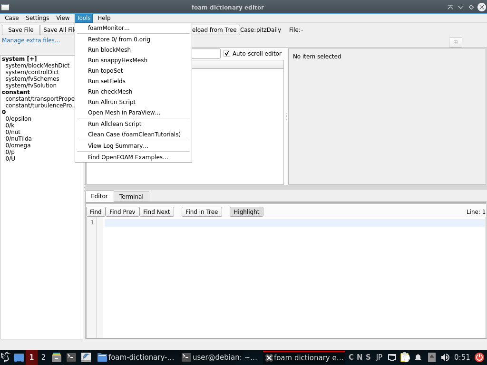

# FoDE — スクリーンショットギャラリー

FoDE の各パネル・オーバーレイ・ダイアログを画面で紹介します。全機能リファレンスは [USER_GUIDE_ja.md](../USER_GUIDE_ja.md)、インストールとクイックスタートは [README_ja.md](../README_ja.md) を参照してください。

## メインウィンドウ

ツリー表示とプレーンテキストエディタを並べて表示し、双方向に同期します。ツリーで値を編集するとエディタ側の該当行がハイライトされ、逆にテキストを編集してツリーへ適用することもできます。詳細は [現在のUI構成](../USER_GUIDE_ja.md#現在のui構成) を参照してください。

Boundary view タブ: すべてのフィールドファイルにまたがる境界パッチをテーブル（パッチ × フィールド）として一覧表示し、各フィールドファイルを個別に開くことなく境界条件全体を一目で確認・編集できます。詳細は [境界条件ビュー](../USER_GUIDE_ja.md#境界条件ビュー) を参照してください。

## BlockMesh 3D ビューア

3D パネルは `blockMeshDict` のジオメトリを描画し、`topoSetDict`・`snappyHexMeshDict`・`setFieldsDict`・サンプリング辞書を開いている、または編集している場合はそのジオメトリも重ねて表示します。詳細は [BlockMesh パネル](../USER_GUIDE_ja.md#blockmesh-パネル) を参照してください。

### topoSetDict オーバーレイ — topoSetShapes ケース

同梱の `tutorials/topoSetShapes` ケース。`box0`・`ball`・`spike`・`ring`・`pipe`・傾いた円柱・回転したボックス（`core`）・円錐台・`coneRing` という 9 個のラベル付き `topoSetDict` 形状が、ブロックメッシュのワイヤーフレーム内に重ねて表示されています。エディタペインには `#eval` 式を使った `coneToCell` エントリが表示されています。詳細は [topoSetDict オーバーレイ](../USER_GUIDE_ja.md#toposetdict-オーバーレイ) を参照してください。

### topoSetDict オーバーレイ — floatingObject ケース

OpenFOAM の `floatingObject` チュートリアル。単位ブロック内に青色の `boxToCell` セルセット（`c0`）が描画されています。詳細は [topoSetDict オーバーレイ](../USER_GUIDE_ja.md#toposetdict-オーバーレイ) を参照してください。

### snappyHexMeshDict オーバーレイ — motorBike ケース（サイドバイサイド）

OpenFOAM の `motorBike` チュートリアルをサイドバイサイドモードで表示: ツリーと 3D ビューが並んで表示されます。motorBike の `triSurfaceMesh` ジオメトリに加えて、紫色の `refinementBox` リージョン（"inside" として分類）と `locationInMesh` マーカーが重ねて描画され、ツリーとエディタは `refinementRegions` エントリにフォーカスしています。詳細は [snappyHexMeshDict オーバーレイ](../USER_GUIDE_ja.md#snappyhexmeshdict-オーバーレイ) と [サイドバイサイドモード](../USER_GUIDE_ja.md#サイドバイサイドモード) を参照してください。

## ダイアログとメニュー

### Find OpenFOAM Examples

非モーダルの Find OpenFOAM Examples ダイアログ: インストール選択、クエリ（この例では `topoSetDict`）、一致したチュートリアルファイルのツリー表示、シンタックスハイライト付きプレビュー、および **Copy File** / **Compare with this case** アクション。詳細は [Find OpenFOAM Examples](../USER_GUIDE_ja.md#find-openfoam-examples) を参照してください。

### Tools メニュー

Tools メニュー: `foamMonitor…` の起動、`0/` を `0.orig` から復元、`blockMesh`/`snappyHexMesh`/`topoSet`/`setFields`/`checkMesh` の実行、ケースの Allrun/Allclean スクリプトの実行、ParaView でのメッシュ表示、ケースのクリーン、ログ要約の表示、OpenFOAM の使用例検索が並びます。詳細は [Run blockMesh](../USER_GUIDE_ja.md#run-blockmesh) と [foamMonitor ランチャー](../USER_GUIDE_ja.md#foammonitor-ランチャー) を参照してください。
