# FoDE — スクリーンショットギャラリー

FoDE の各パネル・オーバーレイ・ダイアログを画面で紹介します。全機能リファレンスは [USER_GUIDE_ja.md](../USER_GUIDE_ja.md)、インストールとクイックスタートは [README_ja.md](../README_ja.md) を参照してください。

以下の **メインウィンドウ** と **BlockMesh 3D ビューア** の各画像は、`tools/screenshot_specs.json` に記述したウィンドウ状態から `tools/capture_screenshots.py` が撮影しています。そのため 1 コマンドで撮り直せ、ライト/ダークのペアはテーマ以外がまったく同一になります。詳細は [スクリーンショットの撮影](../DEVELOPER_ja.md#スクリーンショットの撮影) を参照してください。**ダイアログとメニュー** の各画像は別途撮影しています: 開いたメニューやダイアログはメインウィンドウのフレームの一部ではなく、独立した X ウィンドウであるためです。

## メインウィンドウ

ツリー表示とプレーンテキストエディタを並べて表示し、双方向に同期します。ツリーで値を編集するとエディタ側の該当行がハイライトされ、逆にテキストを編集してツリーへ適用することもできます。詳細は [現在のUI構成](../USER_GUIDE_ja.md#現在のui構成) を参照してください。

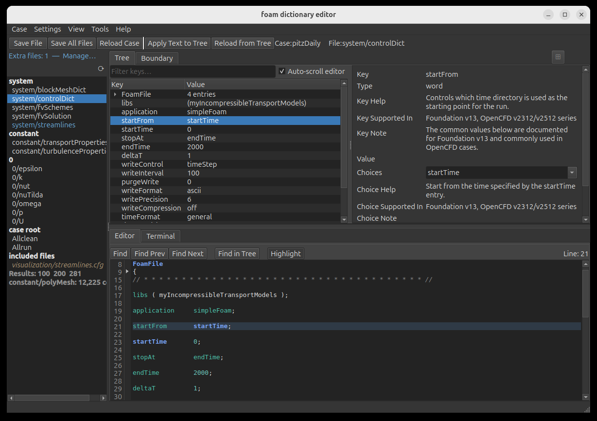

同じ画面を **Settings > Appearance** の **Dark** で表示したもの。テーマはウィンドウが描画するすべてに適用され、エディタのシンタックスハイライト、行番号のガター、選択行の背景色と文字色も含まれます。選択行の配色はデスクトップから継承するのではなく FoDE 自身が算出するため、どのアクセントカラーを設定していても選択行が読みづらくなることはありません。詳細は [外観と配色](../USER_GUIDE_ja.md#外観と配色) を参照してください。

Boundary view タブ: すべてのフィールドファイルにまたがる境界パッチをテーブル（パッチ × フィールド）として一覧表示し、各フィールドファイルを個別に開くことなく境界条件全体を一目で確認・編集できます。各セルにはパッチの `type` が表示され、**Lines per cell** を増やすとその下のエントリ（`value uniform (10 0 0)` など）も表示されます。詳細は [境界条件ビュー](../USER_GUIDE_ja.md#境界条件ビュー) を参照してください。

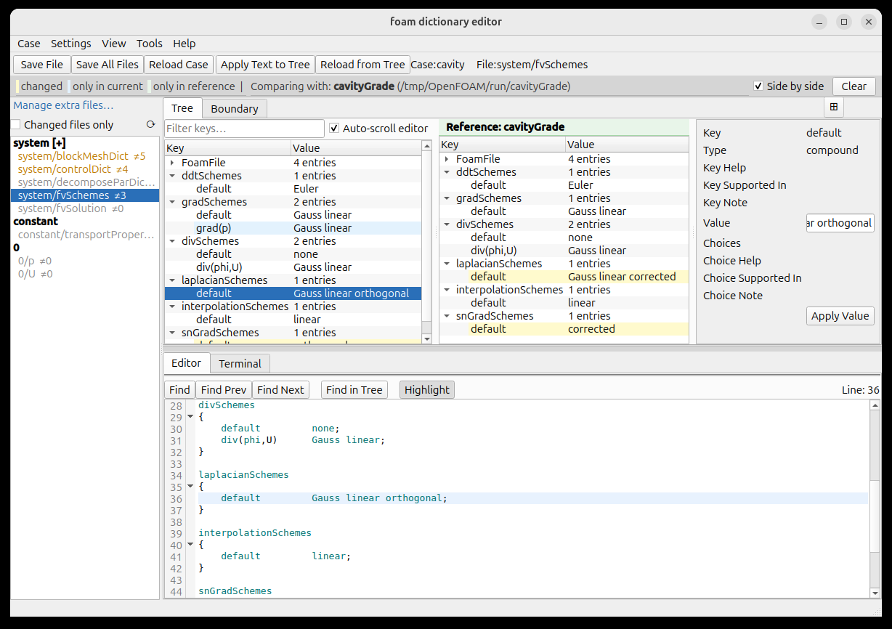

比較モード。`cavity` チュートリアルを開き、`cavityGrade` を参照側に設定した状態です。2 つのツリーが左右に並び、違いは自分で探すのではなくその場でマークされます。値が異なるエントリはハイライトされ、片側にしか存在しないエントリも同様です — この例の `grad(p)` は開いているケースにはあり、参照側にはありません。ファイル一覧にも同じ情報が 1 段上のレベルで表示されるため、ファイルを 1 つも開かないうちにケース全体を見渡せます。各ファイルには差分のあるエントリ数が付き、片側に存在しないファイルはグレー表示になります。比較しても内容は一切変更されません。**Clear** で比較を終了します。詳細は [ケース比較](../USER_GUIDE_ja.md#ケース比較) を参照してください。

## BlockMesh 3D ビューア

3D パネルは `blockMeshDict` のジオメトリを描画し、`topoSetDict`・`snappyHexMeshDict`・`setFieldsDict`・サンプリング辞書を開いている、または編集している場合はそのジオメトリも重ねて表示します。詳細は [BlockMesh パネル](../USER_GUIDE_ja.md#blockmesh-パネル) を参照してください。

### topoSetDict オーバーレイ — topoSetShapes ケース

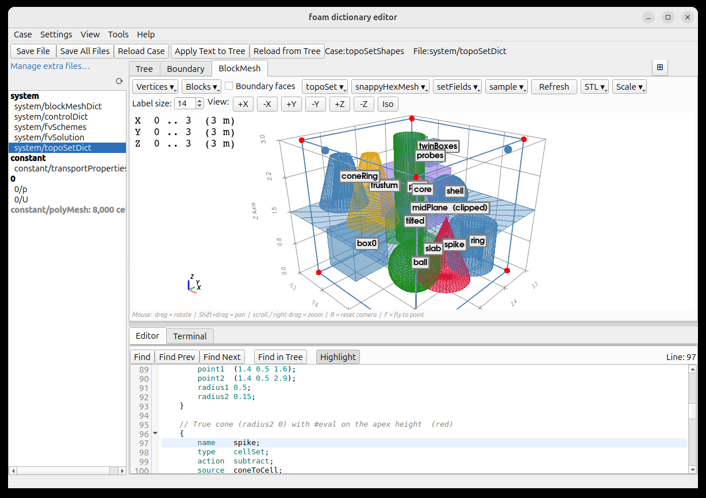

同梱の `tutorials/topoSetShapes` ケース。その `topoSetDict` は、オーバーレイが描画できるすべてのジオメトリソースを網羅しています: ボックス（通常形・`min`/`max` 形・複数ボックスの `boxes` 形）、回転したボックス、中実および中空の球、円柱と円錐のファミリー、点マーカー、`planeToFaceZone` の平面。いずれもブロックメッシュのワイヤーフレーム内に重ねて描画され、形状の中心に名前バッジが表示されます。各形状の色はそれを生成した action に対応しているため、`new`・`add`・`subtract` のセットを一目で区別できます。形状が入れ子になっている箇所ではバッジが重なります。またブロックメッシュの外側へはみ出す形状はクリップして描画され、バッジに `(clipped)` と表示されます（この例では `midPlane`）。エディタペインには `#eval` 式を使った `coneToCell` エントリが表示されています。詳細は [topoSetDict オーバーレイ](../USER_GUIDE_ja.md#toposetdict-オーバーレイ) を参照してください。

### topoSetDict オーバーレイ — floatingObject ケース

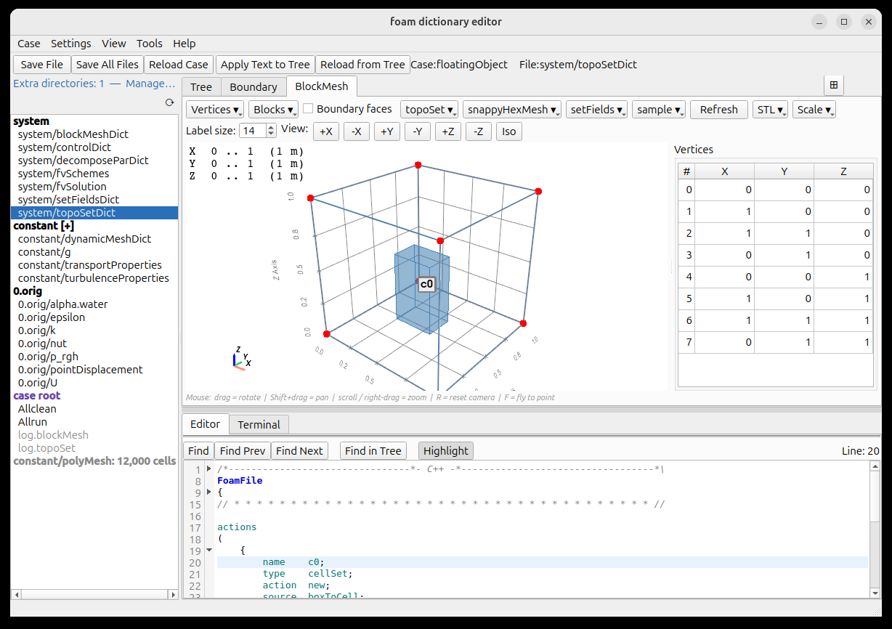

OpenFOAM の `floatingObject` チュートリアル。単位ブロック内に青色の `boxToCell` セルセット（`c0`）が描画されています。詳細は [topoSetDict オーバーレイ](../USER_GUIDE_ja.md#toposetdict-オーバーレイ) を参照してください。

### setFieldsDict オーバーレイ — damBreak ケース

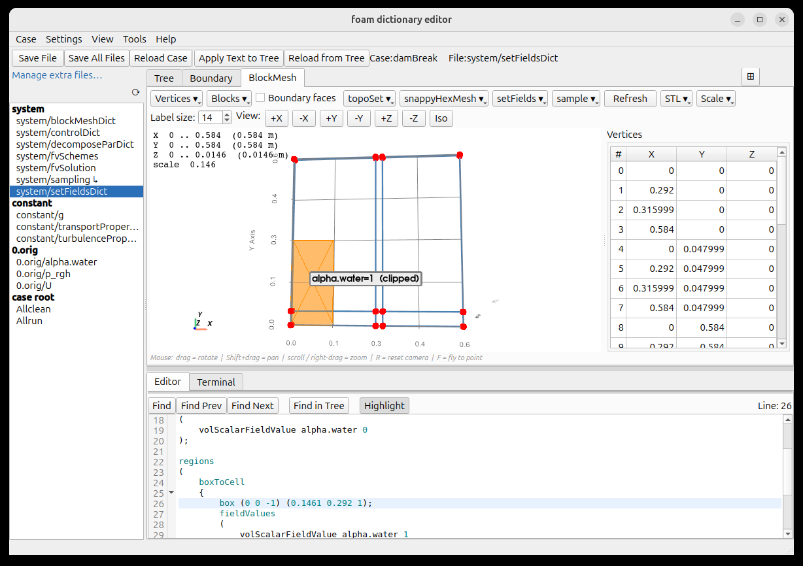

同梱の `tutorials/damBreak` ケース。`setFieldsDict` の `regions` リストがブロックメッシュ上にオレンジ色で描画され、各リージョンにはそれが設定するフィールド値の要約がバッジとして表示されます。これにより `setFields` を実行する前に、初期の水柱をメッシュと照らし合わせて確認できます。この例のリージョンは準 2 次元ケースの奥行き全体をまたぐように記述されていてメッシュより大きくはみ出すため、メッシュに合わせてクリップして描画され、バッジには `(clipped)` と表示されます。辞書ファイル自体は変更されず、STL エクスポートではクリップ前の完全な形状が書き出されます。ツリーで `box` 行を選択すると、エディタがそれを定義している行までスクロールします。詳細は [setFieldsDict オーバーレイ](../USER_GUIDE_ja.md#setfieldsdict-オーバーレイ) と [オーバーレイのクリップ表示](../USER_GUIDE_ja.md#オーバーレイのクリップ表示) を参照してください。

### サンプリングオーバーレイ — samplingShapes ケース

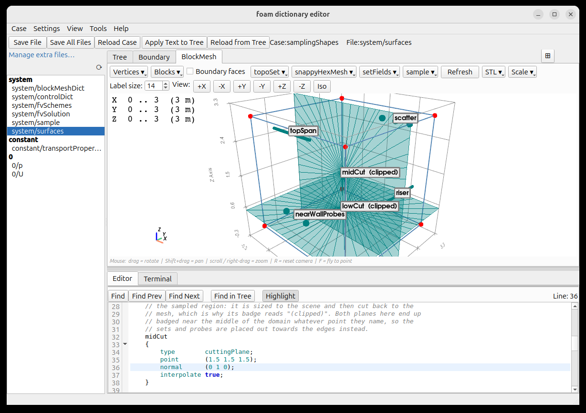

同梱の `tutorials/samplingShapes` ケース。`topoSetShapes` のサンプリング版で、ビューアが描画できるサンプリングジオメトリのすべての種類を 1 つの 3×3×3 ブロック内に収めています。probes と cloud の定義は点マーカーとして、始点・終点を持つ sets はチューブとして、サンプリング平面は円板として描画されます。サンプリングは他のオーバーレイと違って専用の辞書ファイルを持たない点が特徴です — `controlDict` 内の function object としても、スタンドアロンの辞書としても書け、後者にはメンバーリストの記法が 2 通りあります。そこでこのケースでは定義を 3 か所すべてに分散させており、パネルはそれらをマージしたうえで、**sample ▾** メニューの各行に由来ファイルをタグ表示します。2 つの平面はいずれも `(clipped)` と表示されます: 平面は無限に広がるため、描画される円板は表示専用であり、常に表示先のメッシュに合わせて切り取られるからです。詳細は [サンプリングオーバーレイ](../USER_GUIDE_ja.md#サンプリングオーバーレイ) と [オーバーレイのクリップ表示](../USER_GUIDE_ja.md#オーバーレイのクリップ表示) を参照してください。

### snappyHexMeshDict オーバーレイ — motorBike ケース（サイドバイサイド）

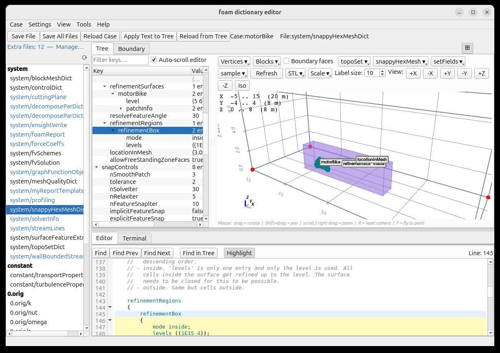

OpenFOAM の `motorBike` チュートリアルをサイドバイサイドモードで表示: ツリーと 3D ビューが並んで表示されます。motorBike の `triSurfaceMesh` ジオメトリに加えて、紫色の `refinementBox` リージョン（"inside" として分類）と `locationInMesh` マーカーが重ねて描画され、ツリーとエディタは `refinementRegions` エントリにフォーカスしています。詳細は [snappyHexMeshDict オーバーレイ](../USER_GUIDE_ja.md#snappyhexmeshdict-オーバーレイ) と [サイドバイサイドモード](../USER_GUIDE_ja.md#サイドバイサイドモード) を参照してください。

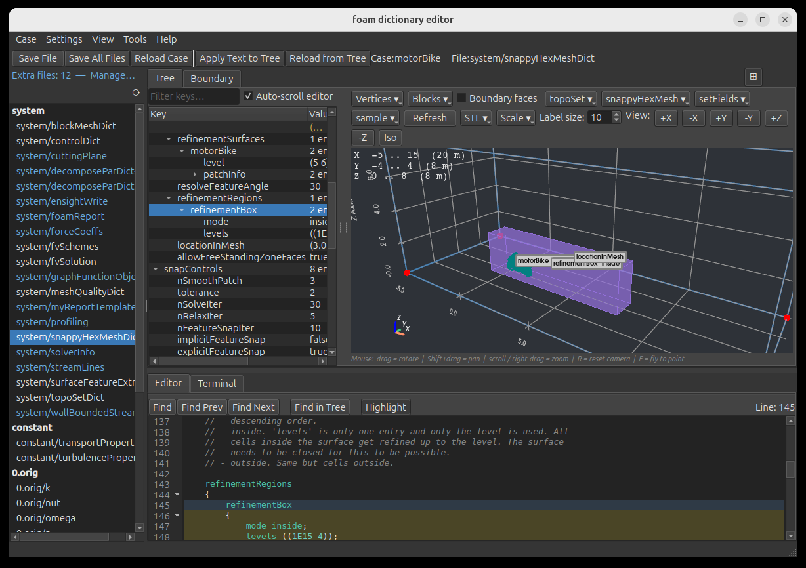

同じオーバーレイを同じカメラ位置からダークテーマで表示したもの — 同じ spec を 2 回撮影しているため、テーマ以外は何も違いません。3D シーンは固有のパレットを持たないため、配色は明示的に指定されています: シーンの背景、その上の範囲表示、グリッドの目盛り数値と軸タイトル、方位軸の X/Y/Z の文字、頂点番号とブロック番号はテーマに追従して切り替わります。一方、パッチやオーバーレイの色は切り替わりません — motorBike の表面は teal、`refinementBox` は紫のままです。これらは何を見ているかを識別するための色だからです。形状名バッジが両テーマで明るいラベルのままなのも同じ理由で、下にあるジオメトリがどの色であっても読めなければならないためです。詳細は [外観と配色](../USER_GUIDE_ja.md#外観と配色) を参照してください。

## ダイアログとメニュー

### Find OpenFOAM Examples

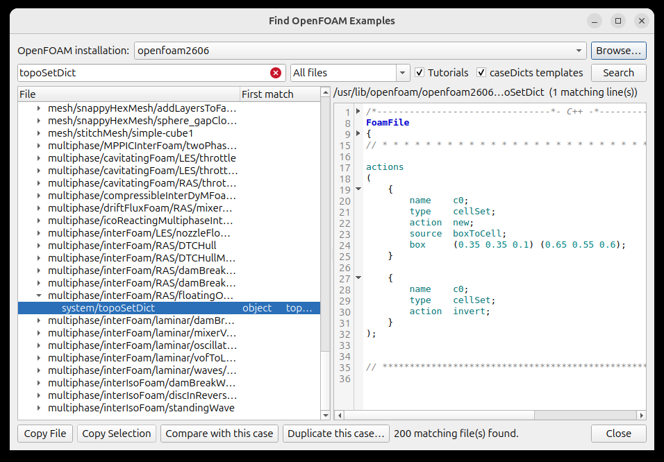

非モーダルの Find OpenFOAM Examples ダイアログ。インストールの `tutorials/` と `etc/caseDicts/` をキーワードで検索します（この例では `topoSetDict` で 200 件が一致）。ヒットは所属するケースごとにグループ化され、選択するとそのファイルがシンタックスハイライト付きでプレビューされます。下端のボタンは、検索結果を実際の作業につなげるためのものです: ファイルをコピーする、そのチュートリアルをケース比較の参照側として開く、あるいはケース全体を編集可能な新しいケースとして複製する。詳細は [Find OpenFOAM Examples](../USER_GUIDE_ja.md#find-openfoam-examples) を参照してください。

### メッシュ・場のツールを実行する

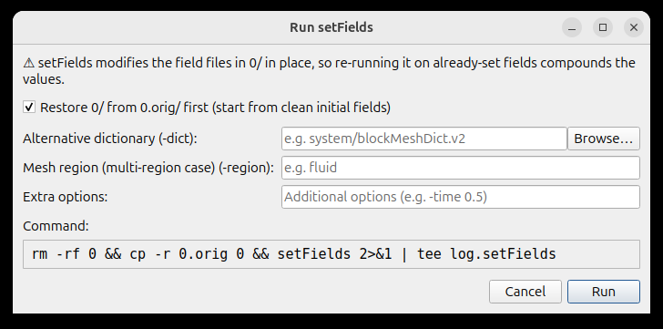

Tools メニューの **Run …** アクションの背後にあるオプションダイアログ。ここでは同梱の `damBreak` ケースに対する `setFields` です。実行ファイルのフラグを覚えておくことを求める代わりに、各ツールについて厳選したフラグを入力欄として提示し、そこに含まれないものは **Extra options** に書きます。そして下端のボックスには、Terminal タブへ実際に送られるコマンドがそのまま表示され、設定を変えるたびに更新されます。組み立てられるコマンドは必ず最後に `log.<ツール名>` へ tee するため、その後 [View Log Summary](#view-log-summary) が読むログが残ります。ツールの落とし穴に先回りするのもこのダイアログの役割です: `setFields` は `0/` をその場で書き換えるため、再実行すると既に設定した値にさらに重ねてしまいます。そこで `0.orig/` から `0/` を復元する選択肢が既定でオンになっており、実際に実行される前置きコマンドとしてコマンド欄にも現れています。詳細は [Run setFields](../USER_GUIDE_ja.md#run-setfields) を参照してください。

### View Log Summary

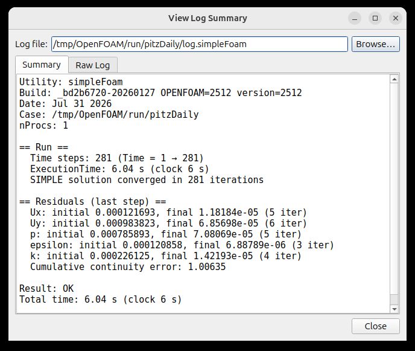

非モーダルの View Log Summary ダイアログ。`pitzDaily` の実行が残した `log.simpleFoam` を読み込み、2,898 行のソルバー出力を画面に見えている内容まで凝縮しています: 実行がどこまで進んだか、収束したか、残差が最終的にどうなったか、正常に終了したか。ケース内で最後に書き込まれた `log.*` が自動的に選ばれ、**Browse…** で別のログを選べます。要約だけでは足りない場合のために、**Raw Log** タブに元のテキストがそのまま入っています。`blockMesh`・`snappyHexMesh`・`topoSet` のログはそれぞれ専用の文法で解析され、そのユーティリティにとって重要な情報 — メッシュ規模、リファインメントの各フェーズ、セットごとの個数 — を代わりに報告します。また繰り返し現れる警告は 1 件ずつ並べるのではなくまとめられます。非モーダルであるため、メインウィンドウの横に置いたまま編集を続けられます。詳細は [View Log Summary](../USER_GUIDE_ja.md#view-log-summary) を参照してください。

### Tools メニュー

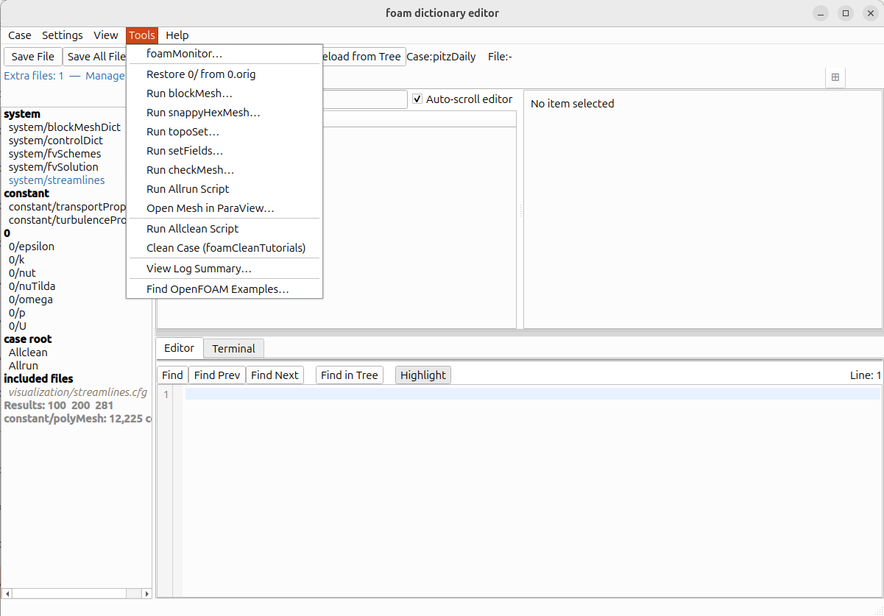

Tools メニューは、FoDE が辞書の編集をやめて OpenFOAM 自身に処理を渡す場所です。各項目は対象ごとにグループ分けされています: メッシュと場のユーティリティ（いずれも上記の「メッシュ・場のツールを実行する」のオプションダイアログを開いてから、コマンドを Terminal タブへ送ります）、ケース全体を対象とするスクリプトとクリーンアップ、メッシュを ParaView へ渡す操作、そして 2 つの非モーダルダイアログ（「View Log Summary」と「Find OpenFOAM Examples」）です。いずれも開いているケース — この例では `pitzDaily` — に対して実行されます。詳細は [Run blockMesh](../USER_GUIDE_ja.md#run-blockmesh) と [foamMonitor ランチャー](../USER_GUIDE_ja.md#foammonitor-ランチャー) を参照してください。
